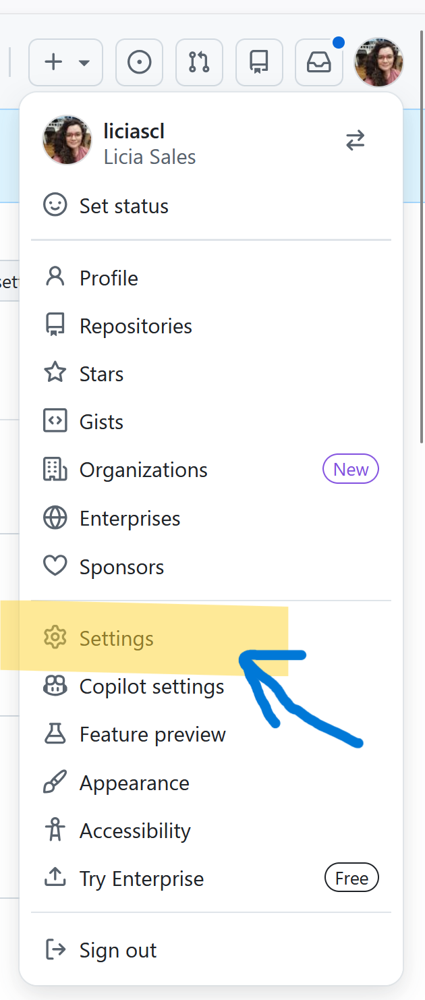
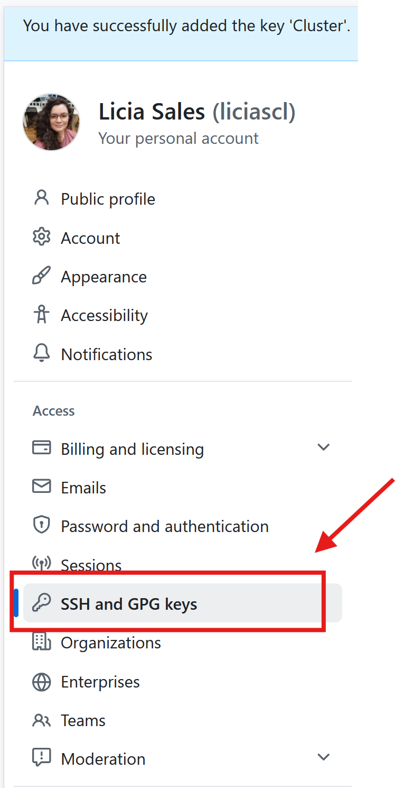
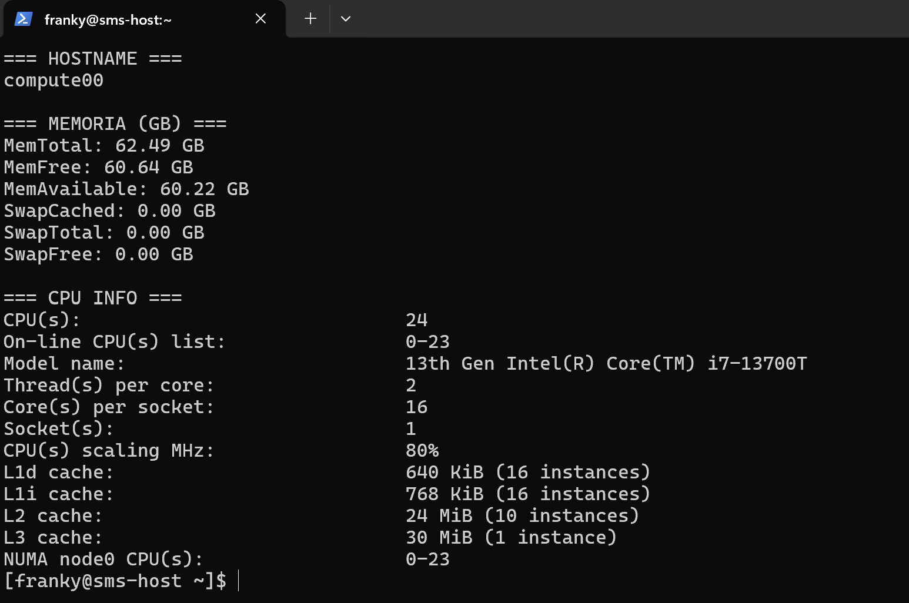

# Aula 02: Acessando o Cluster Franky

Para ter acesso ao Cluster Franky você precisa configurar suas credenciais de acesso e realizar acesso remoto via SSH.

As chaves foram enviadas para o seu email Insper, Faça o download da pasta completa, que contém os arquivos `id_rsa` (chave privada) e `id_rsa.pub` (chave pública), salve essas chaves em algum lugar que você não vai esquecer, depois, siga as instruções abaixo para configurar corretamente seu acesso ao Cluster Franky.


Conecte-se ao cluster utilizando o comando SSH:

O login é o seu "usuario Insper", o endereço de IP foi fornecido durante a aula.


Se você está com o terminal aberto na pasta em que está a sua chave SSH, basta usar o comando:
```bash
ssh -i id_rsa login@ip_do_cluster
```
ou

Se você abriu o terminal em qualquer lugar, então, o comando é este aqui:
```bash
ssh -i caminho_para_a_chave_ssh/id_rsa login@ip_do_cluster
```

### Configurando Acesso SSH ao GitHub dentro do Cluster Franky

Para que você possa realizar clones e commits em repositórios privados sem problemas 

## Gerar uma nova chave SSH

No terminal autenticado dentro do cluster, use o comando:

```bash
ssh-keygen -t ed25519 -C "seu_email_do_github"
```

Quando aparecer:

```
Enter file in which to save the key
```

Pressione **Enter** eternamente até que apareça algo como:

```
...bla bla bla, criamos as chaves nos diretórios
~/.ssh/id_ed25519        ← chave privada
~/.ssh/id_ed25519.pub    ← chave pública
```

Copie a chave pública usando o comando:

```bash
cat ~/.ssh/id_ed25519.pub
```

Copie **toda a linha exibida**, começa com `ssh-ed25519`, termina com o seu email.


Adicione a chave no seu GitHub


1. Acesse GitHub

2. Vá em **Settings**



3. Clique em **SSH and GPG keys**



4. Clique em **New SSH key**


5. Cole a chave pública e depois clique em "Add SSH key"


## Ajustar o arquivo `~/.ssh/config` 

Ambientes de Clusters normalmente possuem uma configuração global no arquivo `~/.ssh/config` que permie a comunicação interna entre os nós. 

Para permitir o uso da sua chave pessoal para acesso ssh ao GitHub sem desconfigurar o acesso entre os nós do cluster;

Cole este conteúdo no arquivo  `~/.ssh/config`:

```
# GitHub
Host github.com
    HostName github.com
    User git
    IdentityFile ~/.ssh/id_ed25519
    IdentitiesOnly yes

# Configuração interna do cluster (não remover)
Host *
   IdentityFile ~/.ssh/cluster
   StrictHostKeyChecking=no
```

Para abrir o arquivo:

```bash
nano ~/.ssh/config
```

Para colar use Crtl + Shift + v

Para salvar use Crtl + s

Para sair use Crtl + x


### Teste a conexão

```bash
ssh -T git@github.com
```

Se estiver correto, aparecerá:

```
Hi usuario! You've successfully authenticated...
```


### **Parte 1: Ambientação no Cluster Franky**

Antes de começar a fazer pedidos de recursos pro SLURM, vamos conhecer os diferentes hardwares que temos disponível no Franky. Vamos utilizar alguns comandos de sistema operacional para ler os recursos de CPU, memória e GPU disponíveis


### Comandos linux que serão utilizados:

* `lscpu`: mostra detalhes da CPU (núcleos, threads, memória cache...)
* `cat /proc/meminfo`: mostra detalhes sobre a memória RAM 
* `nvidia-smi`: mostra detalhes de GPU, se disponível

### Comando SRUN
O SRUN abre um terminal dentro do nó de computação, podemos simplesmente pedir um terminal para, de forma livre, executar nossos comandos:

```bash
srun --partition=gpu --pty bash
```
Você deve ver algo como isso:

Como acessamos o nó pelo SLURM, o sistema não sabe quem é o usuário, então você entra sem identificação no nó.

Para sair, basta digitar no terminal:
```bash
exit
```

Ou, podemos usar o SRUN com um comando definido que será executado no nó de computação de forma direta pelo terminal:

```bash
srun --partition=normal --ntasks=1 --cpus-per-task=1 --mem=1G --time=00:05:00 \
--pty bash -c "hostname && \
cat /proc/meminfo | grep -E 'MemTotal|MemFree|MemAvailable|Swap' && \
lscpu | grep -E 'Model name|Socket|Core|Thread|CPU\\(s\\)|cache' && \
{ command -v nvidia-smi &> /dev/null && nvidia-smi || echo 'nvidia-smi não disponível ou GPU não detectada'; }" 
```

Você deve ver algo como:


`srun`

> É o comando do SLURM usado para **executar uma tarefa interativamente** em um nó do cluster.

`--partition=normal`

> Indica **em qual fila** (partição) o job será executado.
> No seu caso, `normal` pode ser substituído por qualquer outra fila do sistema

`--ntasks=1`

> Solicita **1 tarefa** (processo).
> Se você estivesse rodando um código paralelo, faz sentido trocar esse valor.

`--cpus-per-task=1`

> Cada tarefa receberá **1 CPU (core)**.
> Quando estiver usando paralelismo com várias threads , faz sentido aumentar esse valor.

---

`--mem=1G`

> Aloca **1 gigabyte de memória RAM** para essa tarefa.
> Se ultrapassar esse limite, o job será encerrado.


`--time=00:05:00`

> Define um **tempo máximo de execução de 5 minutos**.
> Depois disso, o SLURM mata o processo automaticamente.

`--pty bash`

> Solicita um terminal para o SLURM dentro do nó de computação.
> Interessante para fazer testes no código ou realizar debugs

`{ command -v nvidia-smi &> /dev/null && nvidia-smi || echo 'nvidia-smi não disponível ou GPU não detectada'; }`

> Esse trecho verifica se o comando `nvidia-smi` está disponível no sistema (ou seja, se há driver NVIDIA instalado e uma GPU NVIDIA acessível).
>
> * Se **`nvidia-smi` estiver disponível**, ele será executado e mostrará as informações da(s) GPU(s) no nó (como nome, memória, uso, driver etc).
> * Se **não estiver disponível** (por exemplo, em nós sem GPU ou sem driver instalado), exibirá a mensagem:
>   `"nvidia-smi não disponível ou GPU não detectada"`.


!!! tip 
      * Em **nós CPU-only** (como os da partição `normal`), é esperado que `nvidia-smi` **não esteja presente**.
      * Para testar o comando em um nó **com GPU**, use `--partition=gpu` ou `--partition=monstrao`  para alocar nós com placas NVIDIA.


O comando abaixo faz exatamente a mesma coisa, mas eu coloquei ele dentro de um shell script para ter uma formatação melhor no display:

```bash
srun --partition=normal --ntasks=1 --pty bash -c \
"echo '=== HOSTNAME ==='; hostname; echo; \
 echo '=== MEMORIA (GB) ==='; \
 cat /proc/meminfo | grep -E 'MemTotal|MemFree|MemAvailable|Swap' | \
 awk '{printf \"%s %.2f GB\\n\", \$1, \$2 / 1048576}'; \
 echo; \
 echo '=== CPU INFO ==='; \
 lscpu | grep -E 'Model name|Socket|Core|Thread|CPU\\(s\\)|cache'
 echo '=== GPU INFO ==='; \
 if command -v nvidia-smi &> /dev/null; then nvidia-smi; else echo 'nvidia-smi não disponível'; fi"
```



O comando `sinfo` mostra quais são as filas e quais são os status dos nós 

```bash
sinfo
```
O comando abaixo mostra detalhes sobre os recursos de cada fila

```bash
scontrol show partition
```

Recomendo que você mude o nome da fila (partition) no comando abaixo para se ambientar no Cluster Franky e desconrir quais são as diferenças entre as filas

```bash
srun --partition=normal --ntasks=1 --pty bash -c \
"echo '=== HOSTNAME ==='; hostname; echo; \
 echo '=== MEMORIA (GB) ==='; \
 cat /proc/meminfo | grep -E 'MemTotal|MemFree|MemAvailable|Swap' | \
 awk '{printf \"%s %.2f GB\\n\", \$1, \$2 / 1048576}'; \
 echo; \
 echo '=== CPU INFO ==='; \
 lscpu | grep -E 'Model name|Socket|Core|Thread|CPU\\(s\\)|cache'
 echo '=== GPU INFO ==='; \
 if command -v nvidia-smi &> /dev/null; then nvidia-smi; else echo 'nvidia-smi não disponível'; fi"
```


### SBATCH — Submissão de Jobs no SLURM

`sbatch` é o comando usado para **enviar um job para a fila do cluster**.

Diferente do `srun`, ele **não é interativo**.  
Você cria um script e o SLURM executa quando houver recursos disponíveis.


Para criar um arquivo lançador de job:

```bash
nano teste.sh
```

Cole o conteúdo abaixo:

```bash
#!/bin/bash

#SBATCH --job-name=sbatch_belezinha        # Nome do job (aparece no squeue)
#SBATCH --partition=gpu           # Fila (partition) onde o job será executado
#SBATCH --ntasks=1                   # Número de tarefas (processos)
#SBATCH --cpus-per-task=1            # Número de CPUs (cores) por tarefa
#SBATCH --mem=1G                     # Memória RAM solicitada
#SBATCH --time=00:05:00              # Tempo máximo de execução (HH:MM:SS)
#SBATCH --output=meu_orgulho_%j.log  # Arquivo de saída (%j = ID do job)

echo "=== HOSTNAME ==="
hostname
echo

echo "=== MEMORIA (GB) ==="
cat /proc/meminfo | grep -E 'MemTotal|MemFree|MemAvailable|Swap' | \
awk '{printf "%s %.2f GB\n", $1, $2 / 1048576}'
echo

echo "=== CPU INFO ==="
lscpu | grep -E 'Model name|Socket|Core|Thread|CPU\(s\)|cache'
echo

echo "=== GPU INFO ==="
if command -v nvidia-smi &> /dev/null; then
    nvidia-smi
else
    echo "nvidia-smi não disponível"
fi
#Sleep desnecessário, só para você conseguir enxergar o seu job na fila do slurm
sleep 20
```

Salve usando Crtl + s, 

e saia usando Crlt + x.


Para submeter o job:

```bash
sbatch teste.sh
```

Você verá algo como:

```
Submitted batch job 12345
```

O número é o **ID do job**.


Para verificar se o lançador deu certo e o seu job está rodando:

```bash
squeue 
```
Se quiser filtrar apenas o seu usuário:

```bash
squeue -u $USER
```

Quando o job terminar, será criado um arquivo como:

```
saida_12345.log
```

Visualize com:

```bash
cat saida_12345.log
```

Você deve ver algo parecido com:


Se você não quiser gerar um arquivo de log separado para cada SBATCH que submeter do mesmo arquivo lançador


Basta excluir o "%j" do nome do seu arquivo de log


Pronto. Você submeteu seus primeiros jobs, uhuuuul!!!

# Exercício

Na aula passada nós vimos que a linguagem importa, além disso, existem recursos da linguagem que tem o poder de acelerar o nosso código, e mais ainda, podemos usar otimizações a nível de compilação para ir além e conseguir uma otimização ainda maior. Agora vamos executar os scripts da aula passada no Cluster Franky para verificar o quanto o hardware impacta nessa abordagem, como será que ficará o desempenho ao executar os códigos em diferentes arquiteturas de computadores?


Vamos utilizar o SLURM para pedir recursos computacionais do nosso Cluster, agora que você ja conhece o hardware que tem em cada fila, faça as suas escolhas de recursos e teste o seu código!

**Script SLURM para o código em Python:**

media_py.slurm

```bash
#!/bin/bash
#As instruções SBATCH não devem ser descomentadas

#SBATCH --job-name=OLHA_EU
# define o nome do job. Esse nome aparece nas listas de jobs e é útil para identificar o job.

#SBATCH --output=media_py%j.out
# Especifica o arquivo onde a saída padrão (stdout) do job será salva.

#SBATCH --ntasks=1
# Define o número de tarefas que o job executará. Neste caso, o job executa uma única tarefa.

#SBATCH --time=00:10:00
# Define o tempo máximo de execução para o job. Neste caso, o job tem um tempo limite de 10 minutos. Se o job exceder esse tempo, ele será automaticamente encerrado.

#SBATCH --partition=normal
# Especifica a partição (ou fila) onde o job será submetido. Aqui.

time python3 media_movel.py
#Executa o programa dentro do nó de computação.
```

**Script SLURM para arquivos C++:**

Como o C++ é uma linguagem que requer compilação, precisamos gerar o executável antes de preparar o arquivo .slurm.

Dentro da pasta SCRATCH, compile seu código .cpp para gerar o binário.

```bash
g++ media_movel.cpp -o sem_otimizacao
g++ -O2 media_movel.cpp -o otimizacao_O2
g++ -O3 media_movel.cpp -o otimizacao_O3
g++ -Ofast media_movel.cpp -o otimizacao_Ofast
```


media_cpp.slurm
```bash
#!/bin/bash
#SBATCH --job=OI_GALERA
# Define o nome do job. Esse nome aparece nas listas de jobs e é útil para identificar o job.

#SBATCH --output=media_cpp%j.out
# Especifica o arquivo onde a saída padrão (stdout) do job será salva.

#SBATCH --ntasks=1
# Define o número de tarefas que o job executará. Neste caso, o job executa uma única tarefa.

#SBATCH --time=00:10:00
# Define o tempo máximo de execução para o job. Neste caso, o job tem um tempo limite de 10 minutos. Se o job exceder esse tempo, ele será automaticamente encerrado.

#SBATCH --partition=normal
# Especifica a partição (ou fila) onde o job será submetido. Aqui, o job será submetido a fila "normal".


echo "========== SEM OTIMIZACAAAOOOO ========"
time ./sem_otimizacao

echo "========= OTIMIZACAO 02 ==============="
time ./otimizacao_O2

echo "======== OTIMIZACAO O3 ==============="
time ./otimizacao_O3

echo "=========== OFAST ESSA ==============="
time ./otimizacao_Ofast

# Executa os binários dentro do nó de computação.

```


### **Parte 2: Execução das Implementações no Cluster**

**Submissão dos Jobs:**

Utilize o comando `sbatch` para submeter cada script SLURM ao cluster.

**Exemplo:**

```bash
sbatch media_py.slurm
sbatch media_cpp.slurm
```

**Monitoramento dos Jobs:**

Use o comando `squeue` para monitorar o status dos jobs.

**Exemplo:**

```bash
squeue 
```

**Análise dos Resultados:**

Após a execução dos jobs, os resultados estarão disponíveis nos arquivos `.out`  especificados em cada script SLURM.

  - Compare os tempos de execução dos programas no cluster.

  - Troque a fila de submissão no arquivo .slurm e compare o desempenho dos programas novamente

  - Analise como as diferentes arquiteturas de hardware dentro do cluster impactam o desempenho do código, compare também com os seus resultados obtidos executando na sua máquina local.

!!! tip "Links úteis"
      [Guia do Slurm - CENAPAD](https://cenapad.ufc.br/documentacao/guia-do-slurm/)
      [Documentação Oficial SLURM](https://slurm.schedmd.com/quickstart.html
      )
      [Guia de Comandos SLURM](https://slurm.schedmd.com/pdfs/summary.pdf)


## **Esta atividade não tem entrega, Bom final de semana!**


