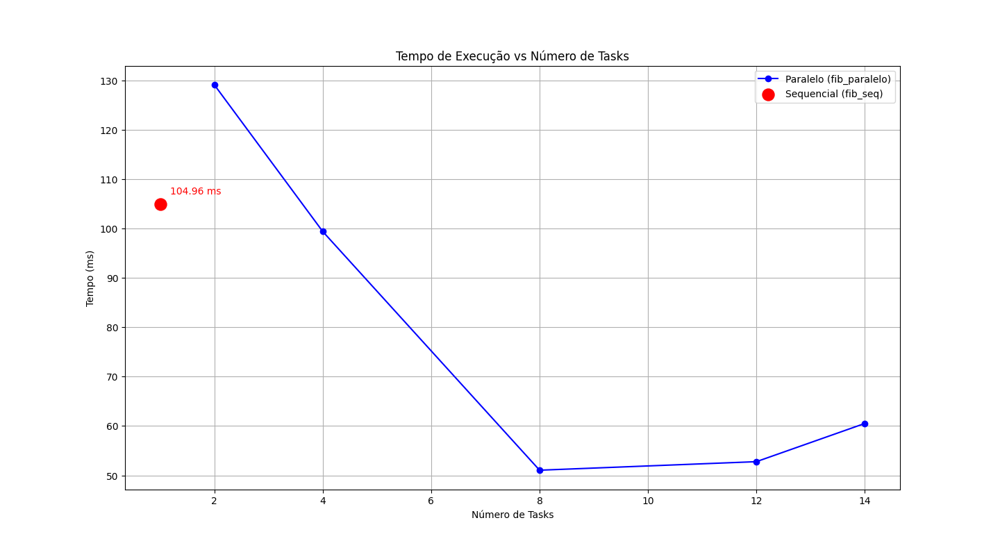
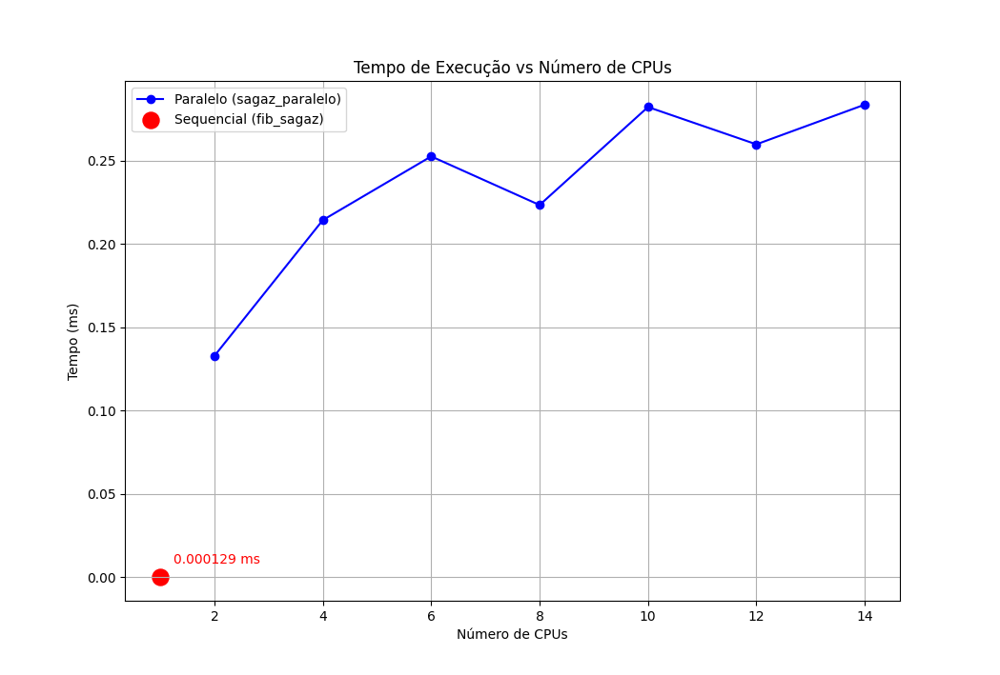

# Efeitos Colaterais do Paralelismo

Paralelizar um programa pode parecer simples: basta distribuir as iterações de um laço entre várias threads e esperar que o tempo de execução diminua.

Na prática, porém, quando múltiplas threads executam ao mesmo tempo elas podem competir pelo acesso a dados compartilhados, gerar condições de corrida, produzir resultados incorretos ou até tornar o programa mais lento devido ao overhead de sincronização e criação de tarefas.

O objetivo não é apenas adicionar diretivas de paralelismo ao código, mas entender quando o paralelismo funciona bem, e quando é melhor repensar a estratégia para ganhar desempenho.


## Transformação elemento-a-elemento (map)

Na aula passada implementamos o paralelismo neste laço:

```cpp
#pragma omp parallel for schedule(runtime)
for (int i = 0; i < N; i++) {
    c[i] = alpha * a[i] + beta;
}
```

* Você executou com 1, 2, 4 e 8 threads.
* Testou diferentes `OMP_SCHEDULE` (`static`, `dynamic`, `guided`).
* Observou que o **resultado não muda nunca**, apenas o **tempo de execução** varia.

Este é um exemplo de paralelismo **seguro**, pois cada iteração escreve em posições diferentes do vetor `c`.

**Pergunta para pensar:** por que será que este laço é naturalmente paralelizável e não da problema nenhum?


## Soma (redução) 
Também vimos esse for, se apenas paralelizar ele sem muito cuidado, pode acabar caindo na cheteação de implementar algo como:

```cpp
double soma = 0.0;
#pragma omp parallel for schedule(runtime)
for (int i = 0; i < N; i++) {
    soma += static_cast<double>(c[i]) * static_cast<double>(c[i]); 
}
```

Com essa implementação os valores da soma ficaram inconsistentes.
Isso acontece porque várias threads tentam atualizar a mesma variável ao mesmo tempo gerando condição de corrida (*race condition*).


Para situações desse tipo, o certo é usar uma redução.

```cpp
double soma = 0.0;
#pragma omp parallel for schedule(runtime) reduction(+:soma)
for (int i = 0; i < N; i++) {
    soma += (double)c[i] * c[i]; // <- corrigido
}
```

Agora cada thread acumula uma soma local e no final todas são combinadas.
O resultado fica estável e correto em qualquer número de threads.


## Dependência de dados

Nem sempre podemos dar um "jeitinho" para paralelizar

```cpp
for (int i = 1; i < N; i++) {
    a[i] = a[i-1] + 1; // depende da iteração anterior
}
```

Aqui há uma dependência entre iterações: para calcular `a[i]` é necessário já ter calculado `a[i-1]`.
Paralelizar assim gera resultado incorreto.

Só é possível resolver reformulando o algoritmo. 

Maaaaaaaaaaaaaaaaaaaaaaaaaaaaaaaaaaaas se observarmos bem, esse cálculo é apenas uma progressão aritmética:

* `a[1] = a[0] + 1`
* `a[2] = a[0] + 2`
* `a[3] = a[0] + 3`
* …
* `a[i] = a[0] + i`

Ou seja, o valor de `a[i]` não precisa necessariamente `a[i-1]`, pode ser calculado diretamente.

### Versão paralelizável:
Mas somos BR's, e BR é bom mesmo de estratégia!

Quem disse que não da pra dar um "jeitinho"?

```cpp
#pragma omp parallel for schedule(dynamic)
for (int i = 1; i < N; i++) {
    a[i] = a[0] + i;
}
```
O loop original tem dependência sequencial, mas ao analizar o padrão, vemos que é uma progressão. Com uma estratégia adequada eliminamos o problema, agora cada iteração é independente e pode ser distribuída entre threads sem polêmicas.

Fica ai uma grande lição:

`Paralelizar não é só usar #pragma, é preciso analizar o código.`


## Exemplo dos Slides

Versão recursiva e sequencial do Fibonacci:
```cpp
//fib_seq.cpp
#include <iostream>
#include <chrono>

using namespace std;

int fib(int n) {
    if (n < 2)
        return n;

    return fib(n-1) + fib(n-2);
}

int main() {
    int n = 40;

    auto inicio = chrono::high_resolution_clock::now();

    int resultado = fib(n);

    auto fim = chrono::high_resolution_clock::now();

    chrono::duration<double> tempo = fim - inicio;

    cout << "Resultado: " << resultado << endl;
    cout << "Tempo: " << tempo.count() << " segundos" << endl;
}
```

Para gerar o binário:
```bash
g++ -fopenmp -O3 fib_seq.cpp -o fib_seq
```

Para testar no Cluster Franky
```bash
srun --partition=normal fib_seq
```


### Versão paralela com OpenMP

```cpp
// fib_paralelo.cpp
#include <iostream>
#include <omp.h>
#include <chrono>

using namespace std;

int fib(int n) {
    int x, y;

    if (n < 2)
        return n;

    // Evitar overhead de tarefas pequenas
    if (n < 20) {
        return fib(n-1) + fib(n-2);
    } else {

        #pragma omp task shared(x)
        x = fib(n-1);

        #pragma omp task shared(y)
        y = fib(n-2);

        #pragma omp taskwait
        return x + y;
    }
}

int main() {

    int n = 40;
    int resultado;  /

    auto inicio = chrono::high_resolution_clock::now();

    #pragma omp parallel
    {
        #pragma omp single
        resultado = fib(n);
    }

    auto fim = chrono::high_resolution_clock::now();

    chrono::duration<double> tempo = fim - inicio;

    cout << "Resultado: " << resultado << endl;
    cout << "Tempo: " << tempo.count() << " segundos" << endl;

    return 0;
}

```

Para gerar o binário:
```bash
g++ -fopenmp -O3 fib_paralelo.cpp -o fib_paralelo
```


Para testar no Cluster Franky
```bash
srun --partition=normal --cpus-per-task=4 fib_paralelo
```

Nesta versão eu coloquei os `#pragmas` no código procurando evitar problemas, tomei cuidado para não estourar o número de tasks na implementação mas não melhorei a estratégia do código.

Em relação a versão sequêncial, esses foram os resultados:

| Versão                   |  Tasks  | Tempo (s) | 
| ------------------------ | ------- | --------- | 
| Sequencial `fib_seq`     |    1    | 0.104961  |
| Paralelo `fib_paralelo`  |    2    | 0.129041  |
| Paralelo `fib_paralelo`  |    4    | 0.0993562 | 
| Paralelo `fib_paralelo`  |    8    | 0.0510503 | 
| Paralelo `fib_paralelo`  |    12   | 0.0527775 | 
| Paralelo `fib_paralelo`  |    14   | 0.0605104 | 



### Versão Iterativa
Sempre que for possível trocar a estratégia para fugir de recursões, é aconselhavel fazer isso.

Nesta implementação em vez de paralelizar, troquei o algoritmo, em vez de chamar a função várias vezes usando a recursão, podemos guardar apenas os dois últimos valores. Depois vamos construindo a sequência passo a passo.

```cpp
//fib_sagaz.cpp
#include <iostream>
#include <chrono>
using namespace std;

int fib(int n) {
    
    if (n < 2)
        return n;

    int a = 0;
    int b = 1;
    int c;

    for (int i = 2; i <= n; i++) {
        c = a + b;
        a = b;
        b = c;
    }

    return b;
}

int main() {
    int n = 40;

    auto inicio = chrono::high_resolution_clock::now();

    int resultado = fib(n);
 
   
    auto fim = chrono::high_resolution_clock::now();

    chrono::duration<double> tempo = fim - inicio;

    cout << "Resultado: " << resultado << endl;
    cout << "Tempo: " << tempo.count() << " segundos" << endl;

    return 0;
}

```

Para gerar o binário:
```bash
g++ -fopenmp -O3 fib_sagaz.cpp -o fib_sagaz
```

Para testar no Cluster Franky
```bash
srun --partition=normal fib_sagaz
```
O resultado foi:
```bash
Resultado: 102334155
Tempo: 1.59e-07 segundos
```

E se eu quisesse paralelizar o `fib_sagaz`?

```cpp
// fib_sagaz_paralelo.cpp
#include <iostream>
#include <omp.h>
#include <chrono>

using namespace std;

int fib_seq(int n) {

    if (n < 2)
        return n;

    int a = 0;
    int b = 1;
    int c;

    for (int i = 2; i <= n; i++) {
        c = a + b;
        a = b;
        b = c;
    }

    return b;
}

int fib(int n) {

    int result = 0;

    #pragma omp parallel for  // coloquei o pragma na esperança de que tudo se resolva </3
    for (int i = 0; i <= n; i++) {

        int val = fib_seq(i);

        if (i == n) {
            result = val;
        }
    }

    return result;
}

int main() {

    int n = 40;

    auto inicio = chrono::high_resolution_clock::now();

    int resultado = fib(n);


    auto fim = chrono::high_resolution_clock::now();

    chrono::duration<double> tempo = fim - inicio;

    cout << "Resultado: " << resultado << endl;
    cout << "Tempo: " << tempo.count() << " segundos" << endl;

    return 0;
}
```

Para gerar o binário:
```bash
g++ -fopenmp -O3 fib_sagaz_paralelo.cpp -o sagaz_paralelo
```
Para testar no Cluster Franky
```bash
srun --partition=normal --cpus-per-task=4 sagaz_paralelo
```

O resultado foi:


| Versão                    | CPUs | Tempo (s)   | Resultado |
| ------------------------- | ---- | ----------- | --------- |
| Sequencial `fib_sagaz`    | 1    | 1.29e-07    | 102334155 |
| Paralelo `sagaz_paralelo` | 2    | 0.000132932 | 102334155 |
| Paralelo `sagaz_paralelo` | 4    | 0.000214436 | 102334155 |
| Paralelo `sagaz_paralelo` | 6    | 0.000252677 | 102334155 |
| Paralelo `sagaz_paralelo` | 8    | 0.000223494 | 102334155 |
| Paralelo `sagaz_paralelo` | 10   | 0.000282311 | 102334155 |
| Paralelo `sagaz_paralelo` | 12   | 0.000259918 | 102334155 |
| Paralelo `sagaz_paralelo` | 14   | 0.000283749 | 102334155 |



Paralelizar esse código é uma péssima ideia porque o paralelismo faz trabalho redundante e não resolve nenhum gargalo real do algoritmo. 

O objetivo do programa é calcular apenas `fib(n)`, mas ao aplicar `#pragma omp parallel for` no laço que vai de `0` até `n`, cada thread passa a calcular vários valores intermediários de Fibonacci (`fib(0)`, `fib(1)`, `fib(2)`, …, `fib(n)`). Porém, todos esses resultados são descartados, exceto o último, quando `i == n`. Isso significa que grande parte do trabalho realizado pelas threads **não contribui para o resultado final**.

Ao paralelizar o laço, temos o overhead de criação e gerenciamento de threads, sincronização e divisão do trabalho entre elas. Fazendo com que a versão paralela seja mais lenta que a versão sequencial.

Outro problema é que o paralelismo foi aplicado **sem analisar a estrutura do problema**. O cálculo iterativo de Fibonacci possui uma dependência direta entre as iterações: cada novo valor depende dos dois anteriores. Isso significa que o algoritmo original já é naturalmente sequencial. Em vez de explorar paralelismo real, o código apenas replica cálculos independentes que não são necessários.

Sair paralelizando na esperança de que o desempenho melhore, sem considerar a dependência de dados, o custo das threads e a utilidade real do trabalho distribuído, o resultado é um programa que faz mais trabalho do que o necessário e é mais lento do que a versão original.


## Conclusão
SEGURA A EMOÇÃO, estude o código com cuidado antes de fazer as suas implementações!


Vimos que nem todo problema é igual. No caso da transformação elemento a elemento (map), o paralelismo funciona sem complicações porque cada iteração é totalmente independente. Já na soma parcial, o acesso simultâneo a uma variável compartilhada gera condições de corrida, que precisam ser resolvidas com mecanismos como `reduction`.

Também vimos que alguns laços possuem dependência e a solução não é trivial, é necessário repensar o algoritmo para eliminar a dependência.

Por fim, a experiência com recursão e tasks mostrou que o paralelismo pode gerar overhead se não for bem controlado. Criar muitas tarefas pequenas pode ser pior do que executar de forma sequencial.


**Esta atividade não tem entrega, bom fim de semana!!!**