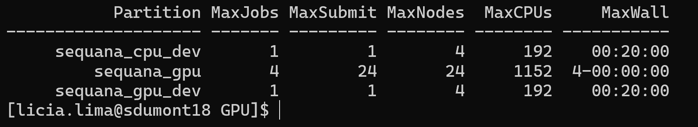

# Acesso ao Supercomputador Santos Dumont (SDumont)

## O LNCC

O **Laboratório Nacional de Computação Científica (LNCC)** é uma unidade de pesquisa do Ministério da Ciência, Tecnologia e Inovações (MCTI), especializada em computação científica de alto desempenho, modelagem matemática, simulação e ciência de dados. 

## O Supercomputador Santos Dumont

O **SDumont** é o maior supercomputador da América Latina disponível para a comunidade como pesquisadores e instituições de todo o Brasil utilizar para projetos de alto impacto, como simulações climáticas, modelagem molecular, bioinformática, inteligência artificial, física computacional, e **formação de profissionais capacitados para operar em sistemas de HPC.**

A infraestrutura do SDumont permite:

- Processamento massivo de dados científicos;
- Execução de simulações paralelas e distribuídas;
- Acesso remoto via SSH para submissão de jobs com uso de SLURM.

As filas que você terá acesso tem essas características:

## Fila sequana_cpu_dev

A fila sequana_cpu_dev pode ser usada para testes em CPU, permitindo a execução de apenas 1 job por vez,  utilizando até 4 nós e 192 CPUs por job, com tempo limite de 20 minutos. A infraestrutura disponível conta com 166 nós e 7968 CPUs no total, com 8 GB de memória por CPU, somando aproximadamente 62 TB de memória. 

## Fila sequana_gpu_dev

A fila sequana_gpu_dev pode ser usada para testes com uso de GPU, também limitada a 1 job por vez, podendo utilizar até 4 nós e 192 CPUs por job, com tempo máximo de 20 minutos. Disponibiliza 61 nós, 2928 CPUs e 244 GPUs, com configuração padrão de 12 núcleos de CPUs por GPU e 94 GB de memória por GPU. A memória por CPU é de 8 GB. 

## Fila sequana_gpu

A fila sequana_gpu é a principal fila utilizada para execução de jobs em GPU, permitindo até 4 jobs simultâneos e 24 submissões, com uso de até 24 nós e 1152 CPUs por job, e **tempo máximo de execução de até 4 dias**. Possui 87 nós, 4176 CPUs e 348 GPUs, mantendo a proporção padrão de 12 CPUs por GPU e 94 GB de memória por GPU. A memória por CPU é de 8 GB, totalizando aproximadamente 32 TB. 

## Como obter acesso ao SDumont

Para utilizar o SDumont **você deve preencher e assinar** o formulário oficial fornecido pelo LNCC.

1. **Preencha** o formulário de acesso (disponível [aqui](./formulario_sdumont_usuario.docx)) e **assine** o formulário;

Preencha o documento conforme os exemplos abaixo:

### Dados Institucionais

- **Instituição:** Insper  
- **Telefone / Ramal:** 4504-2400  
- **Departamento / Instituto:** Laboratório de Redes e Supercomputação – Engenharia da Computação  
- **Cargo:** Aluno

### Dados do Projeto

- **Nome do Coordenador:** Lícia Sales Costa Lima  
- **Título/Sigla do Projeto:** Computação de Alto Desempenho: Um Modelo de Ensino Prático

## Assine o documento

Você pode optar por:

- **Assinar digitalmente com sua conta Gov.br** pelo site [https://assinador.iti.br/](https://assinador.iti.br/).

- **ou assinar à mão**, imprimir e escanear o formulário;

## Próximos passos
Anexe ao e-mail um documento de identificação oficial como RG ou CNH;

Envie os documentos por e-mail para liciascl@insper.edu.br.

**Após o envio, os formulários devidamente preenchidos e assinados serão encaminhados para o LNCC para criação do acesso ao SDumont.**

> **Importante:** O supercomputador SDumont é uma ferramenta poderosa para aprendizado e pesquisa. Use-o com responsabilidade.

Site oficial do Santos Dumont [https://sdumont.lncc.br/index.php](https://sdumont.lncc.br/index.php)
