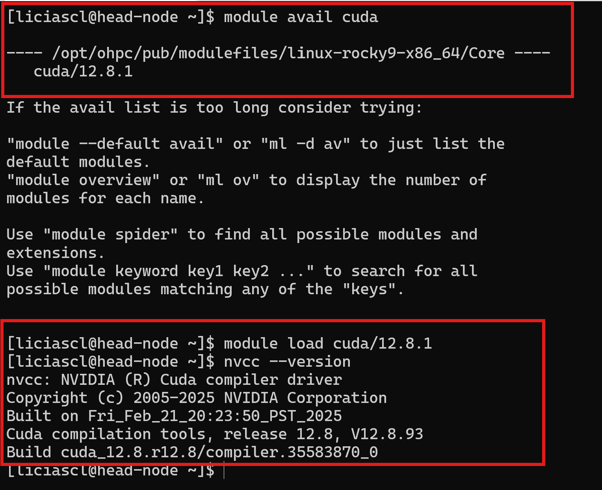

# Uma Introdução a CUDA

O **CUDA (Compute Unified Device Architecture)** é o modelo de programação paralela desenvolvido pela **NVIDIA**.
Ele permite que desenvolvedores usem o poder das **GPUs** para acelerar aplicações de alto desempenho, executando milhares de threads simultaneamente.

Em um **sistema HPC com SLURM**, como o Franky ou o SDumont, a execução de programas CUDA segue três etapas principais:

1. **Carregar o módulo CUDA** disponível no cluster.
2. **Compilar o código** com o compilador `nvcc`.
3. **Executar o binário** com o `srun` ou `sbatch`(solicitando uma GPU).

---

## Etapa 1 — Preparando o ambiente


Liste os módulos disponíveis e carregue o CUDA:

```bash
module avail cuda
module load cuda/12.8.1
```

Verifique se o compilador CUDA está ativo:

```bash
nvcc --version
```

Deve aparecer algo como




## Etapa 2 — Código Base (CPU)

Vamos começar com um programa simples em **C++** que soma os elementos de dois vetores na **CPU**.

Crie o arquivo:

```bash
nano exemplo-cpu.cpp
```

Cole o código abaixo:

```cpp
#include <iostream>
#include <cmath>
#include <chrono> 

// Função que soma os elementos de dois vetores
void add(int n, float *x, float *y)
{
  for (int i = 0; i < n; i++)
      y[i] = x[i] + y[i];
}

int main(void)
{
  int N = 1'000'000'000; 
  float *x = new float[N];
  float *y = new float[N];

  // Inicializa os vetores
  for (int i = 0; i < N; i++) {
    x[i] = 1.0f;
    y[i] = 2.0f;
  }

  // Início da medição de tempo
  auto start = std::chrono::high_resolution_clock::now();

  // Executa a soma
  add(N, x, y);

  // Fim da medição
  auto end = std::chrono::high_resolution_clock::now();
  std::chrono::duration<double> elapsed = end - start;

  // Calcula erro e soma total
  float maxError = 0.0f;
  double somaTotal = 0.0;

  for (int i = 0; i < N; i++) {
    maxError = fmax(maxError, fabs(y[i] - 3.0f));
    somaTotal += y[i];
  }

  std::cout << "Erro: " << maxError << std::endl;
  std::cout << "N: " << N << std::endl;
  std::cout << "Soma total: " << somaTotal << std::endl;
  std::cout << "Tempo de execução: " << elapsed.count() << " segundos" << std::endl;

  delete [] x;
  delete [] y;

  return 0;
}

```

Compile e execute localmente (sem GPU):

```bash
 srun --partition=gpu  --pty ./ex-cpu
```

Saída esperada:

```
Erro: 0
N: 1000000000
Soma total: 3e+09
Tempo de execução: 0.30549 segundos
```


## Etapa 3 — Migrando para GPU (CUDA)

Agora, vamos reescrever o mesmo código para rodar **na GPU**.

Crie o arquivo:

```bash
nano exemplo-gpu.cu
```

Analise o código abaixo:

```cpp
#include <iostream>
#include <cmath>
#include <chrono>
#include <cuda_runtime.h>

using namespace std;

// Kernel CUDA (função que será executada na GPU)
__global__
void add(int n, float *x, float *y)
{
  // Calcula o índice global da thread
   // cada thread obtém um índice único 'i'
  int i = blockIdx.x * blockDim.x + threadIdx.x;

  // Garante que a thread só acesse posições válidas do vetor
  if (i < n)

    // Cada thread realiza a soma de UM elemento:
    y[i] = x[i] + y[i];
}

int main(void)
{
  int N = 1'000'000'000;
  size_t size = N * sizeof(float);

  // Cria os vetores na CPU
  float *x = new float[N];
  float *y = new float[N];

  // Inicializa na CPU
  for (int i = 0; i < N; i++) {
    x[i] = 1.0f;
    y[i] = 2.0f;
  }

  // Cria os vetores para a GPU
  float *d_x, *d_y;
  // reserva o espaço para os vetores na GPU
  cudaMalloc(&d_x, size);
  cudaMalloc(&d_y, size);

  // início do tempo (incluindo transferência)
  auto start = std::chrono::high_resolution_clock::now();
  
  auto dados_start = std::chrono::high_resolution_clock::now();
  // Transferencia dos dados CPU → GPU
  cudaMemcpy(d_x, x, size, cudaMemcpyHostToDevice);
  cudaMemcpy(d_y, y, size, cudaMemcpyHostToDevice);
  auto dados_end = std::chrono::high_resolution_clock::now();
  
  // Configurando o kernel
  int blockSize = 256;
  int numBlocks = (N + blockSize - 1) / blockSize;

  auto start_comp = chrono::high_resolution_clock::now();
  // Computação na GPU
  add<<<numBlocks, blockSize>>>(N, d_x, d_y);

  // Semáforo para aguardar o término da computação na GPU 
  cudaDeviceSynchronize();

  auto end_comp = chrono::high_resolution_clock::now();

  
  auto start_dados = chrono::high_resolution_clock::now();
  // Transferencia de dados GPU → CPU
  cudaMemcpy(y, d_y, size, cudaMemcpyDeviceToHost);

  auto end_dados = chrono::high_resolution_clock::now();

  // fim do tempo
  auto end = std::chrono::high_resolution_clock::now();
  std::chrono::duration<double> total = end - start;

  std::chrono::duration<double> comp = end_comp - start_comp;
  std::chrono::duration<double> dados_crus = dados_end - dados_start;
  std::chrono::duration<double> dados_comp = end_dados - start_dados;


  // Criação dos das variaveis para exibir o output
  float maxError = 0.0f;
  double somaTotal = 0.0;

  // Preparação dos dados para exibir
  for (int i = 0; i < N; i++) {
    maxError = fmax(maxError, fabs(y[i] - 3.0f));
    somaTotal += y[i];
  }

  std::cout << cudaGetLastError() << std::endl;
  std::cout << "Erro: " << maxError << std::endl;
  std::cout << "N: " << N << std::endl;
  std::cout << "Soma total: " << somaTotal << std::endl;

  std::cout << "Tempo de transferência dos dados (CPU->GPU) " << dados_crus.count() << " segundos" << std::endl;
  std::cout << "Tempo de calculos na GPU " << comp.count() << " segundos" << std::endl;
  std::cout << "Tempo de transferência dos dados (CPU<-GPU) " << dados_comp.count() << " segundos" << std::endl;
  std::cout << "Tempo total de tudo mesmo " << total.count() << " segundos" << std::endl;
  
  // Libera memória
  cudaFree(d_x);
  cudaFree(d_y);
  delete[] x;
  delete[] y;

  return 0;
}

```

Compile com o `nvcc`:

```bash
nvcc exemplo-gpu.cu -o ex-gpu
```

## Etapa 4 — Executando no nó GPU com SLURM

Agora, vamos executar o binário **pedindo uma GPU** via `srun`:

```bash
srun --partition=gpu --gres=gpu:1 ./ex-gpu
```
Esse  `--gres=gpu:1` aloca 1 GPU  para executar o binário  `./ex1`  na fila gpu do Cluster Franky

Saída esperada:

```
0
Erro: 0
N: 1000000000
Soma total: 3e+09
Tempo de transferência dos dados (CPU->GPU) 0.663264 segundos
Tempo de calculos na GPU 0.0722021 segundos
Tempo de transferência dos dados (CPU<-GPU) 0.307847 segundos
Tempo total de tudo mesmo 1.04331 segundos
```

### Natureza do problema

A operação:

```cpp
y[i] = x[i] + y[i];
```

tem as seguintes características:

* 1 soma por elemento
* 2 leituras de memória
* 1 escrita de memória

Isso significa que o custo é dominado por acesso à memória, não por cálculo.

Esse tipo de problema é chamado de:


> memory-bound


O que aconteceu:

1. A GPU executou o cálculo muito rapidamente (0.07 s)
2. Mas o custo de movimentar os dados foi muito alto (~1 s)
3. O tempo total ficou maior que o da CPU

Conclusão importante:

> A GPU não foi mais lenta em computação, mas o sistema como um todo foi mais lento devido à movimentação de dados.


Na CPU 

* Threads compartilham a mesma memória
* Não há cópia de dados
* O custo é apenas acesso à RAM

Na GPU:

* Existe uma memória separada (device memory)
* É necessário copiar dados explicitamente
* O custo de comunicação é alto


## DESAFIO

Teste o código com diferentes configurações:

```cpp
numBlocks = 32;
numBlocks = 128;
numBlocks = 1024;
```

Melhorou ou piorou o tempo?
Como você faria a computação em GPU de uma matriz 2D?
E de uma matriz 3D?
Será que da pra melhorar o tempo de alocação dos dados?

Veremos nos próximos capitulos...

## Se quiser aprender mais

1. Explore a [documentação do CUDA Toolkit](https://docs.nvidia.com/cuda/index.html).
   Veja o [Guia Rápido de Instalação](https://docs.nvidia.com/cuda/cuda-quick-start-guide/index.html) e o [Programming Guide](https://docs.nvidia.com/cuda/cuda-c-programming-guide/index.html).
2. Teste o uso de `printf()` dentro do kernel para imprimir `threadIdx.x` e `blockIdx.x`.
3. Experimente `threadIdx.y`, `threadIdx.z` e `blockIdx.y`.
   Descubra como definir grids e blocos em múltiplas dimensões.
4. Leia sobre a [Unified Memory no CUDA 8](https://developer.nvidia.com/blog/unified-memory-cuda-beginners/) e o mecanismo de migração de páginas da arquitetura Pascal.


obs: Material adaptado do Deep Learning Institute NVIDIA e do NVIDIA Teaching kit - Accelerated Computing
## Esta atividade não tem entrega, bom final de semana!
```
