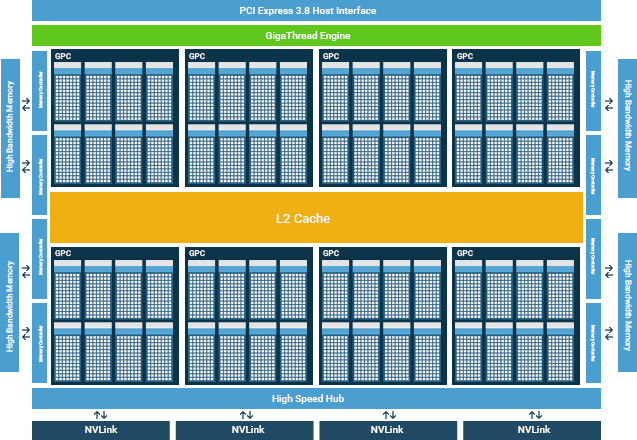
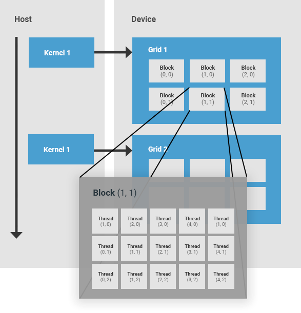
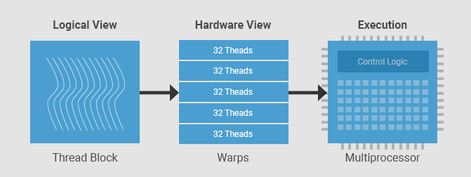
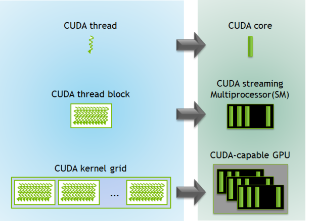
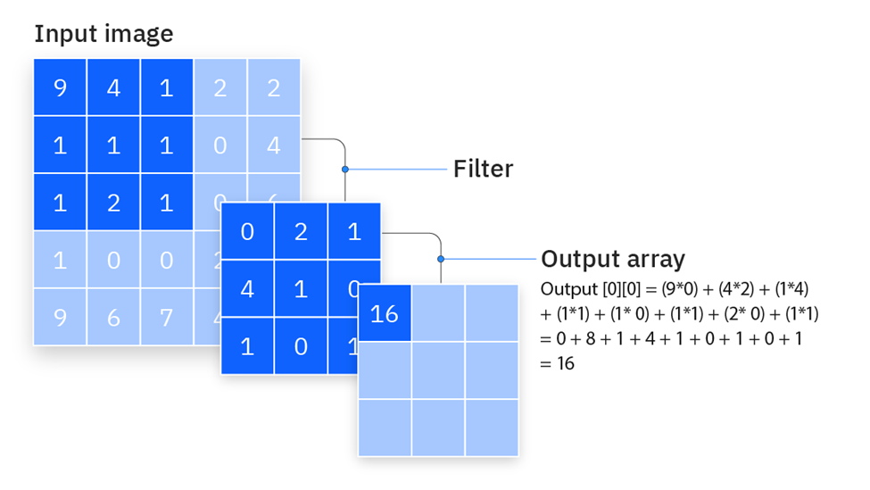
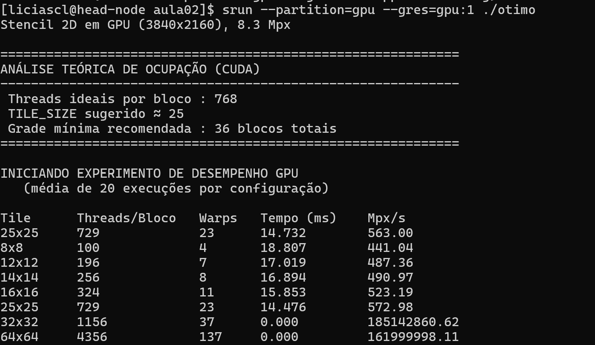
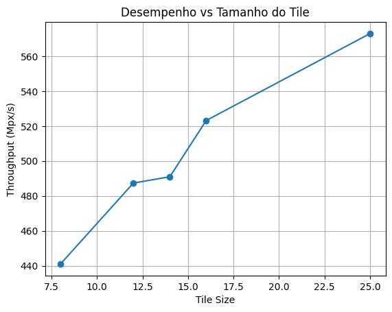

# **Otimização de memória em GPU**

Esta aula é sobre gerenciamento de memória em GPU usando operações de Stencil, estratégias de Tiling com memória compartilhada e agendamento de threads.

## **Organização de hardware em uma GPU NVIDIA**


Uma GPU da NVIDIA tem conjuntos de multiprocessadores chamados **SMs (Streaming Multiprocessors)**. Um SM em uma GPU é responsável pela execução de grupos de threads. Quando um grupo de threads é alocado a um SM, ele permanece nesse SM até o fim de sua execução. Cada SM é composto por um conjunto de núcleos, com memória compartilhada, registradores, unidade de load/store e uma unidade de escalonamento.



### **Hierarquia de Threads em CUDA**

A hierarquia de threads em CUDA é composta por uma grade (*grid*) de blocos de threads.

* **Thread block (Bloco de threads):** um bloco de threads é um conjunto de threads que são alocadas no mesmo SM, compartilham os recursos desse SM e cooperam entre si. Cada bloco de threads possui um identificador dentro de sua grid. Um bloco pode ser unidimensional, bidimensional ou tridimensional.

* **Grid:** uma grid é um conjunto de blocos de threads lançado por um kernel, que lê dados da memória global, escreve resultados na memória global e sincroniza dependências entre chamadas de kernels aninhadas. Uma grid é definida pelo usuário e também pode ser unidimensional, bidimensional ou tridimensional.



### **Warp**

Em CUDA, cada grupo de 32 threads consecutivas é chamado de **warp**. Um warp é a unidade primária de execução em um SM. Uma vez que um bloco de threads é alocado a um SM, ele é subdividido em um conjunto de warps para execução. Sempre há um número inteiro de warps por bloco de threads. Uma thread nunca será dividida entre dois warps. Cada SM contém um escalonador de warps responsável por escalonar os warps para os núcleos do SM. 


Fonte: https://developer.codeplay.com/products/computecpp/ce/1.3.0/guides/sycl-for-cuda-developers/execution-model


* **Warps:** grupos de 32 threads que executam em *SIMT* (Single Instruction, Multiple Thread).
* **SM (Streaming Multiprocessor):** executa vários warps alternadamente para amenizar a latência.
* O **agendador de warps** alterna entre os warps prontos para computação.


### Lógica de programação e efeitos no Hardware


Fonte: https://developer.nvidia.com/blog/cuda-refresher-cuda-programming-model/

O lado esquerdo da imagem é a visão do programador. O menor elemento é a *thread CUDA*, que representa uma unidade de execução lógica. Cada thread executa o mesmo código, mas opera sobre dados diferentes. Essas threads são organizadas em *thread blocks*, que são grupos de threads que podem cooperar entre si, compartilhar memória e sincronizar. Vários blocos formam uma *grid*, que corresponde a toda a execução de um kernel.

No lado direito está a correspondência com o hardware. Cada thread não é mapeada diretamente para um único núcleo físico de forma fixa. Em vez disso, threads são executadas em *CUDA cores*, que são as unidades aritméticas da GPU. Os blocos de threads são mapeados para *Streaming Multiprocessors (SMs)*, que são as unidades de execução principais da GPU. Cada SM contém vários CUDA cores, além de registradores e memória compartilhada. Já a grid inteira é distribuída entre vários SMs dentro da GPU.

Uma thread será executada em um CUDA core, mas não de forma exclusiva. Um bloco de threads é atribuído a um único SM, onde suas threads podem compartilhar recursos. Já a grid é distribuída pela GPU inteira, permitindo paralelismo em larga escala.


Implicações práticas:

* Melhor usar **blocos com múltiplos de 32 threads**.
* Evitar **divergência de fluxo** (ifs dentro do warp).
* Maximizar **ocupação**: usar `cudaOccupancyMaxPotentialBlockSize()` ajuda a determinar o tamanho adequado dos blocos.


## Stencil 

Um stencil é um padrão de computação geométrica onde o valor de um elemento é calculado com base em seus vizinhos.

* Fórmula geral:

$$
out[i, j] = f(in[i-1, j], in[i, j-1], in[i, j], in[i+1, j], in[i, j+1])
$$

Em operações de stencil, há uma alta reutilização de dados. Cada elemento da entrada é lido múltiplas vezes por diferentes threads que calculam elementos de saída vizinhos, isso é muito utilizado para resolver problemas de convolução, por exemplo.

### Operação de Convolução

A convolução é uma aplicação clássica de stencil. Um "filtro" ou "máscara" desliza sobre a imagem de entrada, realizando uma operação com os pixels vizinhos.



Convolução - Fonte: https://www.ibm.com/think/topics/convolutional-neural-networks

Código base, sem otimizações:

```cpp
// base.cu
#include <iostream>
#include <iomanip>
#include <cmath>
#include <cuda_runtime.h>

using namespace std;

#define MASK_RADIUS 1
#define ITER_LOCAL 100

// Kernel: stencil direto na memória global
__global__ void heatStencil2D_naive(float *input, float *output,
                                    int width, int height,
                                    float alpha, float dt) {

    // Índices globais da thread
    int j = blockIdx.x * blockDim.x + threadIdx.x;
    int i = blockIdx.y * blockDim.y + threadIdx.y;

    // Verifica se está dentro da imagem
    if (i >= height || j >= width) return;

    // Valor central
    float Tij  = input[i * width + j];
    float Tnew = Tij;

    for (int k = 0; k < ITER_LOCAL; k++) {
        float cima    = (i > 0)            ? input[(i-1)*width + j] : 0.0f;
        float baixo   = (i < height - 1)   ? input[(i+1)*width + j] : 0.0f;
        float esquerda= (j > 0)            ? input[i*width + (j-1)] : 0.0f;
        float direita = (j < width - 1)    ? input[i*width + (j+1)] : 0.0f;

        // filtro Laplaciano 
        float lap = cima + baixo + esquerda + direita - 4.0f * Tij;
        Tnew = Tij + alpha * dt * tanhf(lap);
        Tij  = 0.99f * Tnew + 0.01f * sinf(Tnew);
    }

    // Escrita do resultado
    output[i * width + j] = Tnew;
}

int main() {
    // Dimensões da matriz (resolução 4K)
    const int width  = 3840;
    const int height = 2160;

    // Número total de elementos (pixels)
    const int N = width * height;

    // Print das informações iniciais
    cout << "Stencil sem otimização (" << width << "x" << height
        << "), " << fixed << setprecision(1) << (N / 1e6) << " Mpx\n";

    // Parâmetros do modelo (controle da atualização do stencil)
    const float alpha = 0.25f;
    const float dt    = 0.1f;

    // Ponteiros para os dados de entrada e saída
    float *input = nullptr, *output = nullptr;

    // Alocação em memória global 
    cudaMallocManaged(&input,  N * sizeof(float));
    cudaMallocManaged(&output, N * sizeof(float));

    // Inicialização dos dados na CPU
    // todos os valores começam como 1.0
    for (int i = 0; i < N; i++) input[i] = 1.0f;

    // Configuração das threads por bloco (16x16 = 256 threads)
    // Valor típico: múltiplo de 32 (tamanho de um warp)
    dim3 threads(16, 16);

    // Cálculo do número de blocos necessários para cobrir a matriz
    dim3 blocks(
        (width  + threads.x - 1) / threads.x,
        (height + threads.y - 1) / threads.y
    );

    // Número de execuções do kernel para obter média de tempo
    const int repeats = 20;

    // Criação de eventos CUDA para medir tempo na GPU
    cudaEvent_t start, stop;
    cudaEventCreate(&start);
    cudaEventCreate(&stop);

    // Marca o início da medição
    cudaEventRecord(start);

    // Executa o kernel várias vezes
    // Isso reduz ruído na medição de desempenho
    for (int r = 0; r < repeats; r++) {
        heatStencil2D_naive<<<blocks, threads>>>(
            input, output, width, height, alpha, dt);
    }

    // Marca o fim da execução
    cudaEventRecord(stop);

    // Garante que o kernel terminou antes de medir o tempo
    cudaEventSynchronize(stop);

    // Tempo total acumulado (em milissegundos)
    float msTotal = 0.0f;
    cudaEventElapsedTime(&msTotal, start, stop);

    // Tempo médio por execução
    const double ms = msTotal / repeats;

    // Throughput: quantos elementos são processados por segundo
    // Métrica mais confiável para desempenho em GPU
    const double mpxPerSec = (N / 1e6) / (ms / 1000.0);

    // Impressão dos resultados
    cout << "\nTempo médio: " << ms << " ms\n";
    cout << "Throughput: " << mpxPerSec << " Mpx/s\n";

    // Liberação da memória
    cudaFree(input);
    cudaFree(output);

    return 0;
}
```

Para testar, primeiro carregue o módulo 
```bash
module load cuda/12.8.1
```

Compile com o `nvcc`:

```bash
nvcc base.cu -o base
```

Executando com srun
```bash
srun --partition=gpu --gres=gpu:1 ./base
```

## Vamos aplicar o **Tiling**

*Tiling* é uma técnica de otimização que divide um problema grande em **blocos menores (tiles)** que ocupam de uma foma melhor a memória do hardware. Em vez de processar toda a matriz de uma vez, processamos pedaços menores, reutilizando dados enquanto eles ainda estão em uma memória mais rápida.

A ideia é simples: **trazer um bloco de dados para uma memória mais rápida, usá-lo ao máximo e só depois buscar novos dados**.

Em CPU, o tiling é usado principalmente para **melhorar o uso de cache**.

Na GPU, o conceito é o mesmo, mas a forma de implementação muda bastante.

Aqui, não existe um cache tão transparente quanto na CPU. Em vez disso, temos a **memória compartilhada (shared memory)**, que é muito mais rápida que a memória global.

* Memória lenta → global memory
* Memória rápida → shared memory

O tiling na GPU funciona assim:

1. Um bloco de threads carrega um pedaço da matriz (tile) da memória global
2. Esse tile é armazenado na shared memory
3. Todas as threads do bloco reutilizam esses dados
4. Só depois um novo tile é carregado


Apesar das diferenças de arquitetura, o princípio é exatamente o mesmo:

* Dividir o problema em blocos menores
* Maximizar reutilização de dados
* Reduzir acessos à memória lenta
* Explorar localidade espacial e temporal


### Aplicando tilling no problema da convolução:

Para aplicar a técnica de tilling neste contexto, é importante planejar a implementação:

* Dividimos a matriz em **tiles** (blocos) que cabem na memória compartilhada.
* Cada bloco carrega seu pedaço + uma margem extra para carregar dados vizinhos.
* Cada *thread block* cuida de um tile.
* *Halo* é o pedaço adicional carregado com os dados vizinhos, para evitar dependência entre blocos.


Aplicando  as otimizações:
```cpp
// otimizado.cu
#include <iostream>
#include <iomanip>
#include <cmath>
#include <cuda_runtime.h>

using namespace std;

// Raio do stencil (1 → vizinhos imediatos)
#define MASK_RADIUS 1

// Número de iterações 
#define ITER_LOCAL 100

// Kernel: Stencil com tiling em memória compartilhada
__global__ void heatStencil2D(float *input, float *output,
                              int width, int height,
                              float alpha, float dt,
                              int tileSize) {

    // Cada bloco carrega um "tile" + halo
    extern __shared__ float tile[];

    // Tamanho total do tile incluindo bordas (halo)
    const int TILE_EXT = tileSize + 2 * MASK_RADIUS;

    // Índices locais da thread dentro do bloco
    int tx = threadIdx.x;
    int ty = threadIdx.y;

    // Índices globais na matriz (com deslocamento para incluir halo)
    int j = blockIdx.x * tileSize + tx - MASK_RADIUS;
    int i = blockIdx.y * tileSize + ty - MASK_RADIUS;


    // Cada thread carrega um elemento da memória global
    // para o tile em memória compartilhada
    if (i >= 0 && i < height && j >= 0 && j < width)
        tile[ty * TILE_EXT + tx] = input[i * width + j];
    else
        // Tratamento de borda: fora da imagem → valor 0
        tile[ty * TILE_EXT + tx] = 0.0f;

    // Sincronização: garante que todo o tile foi carregado
    __syncthreads();


    // Apenas threads da região interna (sem halo) trabalham
    if (tx >= MASK_RADIUS && tx < TILE_EXT - MASK_RADIUS &&
        ty >= MASK_RADIUS && ty < TILE_EXT - MASK_RADIUS &&
        i < height && j < width) {

        // Valor central
        float Tij  = tile[ty * TILE_EXT + tx];
        float Tnew = Tij;

        for (int k = 0; k < ITER_LOCAL; k++) {

            // operação do filtro Laplaciano 
            float lap =
                tile[(ty-1) * TILE_EXT + tx] +   // cima
                tile[(ty+1) * TILE_EXT + tx] +   // baixo
                tile[ty * TILE_EXT + (tx-1)] +   // esquerda
                tile[ty * TILE_EXT + (tx+1)] -   // direita
                4.0f * Tij;                     // centro

            Tnew = Tij + alpha * dt * tanhf(lap);
            Tij  = 0.99f * Tnew + 0.01f * sinf(Tnew);
        }

        // Escrita do resultado final na memória global
        output[i * width + j] = Tnew;
    }
}


int main() {

    //
    const int width  = 3840;
    const int height = 2160;
    const int N = width * height;

    cout << "Stencil 2D em GPU (" << width << "x" << height
         << "), " << fixed << setprecision(1) << (N / 1e6) << " Mpx\n";

    // Parâmetros físicos do modelo
    const float alpha = 0.25f;
    const float dt    = 0.1f;

    // Alocação com memória unificada (simplifica CPU<->GPU)
    float *input = nullptr, *output = nullptr;
    cudaMallocManaged(&input,  N * sizeof(float));
    cudaMallocManaged(&output, N * sizeof(float));

    // Inicialização dos dados
    for (int i = 0; i < N; i++) input[i] = 1.0f;

    int minGrid = 0, optBlock = 0;

    // Sugere número ideal de threads por bloco
    cudaOccupancyMaxPotentialBlockSize(&minGrid, &optBlock,
                                       heatStencil2D, 0, 0);

    // Converte para dimensão 2D (aproximação)
    int suggestedTileExt  = (int)floor(sqrt((double)optBlock));
    int suggestedTileSize = suggestedTileExt - 2 * MASK_RADIUS;

    if (suggestedTileSize < 4) suggestedTileSize = 4;

    cout << "\n============================================================\n";
    cout << "ANÁLISE TEÓRICA DE OCUPAÇÃO (CUDA)\n";
    cout << "------------------------------------------------------------\n";
    cout << " Threads ideais por bloco : " << optBlock << "\n";
    cout << " TILE_SIZE sugerido ≈ " << suggestedTileSize << "\n";
    cout << " Grade mínima recomendada : " << minGrid << " blocos totais\n";
    cout << "============================================================\n\n";

    // Número de repetições para média de tempo
    const int repeats = 20;

    // Teste com diferentes tamanhos de tile
    int tileSizes[] = {8, 12, 14, 16, 25, 32, 64};
    const int numTests = sizeof(tileSizes) / sizeof(tileSizes[0]);

    cout << "INICIANDO EXPERIMENTO DE DESEMPENHO GPU\n";
    cout << "   (média de " << repeats << " execuções por configuração)\n\n";

    cout << left
         << setw(10) << "Tile"
         << setw(16) << "Threads/Bloco"
         << setw(8)  << "Warps"
         << setw(14) << "Tempo (ms)"
         << setw(14) << "Mpx/s"
         << "\n";

    // Loop de testes
    for (int t = 0; t < numTests; t++) {

        int TILE_SIZE = tileSizes[t];
        if (TILE_SIZE <= 0) continue;

        // Tamanho total incluindo halo
        const int TILE_EXT = TILE_SIZE + 2 * MASK_RADIUS;

        // Threads por bloco
        const int threadsPerBlock = TILE_EXT * TILE_EXT;

        // Número de warps (32 threads por warp)
        const int warps = (threadsPerBlock + 31) / 32;

        // Configuração do kernel
        dim3 threads(TILE_EXT, TILE_EXT);
        dim3 blocks(
            (width  + TILE_SIZE - 1) / TILE_SIZE,
            (height + TILE_SIZE - 1) / TILE_SIZE
        );

        // Memória compartilhada necessária
        size_t shmem = (size_t)TILE_EXT * TILE_EXT * sizeof(float);

        // Eventos CUDA para medir tempo
        cudaEvent_t start, stop;
        cudaEventCreate(&start);
        cudaEventCreate(&stop);

        cudaEventRecord(start);

        // Executa várias vezes para média
        for (int r = 0; r < repeats; r++) {
            heatStencil2D<<<blocks, threads, shmem>>>(
                input, output, width, height, alpha, dt, TILE_SIZE);
        }

        cudaEventRecord(stop);
        cudaEventSynchronize(stop);

        float msTotal = 0.0f;
        cudaEventElapsedTime(&msTotal, start, stop);

        cudaEventDestroy(start);
        cudaEventDestroy(stop);

        // Tempo médio
        const double ms = msTotal / repeats;

        // Throughput 
        const double mpxPerSec = (N / 1e6) / (ms / 1000.0);

        cout << left
             << setw(10) << (to_string(TILE_SIZE) + "x" + to_string(TILE_SIZE))
             << setw(16) << threadsPerBlock
             << setw(8)  << warps
             << setw(14) << fixed << setprecision(3) << ms
             << setw(14) << fixed << setprecision(2) << mpxPerSec
             << "\n";
    }

    // Liberação de memória
    cudaFree(input);
    cudaFree(output);

    return 0;
}
```


Para testar, garanta que o módulo está carregado 
```bash
module load cuda/12.8.1
```

Compile com o `nvcc`:

```bash
nvcc otimizado.cu -o otimo
```

Executando com srun
```bash
srun --partition=gpu --gres=gpu:1 ./otimo
```

Se quiser um slurm:

```
#!/bin/bash
#SBATCH --job-name=GPU
#SBATCH --output=saida.out
#SBATCH --partition=gpu
#SBATCH --nodes=1
#SBATCH --ntasks=1
#SBATCH --gres=gpu:1      -// Aqui pedimos ao SLURM para alocar uma GPU
#SBATCH --time=00:10:00
#SBATCH --mem=4G


echo "========= Executando o Otimizado ==========="
./otimo

```

### Sobre os resultados:





Percebemos como o tamanho do bloco (tile) influencia a eficiência de execução de um kernel em GPU.

Para interpretar a tabela corretamente, é importante observar **três parâmetros principais**:

- Tempo médio (Tempo ms)
- Taxa de processamento (Mpx/s)

O **tempo (ms)** indica quanto cada configuração levou para processar toda a matriz. Valores menores significam execuções mais rápidas, mas devem ser analisados com cuidado: blocos grandes podem reduzir artificialmente o tempo total por utilizarem poucos blocos na GPU, o que mascara o real desempenho paralelo.

O parâmetro mais confiável é o **Mpx/s (milhões de pixels por segundo)**, que mede quantos milhões de elementos foram processados por segundo. Esse valor reflete o **throughput da GPU**, ou seja, quão bem o hardware foi aproveitado. Quanto maior o Mpx/s, mais eficiente foi o uso dos recursos. 

Ao comparar esses valores, percebemos que os blocos menores (8×8, 12×12) apresentam maiores tempos e menores taxas de Mpx/s.

Isso acontece porque há poucas threads por bloco, resultando em **subocupação** da GPU.

Nos blocos intermediários (14×14 a 25×25), o desempenho melhora gradualmente: o tempo diminui, e o Mpx/s aumenta até atingir um ponto em torno do tile de **25×25**, o valor sugerido pelo CUDA. Esse é o ponto de equilíbrio entre paralelismo e uso de memória compartilhada, o bloco é grande o suficiente para gerar alto throughput, mas não tão grande a ponto de limitar a quantidade de blocos ativos por SM.

Já o bloco de 32×32 aparenta ter tempo “zero”, mas isso é um bug de medição: o kernel termina tão rapidamente que o cronômetro perde precisão.
Na prática, blocos muito grandes consomem mais memória compartilhada e reduzem a **ocupação real da GPU**, resultando em menor eficiência, mesmo que o tempo aparente seja baixo.


