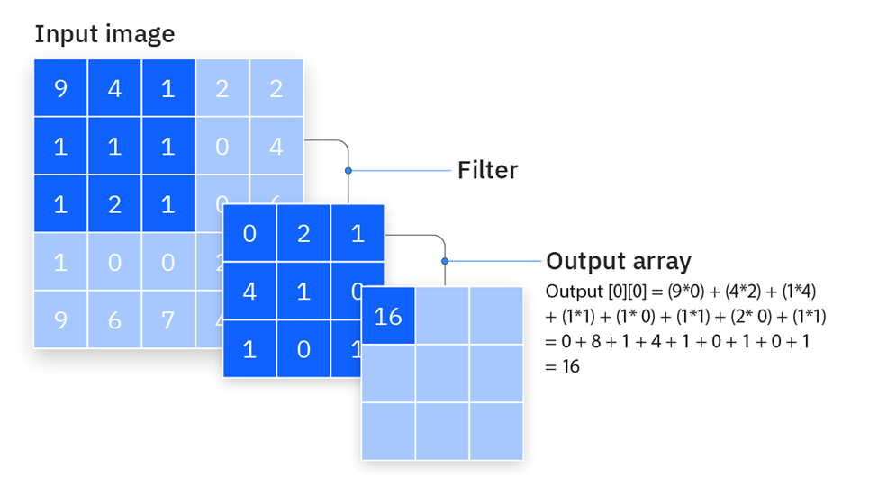
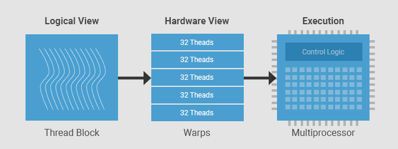
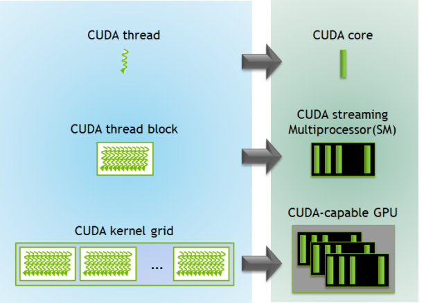

# **Programação Paralela em GPU com CUDA – Stencil, Tiling e Agendamento de Threads**

## O que é um *Stencil Operation*?

Um **stencil** é um padrão computacional onde o valor de uma célula de saída depende de uma **vizinhança local** de células de entrada.

* Fórmula geral:

$$
out[i, j] = f(in[i-1, j], in[i, j-1], in[i, j], in[i+1, j], in[i, j+1])
$$

Quando estamos trabalhando em GPU é preciso pensar **em blocos e vizinhos compartilhados**.


## **Aplicando a lógica de Stencil a uma operação de convolução**


Convolução - Fonte: https://www.ibm.com/think/topics/convolutional-neural-networks
### Exemplo: Filtro 3×3

**Problema:** cada thread acessa os mesmos elementos da memória global.

**Solução:** usar shared memory com tiling.

```cpp
__global__ void conv2D(float *input,   // ponteiro para a imagem de entrada 
                       float *output,  // ponteiro para a imagem de saída
                       float *mask,    // máscara 3x3 usada na convolução
                       int width,      // largura da imagem
                       int height) {   // altura da imagem

    int i = blockIdx.y * blockDim.y + threadIdx.y; // linha da imagem
    int j = blockIdx.x * blockDim.x + threadIdx.x; // coluna da imagem

    float acc = 0.0f; // acumulador
   
   // Varre a vizinhança 3x3 ao redor do pixel central (i, j)
    for (int y = -1; y <= 1; y++) {
        for (int x = -1; x <= 1; x++) {

            // Calcula a posição do vizinho dentro da imagem de entrada
            int r = i + y;
            int c = j + x;

            // Verifica se a posição (r, c) está dentro dos limites da imagem
            bool dentroDaImagem = (r >= 0 && r < height && c >= 0 && c < width);

            if (dentroDaImagem) {
                int pixelIndex = r * width + c;
                int maskRow = y + 1;
                int maskCol = x + 1;
                int maskIndex = maskRow * 3 + maskCol;
                float pixelValue = input[pixelIndex];
                float maskValue  = mask[maskIndex];

                acc += pixelValue * maskValue;
            }
        }
    }

    // Escreve o resultado final no pixel correspondente da saída.
    output[i * width + j] = acc;
}

```

## **Tiling**

### Relembrando:

* Dividimos a matriz em **tiles** (blocos) que cabem na memória compartilhada .
* Cada bloco carrega seu pedaço + uma margem extra para carregar dados vizinhos.
* Cada *thread block* cuida de um tile.
* *Halo* é o pedaço adicional carregado com os dados vizinhos, para evitar dependência entre blocos.
* `__syncthreads()` barreira para garantir que todas as threads carregaram antes de processar.


### Mesmo código, agora com *shared memory* e bordas

```cpp
#define TILE_SIZE 16      // tamanho da área de processamento do bloco
#define MASK_RADIUS 1     // raio da máscara 3x3
#define MASK_SIZE 3

__global__ void conv2D_tiled(float *input,   // imagem de entrada
                             float *output,  // imagem de saída
                             float *mask,    // máscara 3x3
                             int width,      // largura da imagem
                             int height) {   // altura da imagem
                             
                             
    int tx = threadIdx.x;  // coluna da thread dentro do bloco
    int ty = threadIdx.y;  // linha da thread dentro do bloco

    // posição global (i,j) da thread na imagem
    int j = blockIdx.x * TILE_SIZE + tx;
    int i = blockIdx.y * TILE_SIZE + ty;

    // Memória compartilhada do bloco
    __shared__ float tile[TILE_SIZE + 2 * MASK_RADIUS][TILE_SIZE + 2 * MASK_RADIUS];

    // Calcula a posição global do pixel que esta thread deve carregar
    int inputRow = i - MASK_RADIUS;
    int inputCol = j - MASK_RADIUS;

    // Carregamento da imagem para a memória compartilhada, cada thread carrega um elemento
    if (inputRow >= 0 && inputRow < height && inputCol >= 0 && inputCol < width) {
        tile[ty][tx] = input[inputRow * width + inputCol];
    } else {
        tile[ty][tx] = 0.0f;  // preenche com 0 fora da imagem 
    }

    // Garante que todas as threads terminaram de carregar o tile
    __syncthreads();

    // Somente threads dentro da região útil calculam o pixel de saída
    if (tx >= MASK_RADIUS && tx < TILE_SIZE + MASK_RADIUS &&
        ty >= MASK_RADIUS && ty < TILE_SIZE + MASK_RADIUS &&
        i < height && j < width) {

        float acc = 0.0f; // acumulador da convolução

        // Varre a vizinhança 3x3 dentro da memória compartilhada
        for (int y = -MASK_RADIUS; y <= MASK_RADIUS; y++) {
            for (int x = -MASK_RADIUS; x <= MASK_RADIUS; x++) {
                int maskRow = y + MASK_RADIUS;
                int maskCol = x + MASK_RADIUS;
                float pixelValue = tile[ty + y][tx + x];
                float maskValue  = mask[maskRow * MASK_SIZE + maskCol];
                acc += pixelValue * maskValue;
            }
        }

        // Escreve o valor final na imagem de saída (memória global)
        output[i * width + j] = acc;
    }
}

```


## **Agendamento de Threads**

A GPU organiza o trabalho em:


Fonte: https://developer.codeplay.com/products/computecpp/ce/1.3.0/guides/sycl-for-cuda-developers/execution-model


* **Warps:** grupos de 32 threads que executam em *SIMT* (Single Instruction, Multiple Thread).
* **SM (Streaming Multiprocessor):** executa vários warps alternadamente para amenizar a latência.
* O **agendador de warps** alterna entre os warps prontos para computação.



Fonte: https://developer.nvidia.com/blog/cuda-refresher-cuda-programming-model/

### Implicações práticas:

* Melhor usar **blocos com múltiplos de 32 threads**.
* Evitar **divergência de fluxo** (ifs dentro do warp).
* Maximizar **ocupação**: usar `cudaOccupancyMaxPotentialBlockSize()` ajuda a determinar o tamanho adequado dos blocos.


Aplicando todas as otimizações:
```cpp
//demo.cu
#include <iostream>
#include <iomanip>
#include <cmath>
#include <cuda_runtime.h>
using namespace std;

#define MASK_RADIUS 1
#define ITER_LOCAL 100  

// Stencil 2D com tiling em shared
__global__ void heatStencil2D(float *input, float *output,
                              int width, int height,
                              float alpha, float dt,
                              int tileSize) {
    extern __shared__ float tile[];  // shared dinâmica (TILE_EXT*TILE_EXT floats)
    const int TILE_EXT = tileSize + 2 * MASK_RADIUS;

    int tx = threadIdx.x;
    int ty = threadIdx.y;

    // mapeia thread do bloco para coordenadas globais com halo
    int j = blockIdx.x * tileSize + tx - MASK_RADIUS;
    int i = blockIdx.y * tileSize + ty - MASK_RADIUS;

    // carrega input -> shared (com padding 0 fora da imagem)
    if (i >= 0 && i < height && j >= 0 && j < width)
        tile[ty * TILE_EXT + tx] = input[i * width + j];
    else
        tile[ty * TILE_EXT + tx] = 0.0f;

    __syncthreads();

    // região útil (ignora threads que só carregaram halo)
    if (tx >= MASK_RADIUS && tx < TILE_EXT - MASK_RADIUS &&
        ty >= MASK_RADIUS && ty < TILE_EXT - MASK_RADIUS &&
        i < height && j < width) {

        float Tij  = tile[ty * TILE_EXT + tx];
        float Tnew = Tij;

        for (int k = 0; k < ITER_LOCAL; k++) {
            float lap =
                tile[(ty-1) * TILE_EXT + tx] +
                tile[(ty+1) * TILE_EXT + tx] +
                tile[ty * TILE_EXT + (tx-1)] +
                tile[ty * TILE_EXT + (tx+1)] -
                4.0f * Tij;

            Tnew = Tij + alpha * dt * tanhf(lap);
            Tij  = 0.99f * Tnew + 0.01f * sinf(Tnew);
        }

        output[i * width + j] = Tnew;
    }
}


int main() {
    // Conjunto de dados
    const int width  = 8192;
    const int height = 8192;
    const long long N = 1LL * width * height;

    cout << "Stencil 2D em GPU (" << width << "x" << height
         << "), " << fixed << setprecision(1) << (N/1e6) << " Mpx\n";

    // parâmetros “físicos” para a conta
    const float alpha = 0.25f;
    const float dt    = 0.1f;

    // alocação com cuda Malloc Managed
    float *input = nullptr, *output = nullptr;
    CHECK_CUDA(cudaMallocManaged(&input,  N * sizeof(float)));
    CHECK_CUDA(cudaMallocManaged(&output, N * sizeof(float)));

    // inicialização simples
    for (long long i = 0; i < N; i++) input[i] = 1.0f;

    // threads por bloco
    int minGrid=0, optBlock=0;
    CHECK_CUDA(cudaOccupancyMaxPotentialBlockSize(&minGrid, &optBlock,
                     heatStencil2D, 0, 0));

    // tile aproximado
    int suggestedTileExt  = (int)floor(sqrt((double)optBlock));
    int suggestedTileSize = suggestedTileExt - 2*MASK_RADIUS;
    if (suggestedTileSize < 4) suggestedTileSize = 4; // sanidade
    
    // ================================================================
    // Análise de ocupação teórica (CUDA)
    // ================================================================
    cout << "\n============================================================\n";
    cout << "ANÁLISE DOS TILES\n";
    cout << "------------------------------------------------------------\n";
    cout << "• Threads ideais por bloco : " << optBlock << "\n";
    cout << "• TILE_EXT sugerido        : " << suggestedTileExt
        << "  →  TILE_SIZE sugerido ≈ " << suggestedTileSize << "\n";
    cout << "• Grade mínima recomendada : " << minGrid << " blocos totais\n";
    cout << "============================================================\n\n";

    // ================================================================
    // Testando diferentes tamanhos de TILE
    // ================================================================
    int tileSizes[] = {suggestedTileSize, 8, 12, 14, 16, 32};
    const int numTests = sizeof(tileSizes)/sizeof(tileSizes[0]);

    cout << "INICIANDO EXPERIMENTO DE DESEMPENHO GPU\n";
    cout << "   (média de " << repeats << " execuções por configuração)\n\n";

    cout << left
        << setw(10) << "Tile"
        << setw(16) << "Threads/Bloco"
        << setw(8)  << "Warps"
        << setw(14) << "Tempo (ms)"
        << setw(14) << "Mpx/s"
        << "Comentário\n";
    cout << string(75, '-') << "\n";

    // Mede média de várias execuções para precisão
    const int repeats = 20;

    for (int t = 0; t < numTests; t++) {
        int TILE_SIZE = tileSizes[t];
        if (TILE_SIZE <= 0) continue;

        const int TILE_EXT = TILE_SIZE + 2 * MASK_RADIUS;
        const int threadsPerBlock = TILE_EXT * TILE_EXT;
        const int warps = (threadsPerBlock + 31) / 32;

        dim3 threads(TILE_EXT, TILE_EXT);
        dim3 blocks(
            (width  + TILE_SIZE - 1) / TILE_SIZE,
            (height + TILE_SIZE - 1) / TILE_SIZE
        );

        size_t shmem = (size_t)TILE_EXT * TILE_EXT * sizeof(float);

        // --- Medição do tempo médio ---
        cudaEvent_t start, stop;
        CHECK_CUDA(cudaEventCreate(&start));
        CHECK_CUDA(cudaEventCreate(&stop));

        CHECK_CUDA(cudaEventRecord(start));
        for (int r = 0; r < repeats; r++) {
            heatStencil2D<<<blocks, threads, shmem>>>(input, output, width, height, alpha, dt, TILE_SIZE);
        }
        CHECK_CUDA(cudaEventRecord(stop));
        CHECK_CUDA(cudaEventSynchronize(stop));

        float msTotal = 0.0f;
        CHECK_CUDA(cudaEventElapsedTime(&msTotal, start, stop));
        CHECK_CUDA(cudaEventDestroy(start));
        CHECK_CUDA(cudaEventDestroy(stop));

        const double ms = msTotal / repeats;
        const double mpxPerSec = (N / 1e6) / (ms / 1000.0); // milhões de pixels por segundo

        // --- Análise do resultado ---
        string comment;
        if (threadsPerBlock == optBlock)
            comment = "≈ Ideal teórico ";
        else if (abs(threadsPerBlock - optBlock) < 64)
            comment = "Próximo ao ideal";
        else if (threadsPerBlock < optBlock)
            comment = "Subocupação (bloco pequeno)";
        else
            comment = "Shared alta";

        cout << left
            << setw(10) << (to_string(TILE_SIZE) + "x" + to_string(TILE_SIZE))
            << setw(16) << threadsPerBlock
            << setw(8)  << warps
            << setw(14) << fixed << setprecision(3) << ms
            << setw(14) << fixed << setprecision(2) << mpxPerSec
            << comment << "\n";
    }

    CHECK_CUDA(cudaFree(input));
    CHECK_CUDA(cudaFree(output));
    return 0;
}
```

Slurm para executar em um Cluster HPC:

```
#!/bin/bash
#SBATCH --job-name=demo
#SBATCH --output=saida.out
#SBATCH --partition=gpu
#SBATCH --nodes=1
#SBATCH --ntasks=1
#SBATCH --gres=gpu:1
#SBATCH --time=00:10:00
#SBATCH --mem=4G

./demo

```

!!!! warning "Não esqueça de carregar o modulo cuda e compilar com nvcc"


### Conclusão

Percebemos como o tamanho do bloco (tile) influencia a eficiência de execução de um kernel em GPU.

Para interpretar a tabela corretamente, é importante observar **três parâmetros principais**:

- Tempo médio (Tempo ms)
- Taxa de processamento (Mpx/s)

O **tempo (ms)** indica quanto cada configuração levou para processar toda a matriz. Valores menores significam execuções mais rápidas, mas devem ser analisados com cuidado: blocos grandes podem reduzir artificialmente o tempo total por utilizarem poucos blocos na GPU, o que mascara o real desempenho paralelo.

O parâmetro mais confiável é o **Mpx/s (milhões de pixels por segundo)**, que mede quantos milhões de elementos foram processados por segundo. Esse valor reflete o **throughput da GPU**, ou seja, quão bem o hardware foi aproveitado. Quanto maior o Mpx/s, mais eficiente foi o uso dos recursos. 

Ao comparar esses valores, percebemos que os blocos menores (8×8, 12×12) apresentam maiores tempos e menores taxas de Mpx/s.

Isso acontece porque há poucas threads por bloco, resultando em **subocupação** da GPU.

Nos blocos intermediários (14×14 a 25×25), o desempenho melhora gradualmente: o tempo diminui, e o Mpx/s aumenta até atingir um ponto em torno do tile de **25×25**, o valor sugerido pelo CUDA. Esse é o ponto de equilíbrio entre paralelismo e uso de memória compartilhada, o bloco é grande o suficiente para gerar alto throughput, mas não tão grande a ponto de limitar a quantidade de blocos ativos por SM.

Já o bloco de 32×32 aparenta ter tempo “zero”, mas isso é um bug de medição: o kernel termina tão rapidamente que o cronômetro perde precisão.
Na prática, blocos muito grandes consomem mais memória compartilhada e reduzem a **ocupação real da GPU**, resultando em menor eficiência, mesmo que o tempo aparente seja baixo.

O tempo isolado não é o melhor indicador, o desempenho real está no ponto em que o **Mpx/s é máximo**, pois esse indicador apresenta de fato o trabalho da GPU.

