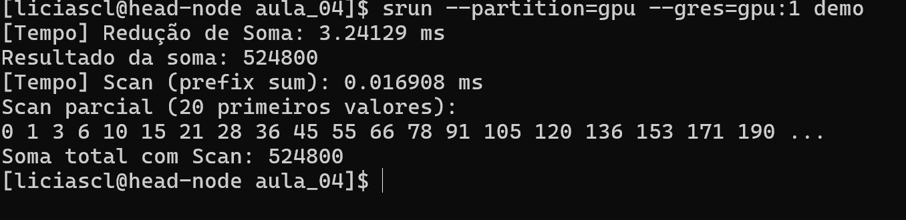

# **Programação paralela em GPU Redução e Scan com CUDA**

## Redução
Uma redução é uma operação onde muitos elementos são combinados em um só, em CUDA, não podemos usar algo como`sum += x[i]` diretamente. Precisamos de uma abordagem recursiva que reduza pares de elementos em várias etapas.

### Estrutura conceitual da redução

O objetivo da redução é combinar N elementos em um único valor.

Como cada soma combina dois elementos por vez, após uma etapa de soma, o número de resultados parciais é metade do original.

Por exemplo:

| Etapa       | Entradas                           | Operação                              | Saídas |
| ----------- | ---------------------------------- | ------------------------------------- | ------ |
| 0 (inicial) | 8 valores                          | -                                     | 8      |
| 1           | (x₀+x₁), (x₂+x₃), (x₄+x₅), (x₆+x₇) | 4 threads somam pares                 | 4      |
| 2           | (x₀+x₁+x₂+x₃), (x₄+x₅+x₆+x₇)       | 2 threads somam resultados anteriores | 2      |
| 3           | (x₀+x₁+x₂+x₃+x₄+x₅+x₆+x₇)          | 1 thread soma os últimos dois         | 1      |

Assim, a cada etapa o número de somas necessárias cai pela metade, logo o número de threads trabalhando também deve cair pela metade.


No código, o `stride` representa a distância entre os elementos que estão sendo somados em cada passo:

```cpp
for (unsigned int stride = blockDim.x; stride > 0; stride /= 2) {
    __syncthreads();
    if (t < stride)
        partialSum[t] += partialSum[t + stride];
}
```

Na primeira iteração (`stride = blockDim.x / 2`), metade das threads soma pares de elementos:

    Thread 0 soma elementos 0 e 512

    Thread 1 soma elementos 1 e 513

    ...

    Thread 511 soma elementos 511 e 1023

Após essa etapa, os 512 primeiros elementos já contêm as somas parciais.

Na próxima iteração (`stride = 256`), apenas as 256 primeiras threads continuam, elas somam pares de resultados parciais. Esse processo continua até que reste apenas uma thread (t = 0), que contém a soma total.

Esse padrão forma uma árvore binária de redução, onde cada nível tem metade dos nós do anterior.


### Estratégia:

* Usar **memória compartilhada** (`__shared__`) para armazenar os somatórios parciais.
* Em cada etapa, **metade das threads** faz soma com valores vizinhos
* O resultado final estará no índice `0` do vetor parcial.

```cpp
// Kernel de redução paralela usando memória compartilhada
__global__ void reduceShared(float *input, float *output, int N) {
    // Vetor alocado dinamicamente na memória compartilhada
    extern __shared__ float partialSum[];

    // Índice da thread no bloco
    unsigned int t = threadIdx.x;

    // Cálculo do índice inicial do bloco (cada bloco processa 2 * blockDim.x elementos)
    unsigned int start = 2 * blockIdx.x * blockDim.x;

    // Cada thread carrega um elemento para a posição t do vetor compartilhado
    if (start + t < N)
        partialSum[t] = input[start + t];
    else
        partialSum[t] = 0.0f;  // preenchimento com zero se passar do fim do vetor

    // Cada thread também carrega um segundo elemento, para a posição blockDim.x + t
    if (start + blockDim.x + t < N)
        partialSum[blockDim.x + t] = input[start + blockDim.x + t];
    else
        partialSum[blockDim.x + t] = 0.0f;

    // Loop de redução: stride aumenta a cada passo (1, 2, 4, ..., blockDim.x)
    for (unsigned int stride = 1; stride <= blockDim.x; stride *= 2) {
        // Garante que todos os valores foram somados antes de prosseguir
        __syncthreads();

        // Threads cujos índices são múltiplos de 'stride' fazem a soma com seu vizinho à direita
        if (t % stride == 0)
            partialSum[2 * t] += partialSum[2 * t + stride];
    }

    // Sincronização final antes de escrever na memória global
    __syncthreads();

    // Apenas a primeira thread de cada bloco escreve o resultado parcial no vetor de saída
    if (t == 0)
        output[blockIdx.x] = partialSum[0];
}
```

Durante cada etapa da redução paralela, o controle sobre quais threads participam da computação influencia diretamente a eficiência da execução no modelo SIMT (Single Instruction, Multiple Threads) da GPU.

Em CUDA, as threads são organizadas em warps de 32 threads que executam as mesmas instruções em blocos sincronizados. Quando se usa uma condição como `t % stride == 0`, as threads ativas a cada etapa ficam espaçadas: apenas aquelas com índice múltiplo de `stride` participam da operação, enquanto as demais permanecem ociosas. Isso leva a dois problemas principais:

1. **Desalinhamento da execução por warp:** embora não haja necessariamente divergência de controle explícita, os warps passam a executar parcialmente, com poucas threads ativas por warp, o que reduz o aproveitamento do paralelismo interno.

2. **Perda da localidade de memória:** os acessos ao vetor compartilhado (`partialSum[]`) deixam de ser contíguos. Threads ativas acessam posições cada vez mais distantes, prejudicando o uso eficiente da cache e da memória compartilhada.

Esses dois fatores combinados degradam significativamente o desempenho.


**Threads espaçadas (divergência alta)**

| Stride | Threads ativas (`t % stride == 0`)              | Observação                |
| ------ | ----------------------------------------------- | ------------------------- |
| 1      | 0 1 2 3 4 5 6 7 8 9 10 11 12 13 14 15 16 ... 31 | todas as threads ativas   |
| 2      | 0 x 2 x 4 x 6 x 8 x 10 x 12 x 14 x 16 ... 30    | metade das threads ativas |
| 4      | 0 x x x 4 x x x 8 x x x  12 x x x  16 ... 28    | 25% das threads ativas    |
| 8      | 0 x x x x x x x 8 x x x x x x x x  16 ... 24    | 12.5% das threads ativas  |
| 16     | 0 x x x x x x x x x x x x x x x x  16 x x x     | apenas 2 threads ativas   |
| 32     | 0 x x x x x x x x x x x x x x x x x x x x x     | uma thread ativa          |


Para resolver esse problema, uma abordagem mais eficiente é reescrever o laço de redução utilizando a condição `if (t < stride)` e iniciando o `stride` com o valor de `blockDim.x`, reduzindo pela metade a cada iteração. 

Com essa estratégia, em cada etapa da redução, as threads ativas são aquelas com índices consecutivos, formando grupos contíguos de threads. 

Isso significa que, nas iterações iniciais, os warps executam de forma uniforme, com todas as threads de um warp realizando a mesma operação, evitando divergência. A divergência só ocorre nas últimas etapas da redução, quando o número de threads ativas se torna inferior a 32, o que tem impacto muito menor no desempenho geral, pois já há menos trabalho a ser feito.

Além de reduzir a divergência, essa abordagem também melhora a localidade espacial do código:

```cpp
for (unsigned int stride = blockDim.x; stride > 0; stride /= 2) {
    __syncthreads();
    if (t < stride)
        partialSum[t] += partialSum[t + stride];
}
```

Vantagem: threads ativas são consecutivas → **sem warp divergentes**


**Threads contíguas sem divergência**

| Stride | Threads ativas (`t < stride`) | Observação                         |
| ------ | ----------------------------- | ---------------------------------- |
| 32     | 0 1 2 3 4 5 6 7 8 9 10 ... 31 | warp inteiro executa uniformemente |
| 16     | 0 1 2 3 4 5 6 7 8 9 10 ... 15 | metade do warp, contígua           |
| 8      | 0 1 2 3 4 5 6 7 x x x         | 8 threads contíguas ativas         |
| 4      | 0 1 2 3 x x x x x x x         | 4 threads contíguas ativas         |
| 2      | 0 1 x x x x x x x x x         | 2 threads                          |
| 1      | 0 x x x x x x x x x x         | 1 thread                           |


**Comparando as duas versões:**

```
Versão (t % stride == 0):

Stride  1 → [* * * * * * * * * * * * * * * * * * * * * * * * * * * * * * * *]
Stride  2 → [* X * X * X * X * X * X * X * X * X * X * X * X]
Stride  4 → [* X X X * X X X * X X X * X X X * X X X * X X X]
Stride  8 → [* X X X X X X X * X X X X X X X * X X X X X X X *]
Stride 16 → [* X X X X X X X X X X X X X X X * X X X X X X X X X X X X X X X]
Stride 32 → [* X X X X X X X X X X X X X X X X X X X X X X X X X X X X X X X]
(Localidade espacial ruim)

Versão (t < stride):

Stride 32 → [* * * * * * * * * * * * * * * * * * * * * * * * * * * * * * * *]
Stride 16 → [* * * * * * * * * * * * * * * * X X X X X X X X X X X X X X X X]
Stride  8 → [* * * * * * * * X X X X X X X X X X X X X X X X X X X X X X X X]
Stride  4 → [* * * * X X X X X X X X X X X X X X X X X X X X X X X X X X X X]
Stride  2 → [* * X X X X X X X X X X X X X X X X X X X X X X X X X X X X X X]
Stride  1 → [* X X X X X X X X X X X X X X X X X X X X X X X X X X X X X X X]
(Boa localidade espacial)

```

## Scan

Em algumas situações não basta saber apenas o valor total da operação, precisamos saber **a soma parcial até cada ponto** ou seja, os **prefixos acumulados**. Para isso, usamos a operação chamada **scan** (ou **prefix sum**).

Exemplo de **scan**:

```cpp
Entrada:  [3, 1, 7, 0, 4, 1, 6, 3]
Scan:     [0, 3, 4, 11, 11, 15, 16, 22]
```

Aqui, cada posição `i` contém a soma de todos os elementos anteriores `A[0] + A[1] + ... + A[i-1]`.

**Diferença prática entre redução e scan**

| Operação | Resultado         | Quando usar                    |
| -------- | ----------------- | ------------------------------ |
| Redução  | Valor único       | Quando só o total importa      |
| Scan     | Vetor de prefixos | Quando queremos somas parciais |

A redução descarta as somas intermediárias. Já o scan preserva essas informações, o que é essencial para várias aplicações como:

* Compactação de vetores
* Geração de índices de escrita
* Alocação dinâmica paralela
* Processamento de streams
* Pré-processamento em algoritmos de ordenação (ex: radix sort)

### **Scan Simples**

Nesta versão cada thread calcula seu valor somando os valores anteriores, exatamente como faríamos sequencialmente, mas de forma paralela e em várias etapas.

### Estratégia:

* Cada thread carrega um valor.
* Em cada etapa, somamos com o valor de uma certa "distância" (`stride`).
* A distância dobra a cada passo: 1, 2, 4, 8...

```plaintext
stride = 1 → somar vizinhos:
[3, 1, 7, 0, 4, 1, 6, 3]
 ↓  ↓  ↓  ↓
[3, 4, 7, 7, 4, 5, 6, 9]

stride = 2 → somar a cada 2:
[3, 4, 7, 7, 4, 5, 6, 9]
     ↓      ↓
[3, 4, 10, 7, 4, 5, 15, 9]

stride = 4 → somar centro da árvore:
[3, 4, 10, 7, 4, 5, 15, 9]
               ↓
[3, 4, 10, 7, 4, 5, 15, 25]

```

Esse padrão continua até que todas as somas estejam corretas.

### Código (CUDA):

```cpp
__global__ void scan_simples(int *entrada, int *saida, int N) {
    extern __shared__ int XY[];
    int tid = threadIdx.x;
    int gid = blockIdx.x * blockDim.x + tid;

    // 1. Cada thread lê da entrada (ajustado para scan)
    if (gid > 0 && gid < N)
        XY[tid] = entrada[gid - 1];
    else
        XY[tid] = 0;

    __syncthreads();

    // 2. Para cada passo, somar com o valor `stride` posições atrás
    for (int passo = 1; passo < blockDim.x; passo *= 2) {
        int temp = 0;
        if (tid >= passo)
            temp = XY[tid - passo];
        __syncthreads();
        XY[tid] += temp;
        __syncthreads();
    }

    // 3. Escreve no vetor de saída
    if (gid < N)
        saida[gid] = XY[tid];
}
```

## Limitações dessa abordagem

Apesar de simples, essa versão faz mais operações do que o necessário:

* Todas as threads participam em todas as etapas.
* Muitas threads fazem trabalho redundante ou nulo (especialmente nas etapas iniciais).
* O número total de somas realizadas é **O(n log n)**, maior que o necessário.


## Otimização: Varredura em Árvore com Propagação Reversa

Essa versão reduz o trabalho total para **O(n)** usando uma **abordagem em duas fases**:

1. **Up-sweep (redução):** combina pares de elementos até o topo da árvore (como uma redução soma).
2. **Down-sweep (propagação):** distribui os prefixos acumulados corretamente.


### Etapas da otimização:

#### Fase 1 – Up-Sweep

```plaintext
[3, 1, 7, 0, 4, 1, 6, 3]

Passo 1 (stride = 1): soma pares → [3+1, 7+0, 4+1, 6+3] = [4, 7, 5, 9]
Passo 2 (stride = 2): soma pares → [4+7, 5+9] = [11, 14]
Passo 3 (stride = 4): soma final → 11 + 14 = 25
```

#### Fase 2 – Down-Sweep

Distribui os prefixos sem repetir as somas anteriores. Cada valor novo é derivado da soma anterior. O valor final de cada posição será a soma de todos os anteriores, **excluindo a própria posição**.

### Código (CUDA otimizado):

```cpp
__global__ void scan_otimizado(int* entrada, int* saida, int N) {
    extern __shared__ int vetor_auxiliar[];

    int tid = threadIdx.x;
    int inicio_bloco = 2 * blockDim.x * blockIdx.x;
    int indice_global = inicio_bloco + tid;

    int tamanho_bloco = 2 * blockDim.x;

    // Carregamento de dois elementos por thread na memória compartilhada
    int valor_esquerda = 0;
    int valor_direita  = 0;

    if (indice_global < N)
        valor_esquerda = entrada[indice_global];

    if (indice_global + blockDim.x < N)
        valor_direita = entrada[indice_global + blockDim.x];

    vetor_auxiliar[tid] = valor_esquerda;
    vetor_auxiliar[tid + blockDim.x] = valor_direita;

    __syncthreads();

    // --- Fase 1: Up-sweep (redução para soma total do bloco) ---
    for (int passo = 1; passo < tamanho_bloco; passo *= 2) {
        int indice = (tid + 1) * passo * 2 - 1;

        if (indice < tamanho_bloco)
            vetor_auxiliar[indice] += vetor_auxiliar[indice - passo];

        __syncthreads();
    }

    // Zera o último elemento para começar o down-sweep (scan exclusivo)
    if (tid == 0)
        vetor_auxiliar[tamanho_bloco - 1] = 0;

    __syncthreads();

    // --- Fase 2: Down-sweep (distribui os prefixos) ---
    for (int passo = tamanho_bloco / 2; passo >= 1; passo /= 2) {
        int indice = (tid + 1) * passo * 2 - 1;

        if (indice < tamanho_bloco) {
            int valor_anterior = vetor_auxiliar[indice - passo];
            vetor_auxiliar[indice - passo] = vetor_auxiliar[indice];
            vetor_auxiliar[indice] += valor_anterior;
        }

        __syncthreads();
    }

    // Escreve os valores de volta no vetor de saída
    if (indice_global < N)
        saida[indice_global] = vetor_auxiliar[tid];

    if (indice_global + blockDim.x < N)
        saida[indice_global + blockDim.x] = vetor_auxiliar[tid + blockDim.x];
}

```

## Exercício: Redução e Scan com CUDA

Neste exercício, você vai aplicar os conceitos de redução e scan (prefix sum) utilizando programação paralela em GPU com CUDA, aproveitando os recursos de memória compartilhada, sincronização de threads e organização de blocos para maximizar o desempenho da operação.


###  Parte 1: Soma Total com Redução Paralela

Implemente um kernel CUDA chamado que receba um vetor `input` com `N` elementos e produza como saída a soma total desses elementos no vetor `output`.

* Utilize memória compartilhada para armazenar os somatórios parciais dentro de cada bloco.
* Cada bloco deve processar 2 × blockDim.x elementos por vez.
* Use a versão otimizada da redução, com `if (t < stride)` e `stride` decrescendo pela metade em cada etapa.
* O resultado parcial de cada bloco deve ser escrito em `output[blockIdx.x]`.
* Após o kernel principal, chame esse kernel recursivamente até obter o valor total.


### Parte 2: Scan Otimizado

Implemente um kernel CUDA chamado `scan_otimizado(int *entrada, int *saida, int N)` que calcule a soma acumulada dos elementos de entrada.

* Up-sweep: combina pares de elementos como uma redução.
* Down-sweep: distribui os prefixos acumulados para formar o resultado final.
* Cada thread deve carregar dois elementos para melhor aproveitamento da memória compartilhada.
* O vetor resultante `saida[i]` deve conter a soma de `entrada[0] + entrada[1] + ... + entrada[i-1]`.
* Apresente também o valor total da soma calculado com scan

O resultado deve ser algo como:




```cpp
#include <iostream>
#include <vector>
#include <numeric>   // std::iota


// Gera vetor com valores de 1 a N
std::vector<int> gerar_dados(int N) {
    std::vector<int> dados(N);
    std::iota(dados.begin(), dados.end(), 1); // dados = [1, 2, 3, ..., N]
    return dados;
}

// --- TODO 1: Implementar Redução ---
// altere a função para ser executada em um kernel CUDA
int reducao_soma(const std::vector<int>& dados) {
    int soma = 0;

    // TODO: implemente a redução aqui 

    return soma;
}

// --- TODO 2: Implementar Scan ---
// altere a função para ser executada em um kernel CUDA
std::vector<int> scan_prefix_sum(const std::vector<int>& dados) {
    int N = dados.size();
    std::vector<int> prefixos(N);

    // TODO: implemente o scan aqui
    // Cada prefixos[i] deve ser igual à soma de dados[0] até dados[i]

    return prefixos;
}

int main() {
    const int N = 2048;
    std::vector<int> entrada = gerar_dados(N);

    // --- Redução ---
    // TODO: faça a medição do tempo de execução 
    int resultado_soma = reducao_soma(entrada);
 
    std::cout << "[Tempo] Redução de Soma: " << ?????? << "\n";
    std::cout << "Resultado da soma: " << resultado_soma << "\n";

    // --- Scan ---
    // TODO: faça a medição do tempo de execução 
    std::vector<int> prefixos = scan_prefix_sum(entrada);
    
    std::cout << "[Tempo] Scan (prefix sum): " << ??????? << "\n";
    std::cout << "Scan parcial (20 primeiros valores):\n";
    for (int i = 0; i < 20; ++i)
        std::cout << prefixos[i] << " ";
    std::cout << "...\n";

    // TODO: faça o print do valor total da soma calculado pela função scan 


    return 0;
}

```

**A resolução deste exercício não tem entrega**