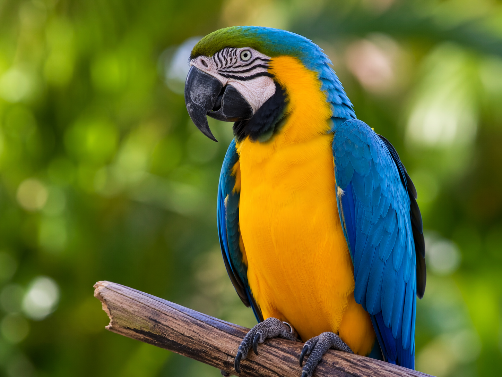
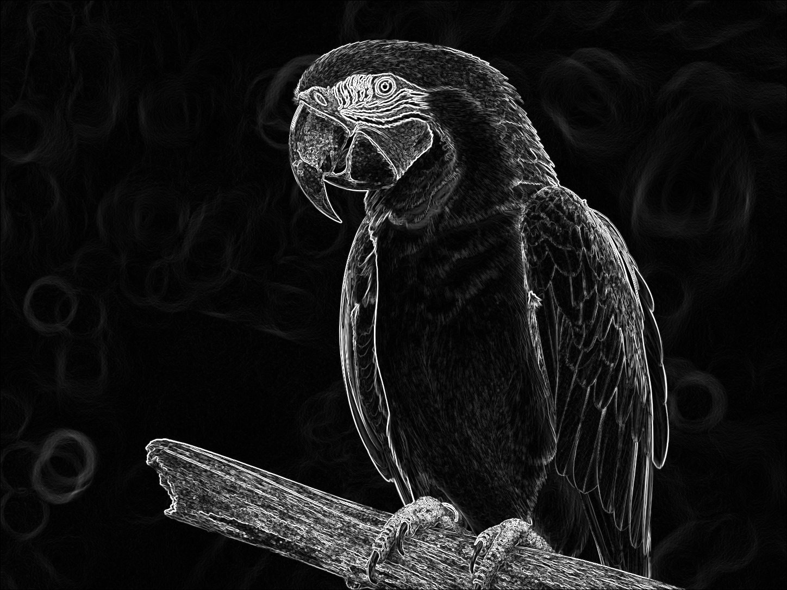

# Detecção de Bordas e Otimização em GPU

Ao final desta aula, você deverá ser capaz de:

* Entender como mapear um algoritmo sequencial para GPU
* Implementar convolução 2D 
* Identificar gargalos de memória
* Aplicar otimizações com shared memory
* Aplicar otimizações com tilling em GPU


## A Missão de Hoje

Vamos aplicar detecção de bordas a uma imagem usando o operador de Sobel.

O operador de Sobel é um método clássico para detecção de bordas em imagens. Ele identifica regiões onde há mudanças bruscas de intensidade, o que normalmente acontece em contornos de objetos.

Imagine percorrer uma imagem pixel a pixel. Em regiões homogêneas (por exemplo, apenas azul), os valores mudam pouco. Já na transição entre azul e amarelo, como na arara, há uma variação intensa.




O Sobel calcula uma aproximação do gradiente da imagem, ou seja, a taxa de variação da intensidade em duas direções:

* horizontal (eixo x)
* vertical (eixo y)

Para isso, ele utiliza dois filtros (máscaras 3×3):

$$
G_x = \begin{bmatrix}
-1 & 0 & 1 \\
-2 & 0 & 2 \\
-1 & 0 & 1
\end{bmatrix},
\quad
G_y = \begin{bmatrix}
-1 & -2 & -1 \\
0 & 0 & 0 \\
1 & 2 & 1
\end{bmatrix}
$$

Após aplicar esses filtros, combinamos os resultados para obter a intensidade da borda:

$$
G = \sqrt{G_x^2 + G_y^2}
$$


* **Gx (horizontal)**: detecta variações da esquerda para a direita
* **Gy (vertical)**: detecta variações de cima para baixo

O resultado é uma nova imagem onde as regiões com bordas aparecem claras (valores altos), e as regiões homogêneas ficam escuras. 




## Precisamos converter a imagem para escala de cinza

O Sobel trabalha com intensidade, não cor é importante tratar a imagem antes de aplicar o filtro.

### Lembra como um pixel é representado em RGB?

Cada pixel em uma imagem colorida possui **3 valores**:

* R (vermelho)
* G (verde)
* B (azul)

Podemos representar isso como uma matriz de pixels:

```text
Imagem RGB (cada posição tem 3 valores):

[(R,G,B)   (R,G,B)   (R,G,B)]
[(R,G,B)   (R,G,B)   (R,G,B)]
[(R,G,B)   (R,G,B)   (R,G,B)]
```

Exemplo de um pixel:

```text
(120, 200, 50)
```

Na escala de cinza, cada pixel passa a ter apenas um valor, que representa a intensidade da luz:

```text
Imagem em escala de cinza:

[  80    120    200 ]
[  60     90    150 ]
[  30     70    110 ]
```

Ou seja:

saímos de **3 valores por pixel para 1 valor por pixel**


Para fazer essa conversão, usamos uma média ponderada dos canais:

$$
Gray = 0.299R + 0.587G + 0.114B
$$

Esses valores vem de um padrão chamado [Rec. 601](https://tech.ebu.ch/docs/techreview/trev_304-rec601_wood.pdf), definido pela [International Telecommunication Union](https://en.wikipedia.org/wiki/ITU-R).

Esse padrão foi criado para sistemas de TV e define como converter cor em luminância.


* RGB → descreve **cor**
* Grayscale → descreve **intensidade**

E é justamente essa intensidade que o Sobel usa para detectar bordas.


## Como testar o Código base

Aqui está o codigo base chamado `base.cpp`

```cpp
// ============================================
// Bibliotecas para ler e escrever PNG 
// ============================================
#define STB_IMAGE_IMPLEMENTATION
#include "stb_image.h"
#define STB_IMAGE_WRITE_IMPLEMENTATION
#include "stb_image_write.h"

#include <iostream>
#include <cmath>
#include <chrono>  

using namespace std;
using namespace std::chrono;

int main() {

    // Variáveis da imagem
    int width, height, channels;

    // Medição do tempo total
    auto t_total_start = high_resolution_clock::now();

    // 1. Leitura da imagem 
    auto t0 = high_resolution_clock::now();

    // le a imagem e salva em uma matriz correspondente aos canais RGB
    unsigned char* input = stbi_load("arara.png", &width, &height, &channels, 3);

    if (!input) {
        cout << "Erro ao carregar imagem!" << endl;
        return -1;
    }

    auto t1 = high_resolution_clock::now();

    // Alocação de memória 
    // Cada pixel grayscale ocupa 1 byte
    unsigned char* gray   = new unsigned char[width * height];
    unsigned char* output = new unsigned char[width * height];

    // 2. RGB -> GRAYSCALE
    auto t2 = high_resolution_clock::now();

    for (int y = 0; y < height; y++) {
        for (int x = 0; x < width; x++) {

            // Índice linear do pixel (posição no vetor)
            int idx = (y * width + x) * 3;

            // Acesso aos canais (layout intercalado: RGBRGB...)
            unsigned char r = input[idx];
            unsigned char g = input[idx + 1];
            unsigned char b = input[idx + 2];

            // Conversão para escala de cinza 
            gray[y * width + x] = 0.299f * r + 0.587f * g + 0.114f * b;
        }
    }

    auto t3 = high_resolution_clock::now();

    // 3. SOBEL (detecção de bordas)
    // Cada pixel depende de uma vizinhança 3x3

    int Gx[3][3] = {
        {-1, 0, 1},
        {-2, 0, 2},
        {-1, 0, 1}
    };

    int Gy[3][3] = {
        {-1, -2, -1},
        { 0,  0,  0},
        { 1,  2,  1}
    };

    auto t4 = high_resolution_clock::now();


    for (int y = 1; y < height - 1; y++) {
        for (int x = 1; x < width - 1; x++) {

            int sumX = 0;
            int sumY = 0;

            // Janela 3x3 (convolução)
            for (int ky = -1; ky <= 1; ky++) {
                for (int kx = -1; kx <= 1; kx++) {

                    int pixel = gray[(y + ky) * width + (x + kx)];

                    sumX += pixel * Gx[ky + 1][kx + 1];
                    sumY += pixel * Gy[ky + 1][kx + 1];
                }
            }

            // Magnitude do gradiente
            int magnitude = sqrt(sumX * sumX + sumY * sumY);

            // Saturação (limite de 8 bits)
            if (magnitude > 255) magnitude = 255;

            output[y * width + x] = (unsigned char)magnitude;
        }
    }

    auto t5 = high_resolution_clock::now();

    // 4. Escrita da imagem
    auto t6 = high_resolution_clock::now();

    // 1 canal → grayscale
    stbi_write_png("saida.png", width, height, 1, output, width);

    auto t7 = high_resolution_clock::now();

    auto t_total_end = high_resolution_clock::now();

    // Cálculo dos tempos (em milissegundos)
    auto t_load   = duration_cast<milliseconds>(t1 - t0).count();
    auto t_gray   = duration_cast<milliseconds>(t3 - t2).count();
    auto t_sobel  = duration_cast<milliseconds>(t5 - t4).count();
    auto t_write  = duration_cast<milliseconds>(t7 - t6).count();
    auto t_total  = duration_cast<milliseconds>(t_total_end - t_total_start).count();


    cout << "=====================================\n";
    cout << "        Relatorio de Tempo\n";
    cout << "=====================================\n";
    cout << "Leitura (PNG):     " << t_load  << " ms\n";
    cout << "Grayscale:         " << t_gray  << " ms\n";
    cout << "Sobel:             " << t_sobel << " ms\n";
    cout << "Escrita (PNG):     " << t_write << " ms\n";
    cout << "-------------------------------------\n";
    cout << "Tempo total:       " << t_total << " ms\n";
    cout << "=====================================\n";

    cout << "Bordas detectadas!" << endl;

    // Liberação de memória
    stbi_image_free(input);
    delete[] gray;
    delete[] output;

    return 0;
}
```


## Para testar o código, modo GitHub:

1. [Crie o seu repositório da atividade](https://classroom.github.com/a/pp9AqNnS)

2. Faça o clone do seu repositório no Cluster

3. Faça o clone do seu repositório no seu computador local

4. Gere o binário no cluster Franky

Compile o código base
```bash
g++ -O3 base.cpp -o base
```
5. Execute o código base no cluster Franky

```bash
srun --partition=normal ./base
```

6. Faça git pull no seu repositório local para verificar a imagem de sáida


## Para testar o código, modo raiz:

Antes de qualquer coisa, vamos preparar o ambiente com os arquivos necessários:

No seu **computador local**, envie a imagem da arara:

```bash
scp -i "endereço-da-sua-chave/id_rsa" "endereço-da-arara.png" seu-login-no-franky@ip-do-cluster:~/scratch/diretorio-de-trabalho/
```

Subistituia corretamente os comandos com as suas informações, a imagem vai aperecer dentro da pasta scratch


No cluster Franky, dentro da pasta que você vai trabalhar, faça o download dos headers que vão possibilitar a manipulação de imagens `.png`

```bash
wget https://raw.githubusercontent.com/nothings/stb/master/stb_image.h
wget https://raw.githubusercontent.com/nothings/stb/master/stb_image_write.h
```

Use o comando `ls` para visualizar os arquivos no diretório de trabalho:

```
stb_image.h
stb_image_write.h
```

Crie o código base com o nano

```bash
nano base.cpp
```

Compile o código base
```bash
g++ -O3 base.cpp -o base
```

Se tudo der certo, se nada der errado o executável `base` será criado.

Teste com o `srun` do SLURM

```bash
srun --partition=normal ./base
```

A imagem de saída aparecerá no diretório de trabalho
 
```bash
ls -lh saida.png
```

Você verá algo como:

```bash
-rw-r--r--. 1 liciascl liciascl 1.3M Apr 24 07:31 saida.png
```

Faça o download da imagem para a sua máquina com o scp:

No terminal do seu computador, de o comando:
```bash
scp -i "endereço-da-sua-chave/id_rsa" seu-login-no-franky@ip-do-cluster:~/scratch/diretorio-de-trabalho/saida.png .
```

Isso salva `saida.png` na pasta atual do seu PC.


Abra o `saida.png` e verifique se as bordas foram detectadas.


## Sua vez!


1.  Realize as operações de grayscale e filtro Sobel na GPU.
Essa será a sua versão ingênua.

2. A partir da versão ingênua, aplique as seguintes otimizações:

* **tiling**
* uso de **shared memory** (traga os dados para a memória L1 das SM's )

3. Meça o tempo de execução e complete a tabela:

| Versão         | Block Size | Tempo (ms) |
|---------------|-----------|-----------|
| CPU           | -         |           |
| GPU ingênua   | 8×8       |           |
| GPU otimizada | 8×8       |           |
| GPU ingênua   | 16×16     |           |
| GPU otimizada | 16×16     |           |
| GPU ingênua   | 32×32     |           |
| GPU otimizada | 32×32     |           |


### Responda:

* Qual configuração apresentou melhor desempenho?
* A otimização trouxe ganho significativo?
* O gargalo do código é computação efetiva ou manipulação de dados?


## [Entregue a atividade pelo Classroom até 01/05/2026 ás 23h59](https://classroom.github.com/a/pp9AqNnS)