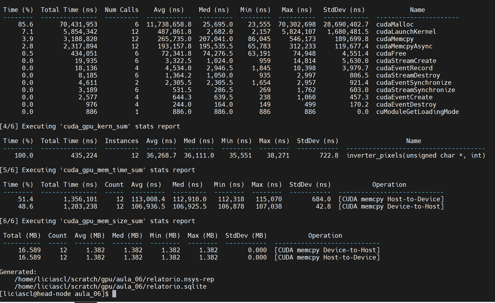
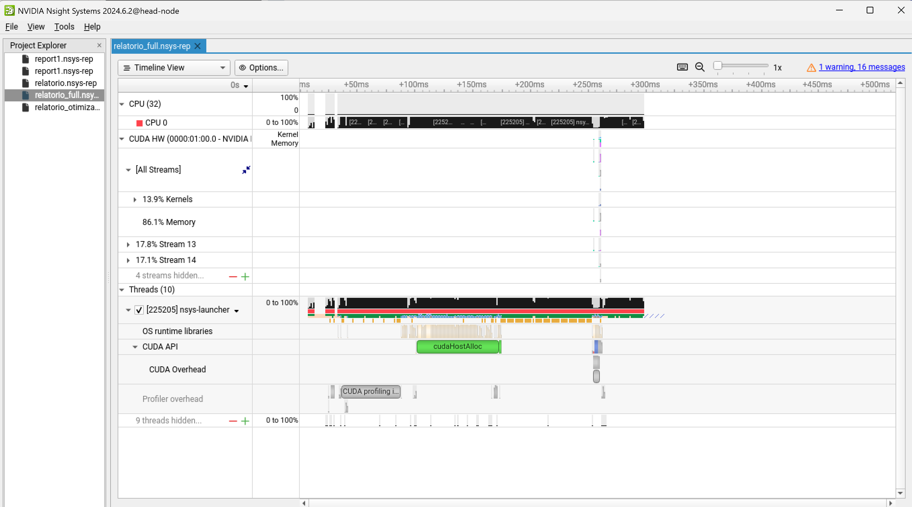
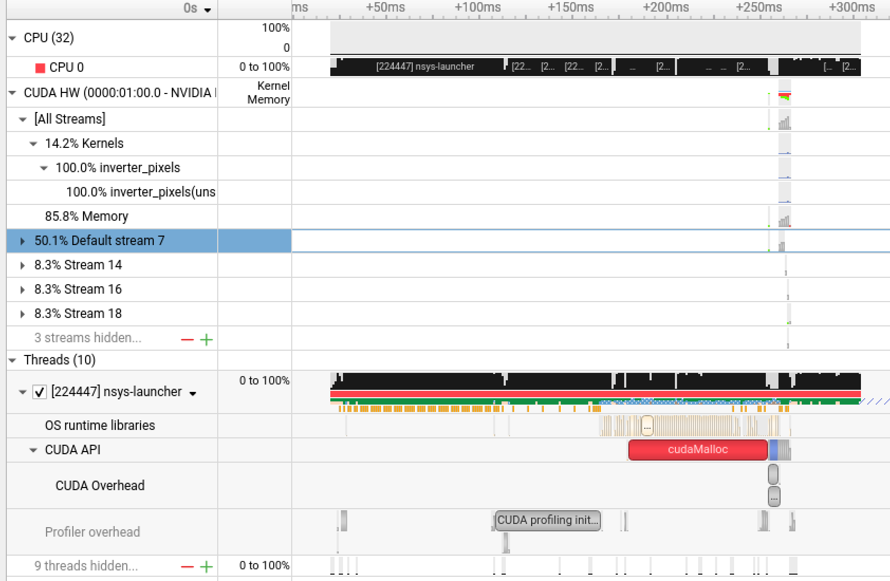

# Código Síncrono vs Assíncrono em CUDA

## Objetivo da Aula

Mostrar, de forma visual e mensurável, a diferença entre:

* **execução síncrona** (um kernel ou cópia de memória por vez)
* **execução assíncrona com *streams*** (múltiplas operações em paralelo)


## Preparação da conexão ssh com suporte ao X11

### Se você está em um ambiente Linux ou MacOs

Acesse o Cluster Franky com interface gráfica redirecionada:

```bash
ssh -X usuario@head-node
```

Verifique se o redirecionamento X11 está ativo:

```bash
xclock
```

Deve aparecer um reloginho na sua tela, como esse:


### Se você está em um ambiente Windows

Acesse o cluster pelo MobaXterm, não sabe do que eu estou falando? volte na [aula02](../aula02/index.md) na parte de conexão com o Cluster Franky


## Profiling em GPU

O termo *profiling* refere-se ao processo de observar, registrar e analisar o comportamento de um programa enquanto ele é executado. Quando escrevemos aplicações CUDA, o código-fonte mostra o que queremos fazer, mas não revela como a GPU realmente executa as instruções, quanto tempo cada operação consome ou onde estão os gargalos. O profiling é justamente a ferramenta que nos permite “abrir a caixa preta” e enxergar o que está acontecendo dentro da GPU em tempo real.

Em um ambiente de HPC, medir e entender o desempenho é tão importante quanto escrever o código. Um kernel pode estar correto e ainda assim ser ineficiente, gastando mais tempo em cópias de memória do que em processamento, ou desperdiçando paralelismo por má organização das threads. 

A Nvidia tem duas ferramentas de profiling para CPU, O **Nsight Systems `nsys`** fornece uma visão global da aplicação: ele registra a linha do tempo da execução, mostrando todas as chamadas CUDA, transferências de dados entre CPU e GPU, sincronizações e kernels. Ele é útil para entender o fluxo entre CPU e GPU e visualizar quando as operações acontecem de forma sequencial ou paralela. 

Para começar, é preciso compilar o código:


```cpp
#include <iostream>
#include <cuda_runtime.h>
#include <cstdlib>
#include <ctime>

#define LARGURA 3840
#define ALTURA  2160

// Kernel simples: inverte a intensidade do pixel
__global__ void inverter_pixels(unsigned char *imagem, int tamanho) {
    int idx = blockIdx.x * blockDim.x + threadIdx.x;
    if (idx < tamanho)
        imagem[idx] = 255 - imagem[idx];
}

// Função auxiliar para medir tempo
float medir_tempo(cudaEvent_t start, cudaEvent_t stop) {
    float ms = 0.0f;
    cudaEventElapsedTime(&ms, start, stop);
    return ms;
}

int main() {
    srand(time(nullptr));

    const int largura = LARGURA;
    const int altura  = ALTURA;
    const int tamanho_total = largura * altura;
    const size_t bytes_total = tamanho_total * sizeof(unsigned char);

    std::cout << "Imagem sintética 4K gerada: "
              << largura << "x" << altura
              << " (" << (bytes_total / (1024.0 * 1024.0)) << " MB)\n";

    // ===============================
    // Alocação de memória no host
    // ===============================
    unsigned char *h_imagem = (unsigned char*)malloc(bytes_total);
    unsigned char *h_saida  = (unsigned char*)malloc(bytes_total);

    for (int i = 0; i < tamanho_total; i++)
        h_imagem[i] = rand() % 256;

    // ===============================
    // Alocação de memória na GPU
    // ===============================
    unsigned char *d_imagem;
    cudaMalloc(&d_imagem, bytes_total);

    // ===============================
    // Medição com eventos CUDA
    // ===============================
    cudaEvent_t start, stop;
    cudaEventCreate(&start);
    cudaEventCreate(&stop);
    cudaEventRecord(start);

    // ===============================
    // Cópia síncrona CPU → GPU
    // ===============================
    cudaMemcpy(d_imagem, h_imagem, bytes_total, cudaMemcpyHostToDevice);

    // ===============================
    // Execução do kernel
    //=============================
    int threads = 256;
    int blocks = (tamanho_total + threads - 1) / threads;

    inverter_pixels<<<blocks, threads>>>(d_imagem, tamanho_total);

    // Espera o kernel terminar
    cudaDeviceSynchronize();

    // ===============================
    //  Cópia síncrona GPU → CPU
    // ===============================
    cudaMemcpy(h_saida, d_imagem, bytes_total, cudaMemcpyDeviceToHost);

    // Marca o fim da região medida
    cudaEventRecord(stop);
    cudaEventSynchronize(stop);

    float tempo_ms = medir_tempo(start, stop);

    // ===============================
    // Resultados
    // ===============================
    std::cout << "--------------------------------------------\n";
    std::cout << "execução síncrona\n";
    std::cout << "Tempo total: " << tempo_ms << " ms\n";
    std::cout << "--------------------------------------------\n";

    for (int i = 0; i < 10; i++) {
        std::cout << "Pixel[" << i << "] "
                  << (int)h_imagem[i] << " → "
                  << (int)h_saida[i] << "\n";
    }

    // ===============================
    // Liberação de recursos
    // ===============================
    cudaFree(d_imagem);
    free(h_imagem);
    free(h_saida);
    cudaEventDestroy(start);
    cudaEventDestroy(stop);

    return 0;
}

```

Não se esqueça de carregar o módulo cuda
```bash
module load cuda/12.8.1
```

```bash
nvcc -O3 sincrono.cu -o sincrono
```

Para executar o binário no Cluster Franky, com suporte a GPU é assim:

```bash
srun --partition=gpu --gres=gpu:1 ./sincrono
```

Para analisar o comportamento em detalhe, com suporte ao profiler, o comando fica assim:

```bash
srun --partition=gpu --gres=gpu:1 nsys profile -o relatorio_sincrono --stats=true --trace=cuda,osrt ./sincrono
```

`--trace=cuda` Captura todas as chamadas CUDA: `cudaMalloc`, `cudaMemcpy`, `cudaLaunchKernel`, etc.

`--trace=osrt` Captura chamadas de sistema (CPU threads, sincronizações, alocações).                

`--stats=true`  Gera um relatório resumido no terminal                                               


A saída vai ser algo parecido com isso:



Se quiser ver na interface gráfica, o comando é esse:

```bash
nsys-ui relatorio_sincrono.nsys-rep
```



Este código não tem otimizações, é apenas um código que foi portado pra GPU de forma síncrona e sem cuidados com o gerenciamento dos dados, agora vamos aplicar algumas otimizações:


```cpp
#include <iostream>
#include <cuda_runtime.h>
#include <cstdlib>
#include <ctime>

#define NSTREAMS 2   // número de streams paralelas
#define LARGURA 3840
#define ALTURA  2160

// =======================================================
// Kernel simples: inverte a intensidade do pixel
// =======================================================
__global__ void inverter_pixels(unsigned char *imagem, int tamanho) {
    int idx = blockIdx.x * blockDim.x + threadIdx.x;
    if (idx < tamanho)
        imagem[idx] = 255 - imagem[idx];
}

// =======================================================
// Mede tempo entre eventos CUDA
// =======================================================
float medir_tempo(cudaEvent_t start, cudaEvent_t stop) {
    float ms = 0.0f;
    cudaEventElapsedTime(&ms, start, stop);
    return ms;
}

int main() {
    std::srand(static_cast<unsigned>(std::time(nullptr)));

    const int largura = LARGURA;
    const int altura  = ALTURA;
    const int tamanho_total = largura * altura;
    const size_t bytes_total = static_cast<size_t>(tamanho_total) * sizeof(unsigned char);

    std::cout << "Imagem sintética 4K gerada: "
              << largura << "x" << altura << " ("
              << (bytes_total / (1024.0 * 1024.0)) << " MB)\n";

    // =======================================================
    // 1) Alocação de memória no host 
    // =======================================================
    unsigned char *h_imagem = static_cast<unsigned char*>(std::malloc(bytes_total));
    unsigned char *h_saida  = static_cast<unsigned char*>(std::malloc(bytes_total));

    for (int i = 0; i < tamanho_total; ++i)
        h_imagem[i] = static_cast<unsigned char>(std::rand() % 256);

    // =======================================================
    // 2) Divisão da imagem entre as streams
    // =======================================================
    const int linhas_por_stream   = altura / NSTREAMS;
    const int pixels_por_stream   = linhas_por_stream * largura;
    const size_t bytes_por_stream = static_cast<size_t>(pixels_por_stream) * sizeof(unsigned char);

    unsigned char *d_blocos[NSTREAMS];
    cudaStream_t  streams[NSTREAMS];

    for (int i = 0; i < NSTREAMS; ++i) {
        cudaMalloc(&d_blocos[i], bytes_por_stream);
        cudaStreamCreate(&streams[i]);
    }

    // =======================================================
    // 3) Criação de eventos para medir o tempo total e por stream
    // =======================================================
    cudaEvent_t start_total, stop_total;
    cudaEventCreate(&start_total);
    cudaEventCreate(&stop_total);
    cudaEventRecord(start_total);

    cudaEvent_t start_stream[NSTREAMS], stop_stream[NSTREAMS];
    for (int i = 0; i < NSTREAMS; ++i) {
        cudaEventCreate(&start_stream[i]);
        cudaEventCreate(&stop_stream[i]);
    }

    // =======================================================
    // 4) Execução assíncrona
    // =======================================================
    for (int i = 0; i < NSTREAMS; ++i) {
        unsigned char *h_chunk_in  = h_imagem + i * pixels_por_stream;
        unsigned char *h_chunk_out = h_saida  + i * pixels_por_stream;

        cudaEventRecord(start_stream[i], streams[i]);  // início da stream

        // Cópia H2D assíncrona
        cudaMemcpyAsync(d_blocos[i], h_chunk_in, bytes_por_stream,
                        cudaMemcpyHostToDevice, streams[i]);

        // Kernel por stream
        int threads = 256;
        int blocks  = (pixels_por_stream + threads - 1) / threads;
        inverter_pixels<<<blocks, threads, 0, streams[i]>>>(d_blocos[i], pixels_por_stream);

        // Cópia D2H assíncrona
        cudaMemcpyAsync(h_chunk_out, d_blocos[i], bytes_por_stream,
                        cudaMemcpyDeviceToHost, streams[i]);

        cudaEventRecord(stop_stream[i], streams[i]);  // fim da stream
    }

    // =======================================================
    // 5) Sincronização geral
    // =======================================================
    for (int i = 0; i < NSTREAMS; ++i)
        cudaStreamSynchronize(streams[i]);

    cudaEventRecord(stop_total);
    cudaEventSynchronize(stop_total);

    float tempo_total = medir_tempo(start_total, stop_total);

    // =======================================================
    // 6) Resultados
    // =======================================================
    std::cout << "--------------------------------------------\n";
    std::cout << "Tempo total (assíncrono, host pageable): " << tempo_total << " ms\n";
    std::cout << "--------------------------------------------\n";

    for (int i = 0; i < NSTREAMS; ++i) {
        float tempo_stream = medir_tempo(start_stream[i], stop_stream[i]);
        std::cout << "Stream " << i << " → tempo: " << tempo_stream << " ms\n";
    }

    std::cout << "--------------------------------------------\n";
    std::cout << "Amostra de pixels (antes e depois):\n";
    for (int i = 0; i < 10; ++i) {
        std::cout << "Pixel[" << i << "] "
                  << static_cast<int>(h_imagem[i]) << " → "
                  << static_cast<int>(h_saida[i]) << "\n";
    }

    // =======================================================
    // 7) Liberação de recursos
    // =======================================================
    for (int i = 0; i < NSTREAMS; ++i) {
        cudaFree(d_blocos[i]);
        cudaStreamDestroy(streams[i]);
        cudaEventDestroy(start_stream[i]);
        cudaEventDestroy(stop_stream[i]);
    }

    cudaEventDestroy(start_total);
    cudaEventDestroy(stop_total);
    std::free(h_imagem);
    std::free(h_saida);

    return 0;
}

```


Vamos compilar
```bash
nvcc -O3 assincrono.cu -o assincrono
```

Vamos gerar o relatório:

```bash
srun --partition=gpu --gres=gpu:1 nsys profile -o relatorio_assincrono --stats=true --trace=cuda,osrt ./assincrono
```


Se você abrir esse relatório no Nsight UI, verá exatamente isso visualmente:


```bash
nsys-ui relatorio_assincrono.nsys-rep 
```

O código melhorou, mas ainda da pra ajustar um detalhe muito importante!


## Memória “pinned” (page-locked)

Em sistemas operacionais modernos, a memória RAM do host (CPU) é gerenciada virtualmente pelo sistema operacional.
Isso quer dizer que o sistema pode mover páginas de memória entre RAM e disco (swap), e pode realocar fisicamente os blocos conforme necessário.
Essa flexibilidade é ótima para multitarefa, mas traz um problema para a GPU: o DMA (Direct Memory Access) da placa precisa saber endereços físicos fixos para transferir dados diretamente da RAM para a memória da GPU.

Por padrão, quando você usa uma alocação comum em C++:

```cpp
unsigned char* h_imagem = (unsigned char*)malloc(bytes_total);
```

essa memória é “pageable”, ou seja, o sistema operacional pode movê-la a qualquer momento.
Quando a GPU precisa copiar dados dessa memória, o driver CUDA não consegue usar DMA direto, porque não tem garantia de que aqueles dados continuarão no mesmo lugar.

Então o que o driver faz é criar uma cópia intermediária temporária:

1. Ele aloca um buffer “pinned” interno, invisível ao programador;
2. Copia seus dados do buffer “pageable” para esse buffer “pinned”;
3. Só então o DMA da GPU transfere do buffer “pinned” para a VRAM.

Esse caminho duplica o número de cópias e adiciona latência, o que significa que `cudaMemcpy` e `cudaMemcpyAsync` ficam mais lentos e menos eficientes.


## O que muda com `cudaMallocHost`

Quando você usa:

```cpp
cudaMallocHost(&h_imagem, bytes_total);
```

ou:

```cpp
cudaHostAlloc(&h_imagem, bytes_total, cudaHostAllocDefault);
```

o driver CUDA solicita ao sistema operacional que fixe fisicamente essas páginas de memória na RAM.

Com isso, as transferências `cudaMemcpy` e `cudaMemcpyAsync` se tornam muito mais rápidas.
Mais importante ainda: as transferências assíncronas realmente funcionam como assíncronas.

Sem memória *pinned*, o comando:

```cpp
cudaMemcpyAsync(d_ptr, h_ptr, size, cudaMemcpyHostToDevice, stream);
```

não é verdadeiramente assíncrono, o driver precisa bloquear temporariamente a CPU para copiar os dados da memória pageable para o buffer pinned interno.
Na prática, o código se comporta quase como uma cópia síncrona.

Quando o *host buffer* é *pinned*, o `cudaMemcpyAsync` não precisa dessa etapa:
a GPU inicia a transferência imediatamente, em paralelo à execução dos kernels, utilizando o mecanismo de DMA dedicado.
É exatamente isso que permite sobreposição real de cópia e execução.


## Cuidados e boas práticas

1. **Não use pinned memory em excesso**:
   Cada alocação *pinned* reduz a quantidade de memória que o sistema operacional pode gerenciar dinamicamente.
   Se você fixar demais, pode degradar o desempenho global da máquina (especialmente se houver swap ativado).

2. **Ideal para buffers de I/O**:
   Use *pinned memory* apenas para regiões de dados que serão realmente transferidas para a GPU.
   Em outras palavras: é para buffers de entrada e saída, não para todo o estado do programa.

3. **Libere corretamente**:
   Use `cudaFreeHost(ptr)` (ou `cudaFree(ptr)` se foi alocado com `cudaMallocManaged`) para liberar a memória.
   Isso garante que o driver devolva o controle das páginas ao sistema operacional.


Vamos aplicar a pinned memory no código para ele ficar assíncrono de verdade:

```cpp
#include <iostream>
#include <cuda_runtime.h>
#include <cstdlib>
#include <ctime>

#define NSTREAMS 2   // número de streams paralelas
#define LARGURA 3840
#define ALTURA  2160

// =======================================================
// Kernel: inverte a intensidade do pixel
// =======================================================
__global__ void inverter_pixels(unsigned char *imagem, int tamanho) {
    int idx = blockIdx.x * blockDim.x + threadIdx.x;
    if (idx < tamanho)
        imagem[idx] = 255 - imagem[idx];
}

// =======================================================
// Função auxiliar para medir tempo entre eventos
// =======================================================
float medir_tempo(cudaEvent_t start, cudaEvent_t stop) {
    float ms = 0.0f;
    cudaEventElapsedTime(&ms, start, stop);
    return ms;
}

int main() {
    srand(time(nullptr));

    const int largura = LARGURA;
    const int altura  = ALTURA;
    const int tamanho_total = largura * altura;
    const size_t bytes_total = tamanho_total * sizeof(unsigned char);

    std::cout << "Imagem sintética 4K gerada: "
              << largura << "x" << altura << " ("
              << (bytes_total / (1024.0 * 1024.0)) << " MB)\n";

    // =======================================================
    // 1) MEMÓRIA HOST "PINNED" (page-locked)
    // =======================================================
    unsigned char *h_imagem = nullptr;
    unsigned char *h_saida  = nullptr;
    cudaMallocHost(&h_imagem, bytes_total);  // pinned
    cudaMallocHost(&h_saida,  bytes_total);  // pinned

    for (int i = 0; i < tamanho_total; i++)
        h_imagem[i] = rand() % 256;

    // =======================================================
    // 2) Divisão da imagem entre as streams
    // =======================================================
    const int linhas_por_stream   = altura / NSTREAMS;
    const int pixels_por_stream   = linhas_por_stream * largura;
    const size_t bytes_por_stream = pixels_por_stream * sizeof(unsigned char);

    unsigned char *d_blocos[NSTREAMS];
    cudaStream_t  streams[NSTREAMS];

    for (int i = 0; i < NSTREAMS; i++) {
        cudaMalloc(&d_blocos[i], bytes_por_stream);
        cudaStreamCreate(&streams[i]);
    }

    // =======================================================
    // 3) Criação dos eventos de medição
    // =======================================================
    cudaEvent_t start_total, stop_total;
    cudaEventCreate(&start_total);
    cudaEventCreate(&stop_total);
    cudaEventRecord(start_total);

    cudaEvent_t start_stream[NSTREAMS], stop_stream[NSTREAMS];
    for (int i = 0; i < NSTREAMS; i++) {
        cudaEventCreate(&start_stream[i]);
        cudaEventCreate(&stop_stream[i]);
    }

    // =======================================================
    // 4) Execução assíncrona com overlap completo
    // =======================================================
    for (int i = 0; i < NSTREAMS; i++) {
        unsigned char *h_chunk_in  = h_imagem + i * pixels_por_stream;
        unsigned char *h_chunk_out = h_saida  + i * pixels_por_stream;

        cudaEventRecord(start_stream[i], streams[i]);  // início da stream

        // Cópia H2D 
        cudaMemcpyAsync(d_blocos[i], h_chunk_in, bytes_por_stream,
                        cudaMemcpyHostToDevice, streams[i]);

        // Kernel por stream
        int threads = 256;
        int blocks  = (pixels_por_stream + threads - 1) / threads;
        inverter_pixels<<<blocks, threads, 0, streams[i]>>>(d_blocos[i], pixels_por_stream);

        // Cópia D2H 
        cudaMemcpyAsync(h_chunk_out, d_blocos[i], bytes_por_stream,
                        cudaMemcpyDeviceToHost, streams[i]);

        cudaEventRecord(stop_stream[i], streams[i]);  // fim da stream
    }

    // =======================================================
    // 5) Sincronização geral
    // =======================================================
    for (int i = 0; i < NSTREAMS; i++)
        cudaStreamSynchronize(streams[i]);

    cudaEventRecord(stop_total);
    cudaEventSynchronize(stop_total);
    float tempo_total = medir_tempo(start_total, stop_total);

    // =======================================================
    // 6) Resultados
    // =======================================================
    std::cout << "--------------------------------------------\n";
    std::cout << "Tempo total (assíncrono + pinned): " << tempo_total << " ms\n";
    std::cout << "--------------------------------------------\n";

    for (int i = 0; i < NSTREAMS; i++) {
        float tempo_stream = medir_tempo(start_stream[i], stop_stream[i]);
        std::cout << "Stream " << i << " → tempo: " << tempo_stream << " ms\n";
    }

    std::cout << "--------------------------------------------\n";
    std::cout << "Amostra de pixels (antes e depois):\n";
    for (int i = 0; i < 10; i++) {
        std::cout << "Pixel[" << i << "] "
                  << (int)h_imagem[i] << " → "
                  << (int)h_saida[i] << "\n";
    }

    // =======================================================
    // 7) Liberação de recursos
    // =======================================================
    for (int i = 0; i < NSTREAMS; i++) {
        cudaFree(d_blocos[i]);
        cudaStreamDestroy(streams[i]);
        cudaEventDestroy(start_stream[i]);
        cudaEventDestroy(stop_stream[i]);
    }

    cudaFreeHost(h_imagem);
    cudaFreeHost(h_saida);
    cudaEventDestroy(start_total);
    cudaEventDestroy(stop_total);

    return 0;
}
```

Vamos compilar
```bash
nvcc -O3 otimizado.cu -o otimizado
```

Vamos gerar o relatório:

```bash
srun --partition=gpu --gres=gpu:1 nsys profile -o relatorio_otimizado --stats=true --trace=cuda,osrt ./otimizado
```


Se você abrir esse relatório no Nsight UI, verá exatamente isso visualmente:


```bash
nsys-ui relatorio_otimizado.nsys-rep 
```




## SUA VEZ!!! 

O código a seguir simula um processamento de imagem em GPU, onde uma imagem 4K é dividida em blocos e processada por duas funções distintas, uma que inverte os pixels e outra que altera a saturação.

Apesar de funcionar corretamente, o programa apresenta baixo desempenho e uso ineficiente da GPU.

Seu objetivo será analisar, otimizar e paralelizar o código, deixando ele assíncrono e eficiente.

### Os Problemas de desempenho no código

1. Usa **memória pageable** (`malloc`), o que impede o uso de DMA direto.
2. Todas as operações são **síncronas** (`cudaMemcpy`, `cudaDeviceSynchronize`), impedindo sobreposição.
3. Não há *pipeline* de execução: CPU e GPU trabalham de forma serial.


### Código base

```cpp
#include <iostream>
#include <cuda_runtime.h>
#include <cstdlib>
#include <ctime>

#define LARGURA 3840
#define ALTURA  2160

// =======================================================
// Kernel: inverte a intensidade do pixel
// =======================================================
__global__ void inverter_pixels(unsigned char *imagem, int tamanho) {
    int idx = blockIdx.x * blockDim.x + threadIdx.x;
    if (idx < tamanho)
        imagem[idx] = 255 - imagem[idx];
}

// =======================================================
// Função auxiliar para medir tempo entre eventos
// =======================================================
float medir_tempo(cudaEvent_t start, cudaEvent_t stop) {
    float ms = 0.0f;
    cudaEventElapsedTime(&ms, start, stop);
    return ms;
}

int main() {
    srand(time(nullptr));

    const int largura = LARGURA;
    const int altura  = ALTURA;
    const int tamanho_total = largura * altura;
    const size_t bytes_total = tamanho_total * sizeof(unsigned char);

    std::cout << "Imagem sintética 4K gerada: "
              << largura << "x" << altura
              << " (" << (bytes_total / (1024.0 * 1024.0)) << " MB)\n";

    // =======================================================
    // 1) Alocação de memória no host
    // =======================================================
    unsigned char *h_imagem = (unsigned char*)malloc(bytes_total);
    unsigned char *h_saida  = (unsigned char*)malloc(bytes_total);

    for (int i = 0; i < tamanho_total; i++)
        h_imagem[i] = rand() % 256;

    // =======================================================
    // 2) Alocação de memória na GPU
    // =======================================================
    unsigned char *d_imagem;
    cudaMalloc(&d_imagem, bytes_total);

    // =======================================================
    // 3) Medição com eventos CUDA
    // =======================================================
    cudaEvent_t start, stop;
    cudaEventCreate(&start);
    cudaEventCreate(&stop);
    cudaEventRecord(start);

    // =======================================================
    // 4) Cópia síncrona CPU → GPU
    // =======================================================
    cudaMemcpy(d_imagem, h_imagem, bytes_total, cudaMemcpyHostToDevice);

    // =======================================================
    // 5) Execução do kernel
    // =======================================================
    int threads = 256;
    int blocks = (tamanho_total + threads - 1) / threads;

    inverter_pixels<<<blocks, threads>>>(d_imagem, tamanho_total);
    cudaDeviceSynchronize();  // força a GPU a esperar o kernel

    // =======================================================
    // 6) Cópia síncrona GPU → CPU
    // =======================================================
    cudaMemcpy(h_saida, d_imagem, bytes_total, cudaMemcpyDeviceToHost);

    // =======================================================
    // 7) Finalização da medição
    // =======================================================
    cudaEventRecord(stop);
    cudaEventSynchronize(stop);

    float tempo_total = medir_tempo(start, stop);

    // =======================================================
    // 8) Resultados
    // =======================================================
    std::cout << "--------------------------------------------\n";
    std::cout << "Processamento concluído - execução síncrona em GPU\n";
    std::cout << "Tempo total: " << tempo_total << " ms\n";
    std::cout << "--------------------------------------------\n";

    for (int i = 0; i < 10; i++) {
        std::cout << "Pixel[" << i << "] "
                  << (int)h_imagem[i] << " → "
                  << (int)h_saida[i] << "\n";
    }

    // =======================================================
    // 9) Liberação de recursos
    // =======================================================
    cudaFree(d_imagem);
    free(h_imagem);
    free(h_saida);
    cudaEventDestroy(start);
    cudaEventDestroy(stop);

    return 0;
}

```


