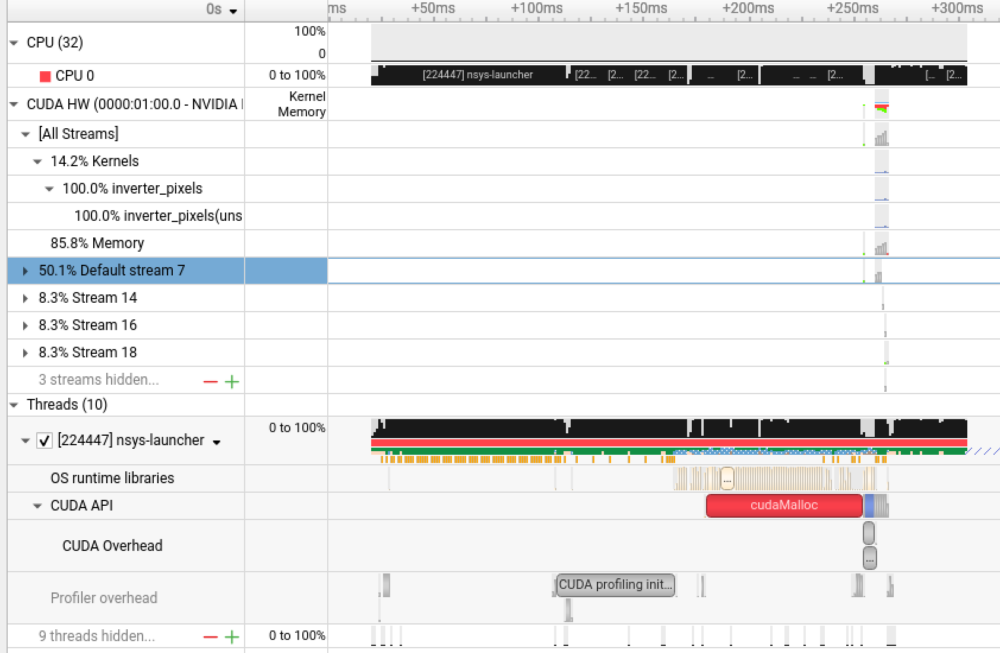
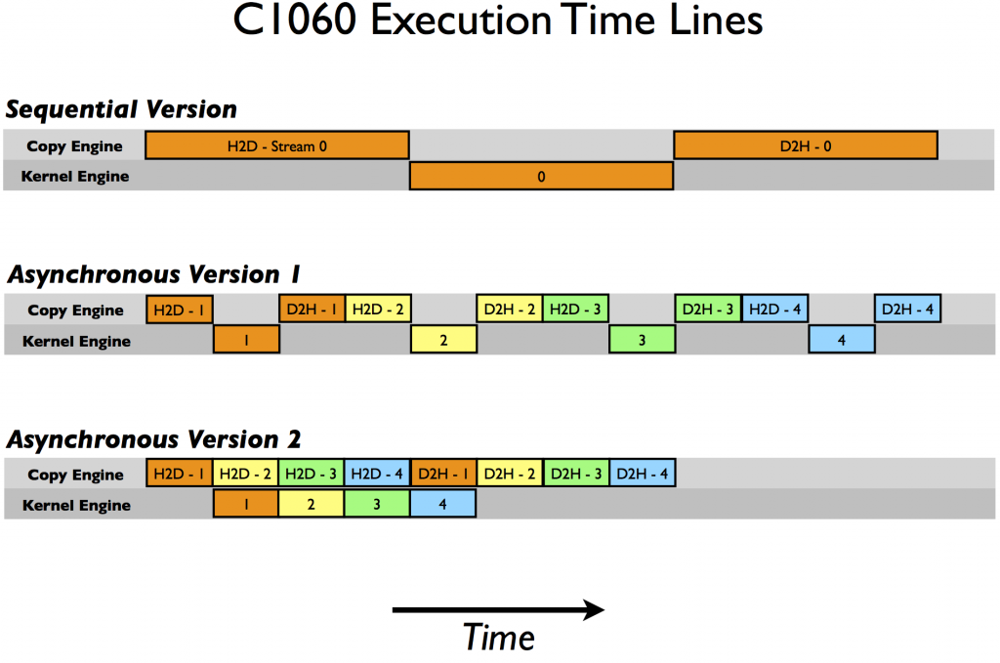

Nesta aula, o objetivo é compreender como estruturas de dados e estratégias de execução assíncrona influenciam diretamente o desempenho de um algoritmo na GPU. 

## Lidando com Matrizes esparsas

Uma matriz esparsa é uma matriz na qual a maioria dos elementos é zero. Para processar dados com essa característica, é preciso levar em conta que armazenar todos os zeros seria um grande desperdício de memória e de tempo de processamento.

Por exemplo, imagine uma matriz 1.000 × 1.000.
Se apenas 10.000 elementos são diferentes de zero, isso significa que **99% dos elementos são zeros**.
Armazenar todos os 1.000.000 de elementos seria extremamente ineficiente, além de custar mais memória, na programação teriamos que elaborar estratégias para lidar com esse dado e evitar por exemplo, erros de divisões por zero.


Para resolver isso, surgiram representações que guardam apenas os elementos não nulos e suas posições. [Existem vários formatos, CSR, COO, ELL, CSC](https://docs.nvidia.com/nvpl/latest/sparse/storage_format/sparse_matrix.html), cada um com vantagens específicas dependendo da arquitetura e do tipo de acesso.

O formato CSR (Compressed Sparse Row), é o mais popular em ambientes de HPC, principalmente para operações de multiplicação matriz-vetor.
Ele organiza os dados de forma compacta e cache-friendly, o que reduz o volume de memória transferido e melhora a eficiência de acesso.

### Estrutura CSR 


Fonte: https://www.john-ros.com/Rcourse/sparse.html


Na matriz 3×4 temos cinco elementos não nulos: $$ a_{01}, a_{02}, a_{11}, a_{13},   a_{20}  $$

Em vez de armazenar os doze elementos (incluindo zeros), o formato CSR guarda apenas as informações essenciais. O  vetor, chamado **Non-zeros**, contém os valores não nulos da matriz, organizados linha por linha. 

Para que seja possível saber a posição de cada valor dentro da matriz original, é necessário também registrar as colunas correspondentes. Isso é feito no vetor **Column Indices**, que contém o índice da coluna de cada elemento armazenado em **Non-zeros**.

Por fim, o vetor mais importante é o **Row Pointers**, que indica onde começa e termina cada linha dentro do vetor de valores. Ele tem tamanho igual ao número de linhas mais um, pois o último elemento marca o fim da última linha. No exemplo, o vetor é ([0, 2, 4, 5]). O zero inicial indica que a primeira linha começa no índice 0 do vetor **Non-zeros**; o número 2 indica que a segunda linha começa no índice 2; o número 4 marca o início da terceira linha; e o número 5 representa o limite final do vetor. Assim, ao percorrer a linha (i), basta ler os elementos entre `row_ptr[i]` e `row_ptr[i+1]`. Isso elimina a necessidade de armazenar zeros, mantendo uma correspondência precisa entre os valores e suas posições.

De forma prática, este é um exemplo de implementação:

```cpp
#include <iostream>
#include <cuda_runtime.h>

// Kernel CUDA para multiplicação matriz-vetor no formato CSR
__global__ void multiplicar_csr_kernel(
    int num_linhas,
    const int *ponteiro_linha,
    const int *indice_coluna,
    const float *valores,
    const float *vetor_x,
    float *vetor_y)
{
    int linha = blockIdx.x * blockDim.x + threadIdx.x; // Cada thread calcula uma linha

    if (linha < num_linhas) {
        float soma = 0.0f;

        int inicio = ponteiro_linha[linha];       // Índice inicial da linha
        int fim    = ponteiro_linha[linha + 1];   // Índice final 

        for (int i = inicio; i < fim; i++) {
            int coluna = indice_coluna[i];
            soma += valores[i] * vetor_x[coluna];  // Multiplica valor não nulo pelo x correspondente
        }

        vetor_y[linha] = soma; // Armazena o resultado final
    }
}

int main() {
    // Considerando a matriz do exemplo:
    // [0  a01 a02  0]
    // [0  a11  0  a13]
    // [a20  0  0   0]

    int num_linhas = 3;
    int num_colunas = 4;
    int num_nao_nulos = 5;

    // Estruturas CSR no host (CPU)
    int h_ponteiro_linha[] = {0, 2, 4, 5};         // Indica o início de cada linha
    int h_indice_coluna[]  = {1, 2, 1, 3, 0};      // Colunas correspondentes
    float h_valores[]      = {1.0f, 2.0f, 3.0f, 4.0f, 5.0f}; // Valores não nulos
    float h_vetor_x[]      = {1.0f, 1.0f, 1.0f, 1.0f};        // Vetor x
    float h_vetor_y[3]     = {0.0f, 0.0f, 0.0f};              // Resultado y

    // Alocação de memória na GPU
    int *d_ponteiro_linha, *d_indice_coluna;
    float *d_valores, *d_vetor_x, *d_vetor_y;

    cudaMalloc(&d_ponteiro_linha, (num_linhas + 1) * sizeof(int));
    cudaMalloc(&d_indice_coluna, num_nao_nulos * sizeof(int));
    cudaMalloc(&d_valores, num_nao_nulos * sizeof(float));
    cudaMalloc(&d_vetor_x, num_colunas * sizeof(float));
    cudaMalloc(&d_vetor_y, num_linhas * sizeof(float));

    // Cópia dos dados da CPU para a GPU
    cudaMemcpy(d_ponteiro_linha, h_ponteiro_linha, (num_linhas + 1) * sizeof(int), cudaMemcpyHostToDevice);
    cudaMemcpy(d_indice_coluna, h_indice_coluna, num_nao_nulos * sizeof(int), cudaMemcpyHostToDevice);
    cudaMemcpy(d_valores, h_valores, num_nao_nulos * sizeof(float), cudaMemcpyHostToDevice);
    cudaMemcpy(d_vetor_x, h_vetor_x, num_colunas * sizeof(float), cudaMemcpyHostToDevice);

    // Configuração de blocos e threads
    int threads_por_bloco = 128;
    int blocos = (num_linhas + threads_por_bloco - 1) / threads_por_bloco;

    // Execução do kernel
    multiplicar_csr_kernel<<<blocos, threads_por_bloco>>>(
        num_linhas, d_ponteiro_linha, d_indice_coluna, d_valores, d_vetor_x, d_vetor_y);

    // Cópia do resultado da GPU para a CPU
    cudaMemcpy(h_vetor_y, d_vetor_y, num_linhas * sizeof(float), cudaMemcpyDeviceToHost);

    // Exibição do resultado
    std::cout << "Resultado y = A * x:" << std::endl;
    for (int i = 0; i < num_linhas; i++) {
        std::cout << "y[" << i << "] = " << h_vetor_y[i] << std::endl;
    }

    // Liberação de memória da GPU
    cudaFree(d_ponteiro_linha);
    cudaFree(d_indice_coluna);
    cudaFree(d_valores);
    cudaFree(d_vetor_x);
    cudaFree(d_vetor_y);

    return 0;
}
```

Cada linha da matriz é independente das outras, então podemos ter uma thread por linha.

Cada thread recebe um número de `linha` e calcula o resultado daquela linha, salvando no vetor de saída `y`.

Para saber onde estão os elementos da `linha` dentro da estrutura CSR, a thread consulta o vetor `ponteiro_linha`. Os valores `ponteiro_linha[linha]` e `ponteiro_linha[linha + 1]` marcam início e fim, indicando quais posições do vetor `valores` pertencem aquela linha.

A thread então percorre esse trecho da memória. Em `indice_coluna[i]`, aponta a coluna onde o valor está localizado na matriz original.

Em `valores[i]`, está o número não nulo que deve ser usado no cálculo.

Com essas informações, a thread sabe que deve multiplicar o valor `valores[i]` pelo elemento correspondente do vetor `x`.

Cada produto parcial é somado no acumulador `soma`.

Quando a thread termina de percorrer seus elementos, ela grava o resultado acumulado em `vetor_y[linha]`.

No final, todas as threads juntas produzem o vetor `y`, que contém o resultado da multiplicação `A * x`.


## Computação assíncrona com streams 

Até agora, o que vimos foi computação síncrona, com um fluxo de trabalho desta forma:

1. **Host → transfere os dados para GPU**
2. **Device → Executa o kernel**
3. **Device → transfere os dados para o Host**

Durante cada etapa, o hardware que não está envolvido permanece ocioso, a GPU espera a CPU passar os dados para fazer a computação, a CPU espera a GPU fazer a computação dos dados para ter os dados trabalhados.

A computação assíncrona é outra estratégia. Ela permite enfileirar tarefas para que a CPU não precise esperar o término das operações na GPU, e para que a GPU possa executar diferentes funções.

Com isso temos uma "sobreposição de operações", melhor aproveitamento do hardware e redução do tempo total de execução da aplicação.

## O que é uma Stream

Uma stream é uma fila de comandos assíncronos na GPU.
Cada stream mantém sua própria sequência de tarefas, como:

```
Stream 0: Memcpy (H2D) → Kernel → Memcpy (D2H)
Stream 1: Memcpy (H2D) → Kernel → Memcpy (D2H)
Stream 2: ...
```

As operações dentro de uma mesma stream são executadas na ordem em que foram emitidas (ordem FIFO).
Mas operações em streams diferentes podem ser executadas de forma concorrente na GPU.

Assim, enquanto uma stream executa um kernel, outra pode estar transferindo dados, e outra pode executar outro kernel.

Sua missão é planejar o envio dessas tarefas de modo que as dependências sejam respeitadas, mas que o máximo possível de operações aconteçam em paralelo.


Fonte: https://developer.nvidia.com/blog/how-overlap-data-transfers-cuda-cc/

Na versão sequencial, todas as operações ocorrem de forma estritamente ordenada: primeiro os dados são transferidos da CPU para a GPU, depois o kernel é executado e, em seguida, os resultados são copiados de volta para a CPU. 

Na Versão assíncrona I, o código passa a utilizar streams CUDA, que permitem a execução de tarefas em filas independentes, como o C1060 possui apenas um motor de cópia. As operações de transferência são executadas de forma alternada dentro do mesmo Copy Engine, essa sequência impede a sobreposição entre cópias e execução de kernels, pois o motor de cópia permanece ocupado o tempo todo alternando entre transferências de entrada e saída. 

Na segunda versão assíncrona, a ordem de emissão das operações é modificada: todas as transferências do host para o device são lançadas primeiro, seguidas da execução dos kernels e, por fim, das transferências de volta. Essa mudança de ordem permite que, enquanto o Kernel processa um conjunto de dados, o Copy Engine possa iniciar a transferência dos dados seguintes. Assim, parte das cópias e das execuções ocorre simultaneamente, o que reduz o tempo total de execução. 


Na prática, para implementar isso em CUDA, fazemos algo assim:

```cpp
cudaMemcpyAsync(d_A, h_A, size, cudaMemcpyHostToDevice, stream1);
kernel<<<blocks, threads, 0, stream1>>>(d_A, d_B, d_C);
cudaMemcpyAsync(h_C, d_C, size, cudaMemcpyDeviceToHost, stream1);
```

Repetindo isso para `stream2`, `stream3`, etc, a GPU executa várias dessas sequências em paralelo.

Aqui temos o exemplo da matriz esparsa, agora, de forma assíncrona:


```cpp
#include <iostream>
#include <cuda_runtime.h>
#include <cstdlib>
#include <ctime>

#define NSTREAMS 6  // número de streams (blocos em paralelo)
#define LARGURA 3840
#define ALTURA 2160

// Kernel: inverte a intensidade do pixel (simula processamento de imagem)
__global__ void inverter_pixels(unsigned char *imagem, int tamanho) {
    int idx = blockIdx.x * blockDim.x + threadIdx.x;
    if (idx < tamanho) {
        imagem[idx] = 255 - imagem[idx];
    }
}

// Função auxiliar para medir tempo entre eventos
float medir_tempo(cudaEvent_t start, cudaEvent_t stop) {
    float ms = 0.0f;
    cudaEventElapsedTime(&ms, start, stop);
    return ms;
}

int main() {
    srand(time(nullptr));

    const int largura = LARGURA;
    const int altura = ALTURA;
    const int tamanho_total = largura * altura;
    const size_t bytes_total = tamanho_total * sizeof(unsigned char);

    std::cout << "Imagem sintética 4K gerada: " 
              << largura << "x" << altura << " (" 
              << (bytes_total / (1024.0 * 1024.0)) << " MB)\n";

    // Cria imagem de entrada com dados aleatórios
    unsigned char *h_imagem = (unsigned char*)malloc(bytes_total);
    unsigned char *h_saida  = (unsigned char*)malloc(bytes_total);
    for (int i = 0; i < tamanho_total; i++)
        h_imagem[i] = rand() % 256;

    // Divide a imagem em blocos verticais
    const int linhas_por_stream = altura / NSTREAMS;
    const int pixels_por_stream = linhas_por_stream * largura;
    const size_t bytes_por_stream = pixels_por_stream * sizeof(unsigned char);

    unsigned char *d_blocos[NSTREAMS];
    cudaStream_t streams[NSTREAMS];

    for (int i = 0; i < NSTREAMS; i++) {
        cudaMalloc(&d_blocos[i], bytes_por_stream);
        cudaStreamCreate(&streams[i]);
    }

    // =====================
    // EXECUÇÃO SÍNCRONA
    // =====================
    cudaEvent_t start_sync, stop_sync;
    cudaEventCreate(&start_sync);
    cudaEventCreate(&stop_sync);
    cudaEventRecord(start_sync);

    for (int i = 0; i < NSTREAMS; i++) {
        unsigned char *h_chunk_in  = h_imagem + i * pixels_por_stream;
        unsigned char *h_chunk_out = h_saida  + i * pixels_por_stream;

        cudaMemcpy(d_blocos[i], h_chunk_in, bytes_por_stream, cudaMemcpyHostToDevice);

        int threads = 256;
        int blocks = (pixels_por_stream + threads - 1) / threads;
        inverter_pixels<<<blocks, threads>>>(d_blocos[i], pixels_por_stream);

        cudaMemcpy(h_chunk_out, d_blocos[i], bytes_por_stream, cudaMemcpyDeviceToHost);
    }

    cudaEventRecord(stop_sync);
    cudaEventSynchronize(stop_sync);
    float tempo_sync = medir_tempo(start_sync, stop_sync);

    // =====================
    // EXECUÇÃO ASSÍNCRONA
    // =====================
    cudaEvent_t start_async, stop_async;
    cudaEventCreate(&start_async);
    cudaEventCreate(&stop_async);
    cudaEventRecord(start_async);

    for (int i = 0; i < NSTREAMS; i++) {
        unsigned char *h_chunk_in  = h_imagem + i * pixels_por_stream;
        unsigned char *h_chunk_out = h_saida  + i * pixels_por_stream;

        cudaMemcpyAsync(d_blocos[i], h_chunk_in, bytes_por_stream, cudaMemcpyHostToDevice, streams[i]);

        int threads = 256;
        int blocks = (pixels_por_stream + threads - 1) / threads;
        inverter_pixels<<<blocks, threads, 0, streams[i]>>>(d_blocos[i], pixels_por_stream);

        cudaMemcpyAsync(h_chunk_out, d_blocos[i], bytes_por_stream, cudaMemcpyDeviceToHost, streams[i]);
    }

    // Sincroniza todas as streams
    for (int i = 0; i < NSTREAMS; i++)
        cudaStreamSynchronize(streams[i]);

    cudaEventRecord(stop_async);
    cudaEventSynchronize(stop_async);
    float tempo_async = medir_tempo(start_async, stop_async);

    // =====================
    // RESULTADOS
    // =====================
    std::cout << "--------------------------------------------\n";
    std::cout << "Tempo SÍNCRONO   : " << tempo_sync  << " ms\n";
    std::cout << "Tempo ASSÍNCRONO : " << tempo_async << " ms\n";
    std::cout << "Speedup          : " << tempo_sync / tempo_async << "x\n";
    std::cout << "--------------------------------------------\n";

    std::cout << "Amostra de pixels (antes e depois):\n";
    for (int i = 0; i < 10; i++) {
        std::cout << "Pixel[" << i << "] " 
                  << (int)h_imagem[i] << " → " 
                  << (int)h_saida[i] << "\n";
    }

    // Libera recursos
    for (int i = 0; i < NSTREAMS; i++) {
        cudaFree(d_blocos[i]);
        cudaStreamDestroy(streams[i]);
    }

    cudaEventDestroy(start_sync);
    cudaEventDestroy(stop_sync);
    cudaEventDestroy(start_async);
    cudaEventDestroy(stop_async);
    free(h_imagem);
    free(h_saida);

    return 0;
}
```

## Sua vez!

O código abaixo processa um conjunto de frames para destacar carros em um vídeo, como na aula passada quando destacamos as bordas da arara. Esse código até que funciona, mas não é eficiente.


Sua missão é otimizar esse código, aplicando as técnicas de otimização vistas até aqui.

A ideia é evitar processamento desnecessário, trabalhando apenas com os pixels relevantes da imagem, e ao mesmo tempo aproveitar melhor os recursos do sistema, sobrepondo etapas como leitura, processamento e escrita dos frames.

O foco da atividade não é mudar o algoritmo, mas sim melhorar sua implementação do ponto de vista de desempenho.


O código base e os outros arquivos necessários para realizar a atividade estão disponíveis [no repositório do GitHub.](https://classroom.github.com/a/JUdZgoEJ)

# A atividade deve ser entregue até 11/05 as 23h59


```cpp

// STB para leitura de imagens (PNG, JPG etc.)
#define STB_IMAGE_IMPLEMENTATION
#include "stb_image.h"

// STB para escrita de imagens
#define STB_IMAGE_WRITE_IMPLEMENTATION
#include "stb_image_write.h"

// Bibliotecas padrão C++
#include <iostream>      // printf moderno (cout)
#include <vector>        // vetores dinâmicos
#include <queue>         // BFS (fila)
#include <cmath>         // sqrt
#include <cstdio>        // sprintf
#include <filesystem>    // criar pastas
#include <chrono>        // medir tempo
#include <algorithm>     // min/max

using namespace std;
namespace fs = std::filesystem;
using namespace std::chrono;


// Representa uma bounding box (retângulo do objeto detectado)
struct Box {
    int minx, miny; // canto superior esquerdo
    int maxx, maxy; // canto inferior direito
};


// Reduz imagem colorida (RGB) para escala de cinza
// Isso simplifica todo o processamento (1 canal ao invés de 3)
void rgb2gray(unsigned char* input, unsigned char* gray, int w, int h) {

    for (int i = 0; i < w * h; i++) {

        int idx = i * 3; // cada pixel tem 3 canais (R, G, B)

        float r = input[idx];
        float g = input[idx + 1];
        float b = input[idx + 2];

        // fórmula padrão de luminância (percepção humana)
        gray[i] = (unsigned char)(
            0.299f * r +
            0.587f * g +
            0.114f * b
        );
    }
}


// O Sobel detecta mudanças bruscas de intensidade → bordas
// usado para destacar contornos dos objetos 
void sobel(unsigned char* gray, unsigned char* out, int w, int h) {

    // máscaras de gradiente horizontal e vertical
    int Gx[3][3] = {{-1,0,1},{-2,0,2},{-1,0,1}};
    int Gy[3][3] = {{-1,-2,-1},{0,0,0},{1,2,1}};

    // percorre imagem ignorando bordas externas
    for (int y = 1; y < h - 1; y++) {
        for (int x = 1; x < w - 1; x++) {

            int sumX = 0; // gradiente horizontal
            int sumY = 0; // gradiente vertical

            // aplica convolução 3x3
            for (int ky = -1; ky <= 1; ky++) {
                for (int kx = -1; kx <= 1; kx++) {

                    int pixel = gray[(y + ky) * w + (x + kx)];

                    sumX += pixel * Gx[ky + 1][kx + 1];
                    sumY += pixel * Gy[ky + 1][kx + 1];
                }
            }

            // magnitude do gradiente (força da borda)
            int mag = (int)sqrt(sumX * sumX + sumY * sumY);

            if (mag > 255) mag = 255;

            out[y * w + x] = (unsigned char)mag;
        }
    }
}


// Converte imagem em preto e branco:
// 255 = objeto / 0 = fundo
void threshold_bin(unsigned char* in, unsigned char* bin, int w, int h, int T) {

    for (int i = 0; i < w * h; i++) {

        bin[i] = (in[i] > T) ? 255 : 0;
    }
}


// Agrupa pixels conectados → forma objetos (blobs)
// Ex: cada carro vira um grupo
vector<Box> findComponents(unsigned char* bin, int w, int h) {

    vector<Box> boxes;              // lista de objetos detectados
    vector<int> visited(w * h, 0);  // marca pixels já visitados

    // vizinhança 4-direções (cima, baixo, esquerda, direita)
    int dx[4] = {1, -1, 0, 0};
    int dy[4] = {0, 0, 1, -1};

    // percorre toda a imagem
    for (int y = 0; y < h; y++) {
        for (int x = 0; x < w; x++) {

            int idx = y * w + x;

            // encontrou pixel de objeto ainda não visitado
            if (bin[idx] == 255 && visited[idx] == 0) {

                queue<pair<int,int>> q;
                q.push({x, y});
                visited[idx] = 1;

                // bounding box inicial
                Box b;
                b.minx = b.maxx = x;
                b.miny = b.maxy = y;

                int area = 0;

                // BFS (expande região conectada)
                while (!q.empty()) {

                    auto p = q.front();
                    q.pop();

                    int cx = p.first;
                    int cy = p.second;

                    area++;

                    // atualiza limites do objeto
                    b.minx = min(b.minx, cx);
                    b.miny = min(b.miny, cy);
                    b.maxx = max(b.maxx, cx);
                    b.maxy = max(b.maxy, cy);

                    // explora vizinhos
                    for (int k = 0; k < 4; k++) {

                        int nx = cx + dx[k];
                        int ny = cy + dy[k];

                        if (nx >= 0 && ny >= 0 && nx < w && ny < h) {

                            int nidx = ny * w + nx;

                            if (bin[nidx] == 255 && visited[nidx] == 0) {
                                visited[nidx] = 1;
                                q.push({nx, ny});
                            }
                        }
                    }
                }

                // remove ruído pequeno (evita falsos positivos)
                if (area > 500) {
                    boxes.push_back(b);
                }
            }
        }
    }

    return boxes;
}


// Desenha retângulos vermelhos nos objetos detectados
void draw_boxes(unsigned char* img, int w, int h, vector<Box>& boxes) {

    for (auto &b : boxes) {

        // linhas horizontais do retângulo
        for (int x = b.minx; x <= b.maxx; x++) {

            int top = (b.miny * w + x) * 3;
            int bot = (b.maxy * w + x) * 3;

            img[top] = 255; img[top+1] = 0; img[top+2] = 0;
            img[bot] = 255; img[bot+1] = 0; img[bot+2] = 0;
        }

        // linhas verticais do retângulo
        for (int y = b.miny; y <= b.maxy; y++) {

            int left  = (y * w + b.minx) * 3;
            int right = (y * w + b.maxx) * 3;

            img[left]  = 255; img[left+1]  = 0; img[left+2]  = 0;
            img[right] = 255; img[right+1] = 0; img[right+2] = 0;
        }
    }
}


int main(int argc, char* argv[]) {

    int max_frames = -1;

    // permite limitar frames 
    if (argc > 1) {
        max_frames = atoi(argv[1]);
        cout << "Modo teste: " << max_frames << " frames\n";
    }

    // cria pasta de saída
    fs::create_directory("out");

    // inicia medição de tempo total
    auto t0 = high_resolution_clock::now();

    int frame = 1;

    while (true) {

        if (max_frames != -1 && frame > max_frames)
            break;

        // monta nome do frame
        char filename[256];
        sprintf(filename, "frames/frame_%04d.png", frame);

        int w, h, c;

        // carrega imagem
        unsigned char* input = stbi_load(filename, &w, &h, &c, 3);

        // fim dos arquivos
        if (!input) {
            cout << "\nFim ou erro: " << filename << endl;
            break;
        }

        // buffers intermediários
        unsigned char* gray = new unsigned char[w*h];
        unsigned char* sob  = new unsigned char[w*h];
        unsigned char* bin  = new unsigned char[w*h];

        // pipeline de visão computacional
        rgb2gray(input, gray, w, h);        // 1. grayscale
        sobel(gray, sob, w, h);             // 2. bordas
        threshold_bin(sob, bin, w, h, 100);  // 3. binarização

        // 4. detecção de objetos
        vector<Box> objects = findComponents(bin, w, h);

        // 5. desenha resultado
        draw_boxes(input, w, h, objects);

        // salva frame processado
        char outname[256];
        sprintf(outname, "out/frame_%04d.png", frame);

        stbi_write_png(outname, w, h, 3, input, w * 3);

        cout << "\rProcessando: " << frame << flush;

        // libera memória
        delete[] gray;
        delete[] sob;
        delete[] bin;
        stbi_image_free(input);

        frame++;
    }

    // finaliza tempo total
    auto t1 = high_resolution_clock::now();
    double total_time = duration<double>(t1 - t0).count();

    cout << "\n\n===== FINAL =====\n";
    cout << "Frames processados: " << frame - 1 << endl;
    cout << "Tempo total: " << total_time << " s\n";

    return 0;
}
```