# Acessando o Cluster Santos Dumont

Você deve ter recebido um e-mail do LNCC com instruções para configurar a VPN e criar sua senha de acesso ao Santos Dumont.

Após concluir a configuração da VPN, será possível acessar o Santos Dumont via SSH.

Em um terminal novo utilize o comando;

```bash
ssh -o MACs=hmac-sha2-256 seu-login-de-acesso@login.sdumont.lncc.br
```
ou 

```bash
ssh seu-login-de-acesso@login.sdumont.lncc.br
```
Ao se conectar via SSH você verá algo como:


Note que sua "home" é a pasta de projeto, chamada "/prj/insperhpc/seu-login", não submeta jobs desta pasta. Para executar e testar seus códigos, utilize a pasta `SCRATCH`, que é o ambiente apropriado para processamento e armazenamento temporário de arquivos.

```bash
cd /scratch/insperhpc/seu-login
```

### Configurando Acesso SSH ao GitHub dentro do Santos Dumont

É importante configurar o GitHub para que você possa realizar clones e commits em repositórios privados. 

## Gerar uma nova chave SSH

No terminal já autenticado no cluster, execute o seguinte comando:

```bash
ssh-keygen -t ed25519 -C "seu_email_do_github"
```

Pressione **Enter** eternamente até que apareça algo como:

```
...bla bla bla, criamos as chaves nos diretórios
/prj/insperhpc/seu-login/.ssh/id_ed25519        ← chave privada
/prj/insperhpc/seu-login/.ssh/id_ed25519.pub    ← chave pública
```

Copie a chave pública usando o comando:

```bash
cat /prj/insperhpc/>>>>>>>>seu-login<<<<<<</.ssh/id_ed25519.pub
```

Copie **toda a linha exibida**, começa com `ssh-ed25519`, e termina com o seu email.


Adicione a chave no seu GitHub


1. Acesse GitHub

2. Vá em **Settings**

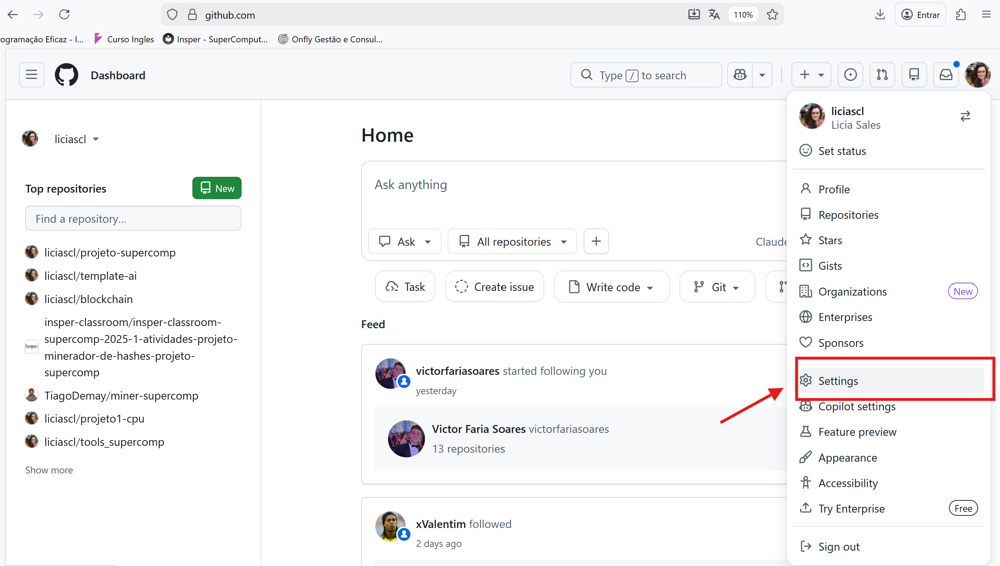

3. Clique em **SSH and GPG keys**

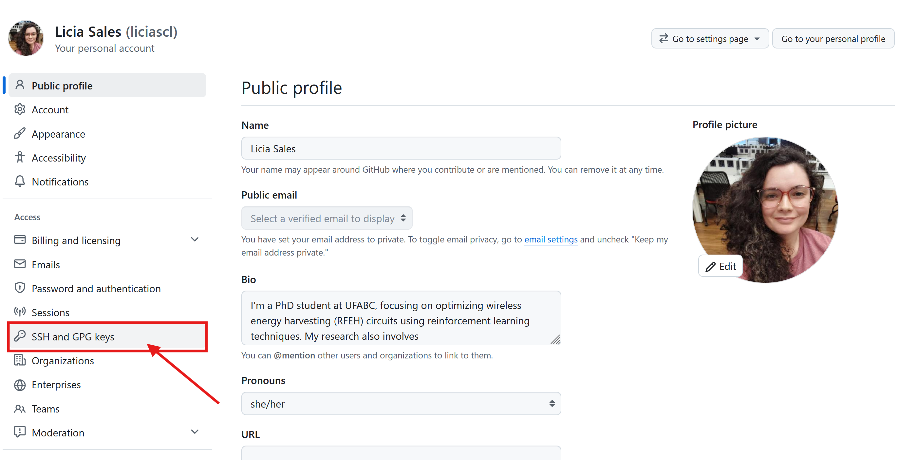

4. Clique em **New SSH key**

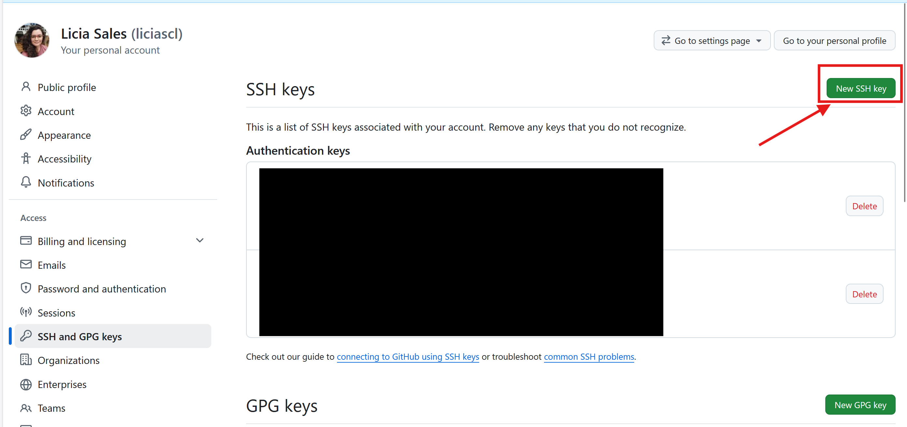

5. Cole a chave pública e depois clique em "Add SSH key"

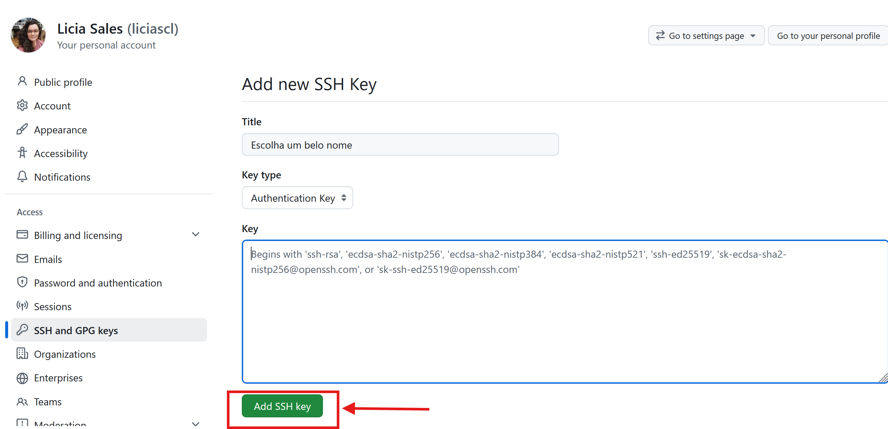


### Teste a conexão

```bash
ssh -T git@github.com
```

Se estiver correto, aparecerá:

```
Hi usuario! You've successfully authenticated...
```


### Ambientação no Santos Dumont

Antes de começar a fazer pedidos de recursos pro SLURM, vamos conhecer as filas que temos acesso e o hardware que temos disponível em cada fila.

```bash
sacctmgr list user $USER -s format=partition%20,MaxJobs,MaxSubmit,MaxNodes,MaxCPUs,MaxWall
```

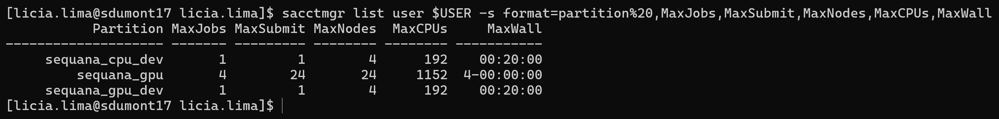


As filas que temos acesso tem essas características:


## Fila sequana_cpu_dev

A fila sequana_cpu_dev pode ser usada para testes em CPU, permitindo a execução de apenas 1 job por vez,  utilizando até 4 nós e 192 CPUs por job, com tempo limite de 20 minutos. A infraestrutura disponível conta com 166 nós e 7968 CPUs no total, com 8 GB de memória por CPU, somando aproximadamente 62 TB de memória. 

## Fila sequana_gpu_dev

A fila sequana_gpu_dev pode ser usada para testes com uso de GPU, também limitada a 1 job por vez, podendo utilizar até 4 nós e 192 CPUs por job, com tempo máximo de 20 minutos. Disponibiliza 61 nós, 2928 CPUs e 244 GPUs, com configuração padrão de 12 núcleos de CPUs por GPU e 94 GB de memória por GPU. A memória por CPU é de 8 GB. 

## Fila sequana_gpu

A fila sequana_gpu é a principal fila utilizada para execução de jobs em GPU, permitindo até 4 jobs simultâneos e 24 submissões, com uso de até 24 nós e 1152 CPUs por job, e **tempo máximo de execução de até 4 dias**. Possui 87 nós, 4176 CPUs e 348 GPUs, mantendo a proporção padrão de 12 CPUs por GPU e 94 GB de memória por GPU. A memória por CPU é de 8 GB, totalizando aproximadamente 32 TB. 


### Explorando com o SRUN
Vale lembrar que podemos pedir via SRUN um terminal dentro do nó de computação, para, de forma livre, executar qualquer comando:

```bash
srun --partition=sequana_gpu_dev --gres=gpu:1 --pty bash
```

Para sair, basta digitar no terminal:
```bash
exit
```

Ou, podemos usar o SRUN com um comando definido que será executado no nó de computação de forma direta pelo terminal:


```bash
srun --partition=sequana_gpu_dev --gres=gpu:1 --ntasks=1 --pty bash -c \
"echo '=== HOSTNAME ==='; hostname; echo; \
 echo '=== MEMORIA (GB) ==='; \
 cat /proc/meminfo | grep -E 'MemTotal|MemFree|MemAvailable|Swap' | \
 awk '{printf \"%s %.2f GB\\n\", \$1, \$2 / 1048576}'; \
 echo; \
 echo '=== CPU INFO ==='; \
 lscpu | grep -E 'Model name|Socket|Core|Thread|CPU\\(s\\)|cache'
 echo '=== GPU INFO ==='; \
 if command -v nvidia-smi &> /dev/null; then nvidia-smi; else echo 'nvidia-smi não disponível'; fi"
```


```bash
srun --partition=sequana_cpu_dev --ntasks=1 --pty bash -c \
"echo '=== HOSTNAME ==='; hostname; echo; \
 echo '=== MEMORIA (GB) ==='; \
 cat /proc/meminfo | grep -E 'MemTotal|MemFree|MemAvailable|Swap' | \
 awk '{printf \"%s %.2f GB\\n\", \$1, \$2 / 1048576}'; \
 echo; \
 echo '=== CPU INFO ==='; \
 lscpu | grep -E 'Model name|Socket|Core|Thread|CPU\\(s\\)|cache'
 echo '=== GPU INFO ==='; \
 if command -v nvidia-smi &> /dev/null; then nvidia-smi; else echo 'nvidia-smi não disponível'; fi"
```

O comando `sinfo` mostra quais são as filas e quais são os status dos nós 

```bash
sinfo
```
Como o Santos Dumont é utilizado por pessoas de todo o país, a quantidade de informações exibidas pode ser muito grande. Por isso, vamos aplicar alguns filtros para visualizar apenas o que é relevante para nós:


Este comando filtra por projeto, então só veremos os jobs relacionados aos alunos do Insper

```bash
squeue -A insperhpc
```
Se quiser filtrar apenas o seu usuário:

```bash
squeue -u $USER
```

Este filtra pela fila

```bash
sinfo -p sequana_gpu_dev
```

```bash
sinfo -p sequana_cpu_dev
```

```bash
sinfo -p sequana_gpu
```

## Carregando módulos no sistema

No Cluster Franky precisamos carregar o módulo da GPU para conseguir compilar os códigos em CUDA e executar os binários na GPU. No Santos Dumont, não é diferente, porém, temos mais módulos disponíveis:

Com o comando:

```bash
module avail cuda
```

Você pode ver a lista de módulos cuda disponíveis:

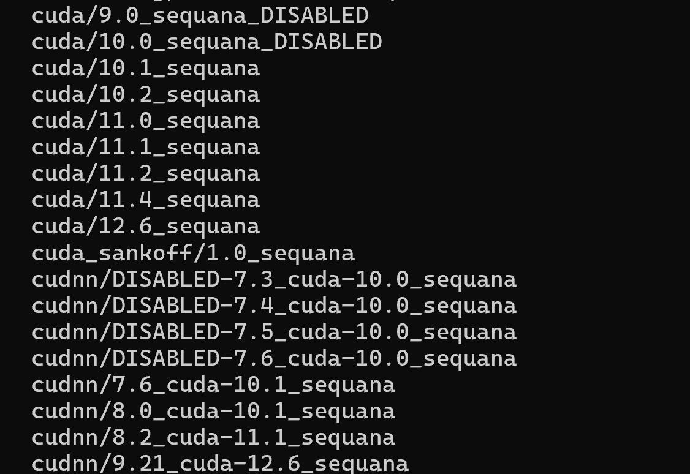

Eu costumo usar o modulo mais próximo ao que temos no Cluster Franky para garantir portabilidade de código, mas fique a vontade para escolher e testar a versão que quiser:

Para carregar o módulo:

```bash
module load cuda/12.6_sequana
```

Crie o arquivo 

`hello.cu`
```cpp 
#include <iostream>
#include <iomanip>
#include <cuda_runtime.h>

// KERNEL CUDA
__global__ void helloGPU()
{
    // ID global da thread
    int global_id =
        blockIdx.x * blockDim.x + threadIdx.x;

    // Warp ao qual a thread pertence
    int warp_id = threadIdx.x / warpSize;

    // blockIdx.x  -> bloco atual
    // threadIdx.x -> thread dentro do bloco
    // global_id   -> thread global no grid
    // warp_id     -> warp da thread
    //
    printf(
        "[Bloco %02d] "
        "[Thread %02d] "
        "[Global ID %03d] "
        "[Warp %02d]\n",

        blockIdx.x,
        threadIdx.x,
        global_id,
        warp_id
    );

}

int main()
{
    cudaDeviceProp hw;

    // Obtém informações da GPU
    cudaGetDeviceProperties(&hw, 0);

    // Configuração do kernel
    int blocks = 1;
    int threads = 40;


    std::cout << "GPU: "
              << hw.name << "\n";

    std::cout << "Memoria Global: "
              << std::fixed
              << std::setprecision(2)
              << hw.totalGlobalMem /
                 (1024.0 * 1024.0 * 1024.0)
              << " GB\n";

    std::cout << "SMs: "
              << hw.multiProcessorCount << "\n";

    std::cout << "Warp: "
              << hw.warpSize << "\n";

    std::cout << "Max Threads/Bloco: "
              << hw.maxThreadsPerBlock << "\n";

    std::cout << "\n";

    // ==================================================
    // CONFIGURAÇÃO DO GRID
    // ==================================================

    std::cout << "Blocos: "
              << blocks << "\n";

    std::cout << "Threads por bloco: "
              << threads << "\n";

    std::cout << "Total de threads: "
              << blocks * threads << "\n";

    std::cout << "Warps por bloco: "
              << (threads + hw.warpSize - 1)
                 / hw.warpSize
              << "\n";

    std::cout << "========================================\n\n";

    // EXECUTA O KERNEL
    helloGPU<<<blocks, threads>>>();

    // Espera a GPU terminar
    cudaDeviceSynchronize();

    return 0;
}
```

Para compilar use

```bash
nvcc -O3 hello.cu -o hello
```

Para executar use:

```bash
srun --partition=sequana_gpu_dev --gres=gpu:1 ./hello
```

Se quiser submeter um job com sbatch:

run.slurm
```bash
#!/bin/bash
#SBATCH --job-name=exemplo_gpu
#SBATCH --output=saida_%j.txt
#SBATCH --time=00:10:00
#SBATCH --gres=gpu:1
#SBATCH --partition=sequana_gpu_dev
#SBATCH --mem=1G                  # 1 GiB por nó


module load cuda/12.6_sequana

./hello

```

```bash
sbatch run.slurm
```

Sugiro que troque o valor de 'blocos' e de 'threads' para ver como diferentes configurações são alocadas na GPU

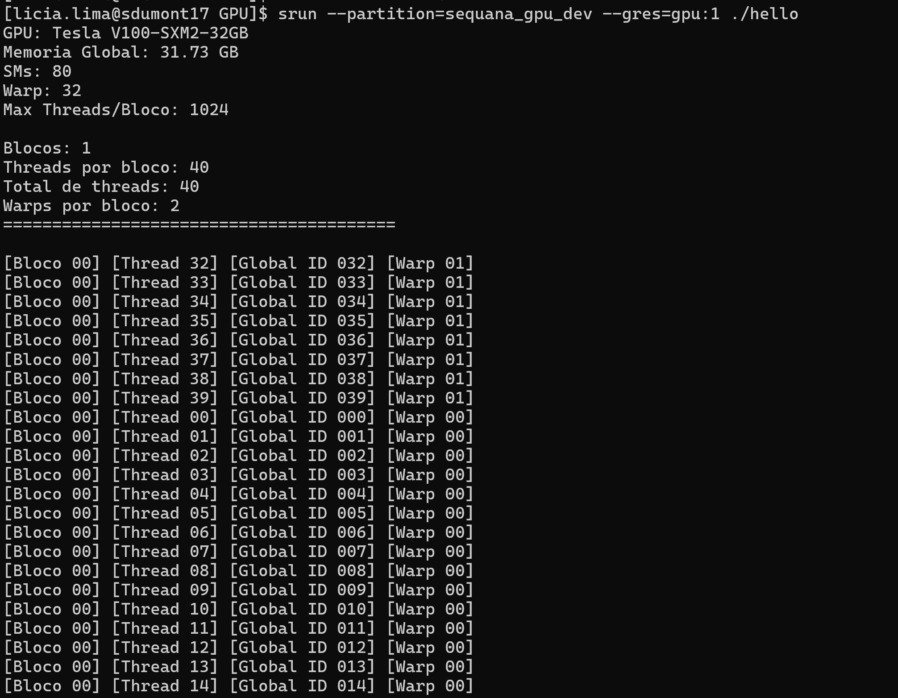

Agora que já aprendemos a acessar a pasta `SCRATCH`, configurar o GitHub, carregar módulos e submeter jobs com GPU alocada, vamos colocar tudo isso em prática:

### Testando a APS2 no SDumont

Para realizar testes da APS2 é importante clonar o repositório na pasta `SCRATCH`

lembrando, para estar na pasta `SCRATCH` utilize o comando:

```bash
cd /scratch/insperhpc/seu-login
```

faça o clone do repositório:

```bash
git clone git@github.com:insper-classroom/>>>>>>>>>aps2-seu-login<<<<<<<<<<<.git
```

Se você apenas der `make` vamos ter alguns problemas...

É importante garantir que você tem os arquivos `main_cpu.cpp` e `main_gpu.cu` para compilar corretamente usando o Makefile disponibilizado.

É importante também que você carregue o módulo do gcc antes de fazer as compilações, temos várias opções disponíveis, eu vou utilizar esta para garantir compatibilidade com o modulo cuda.

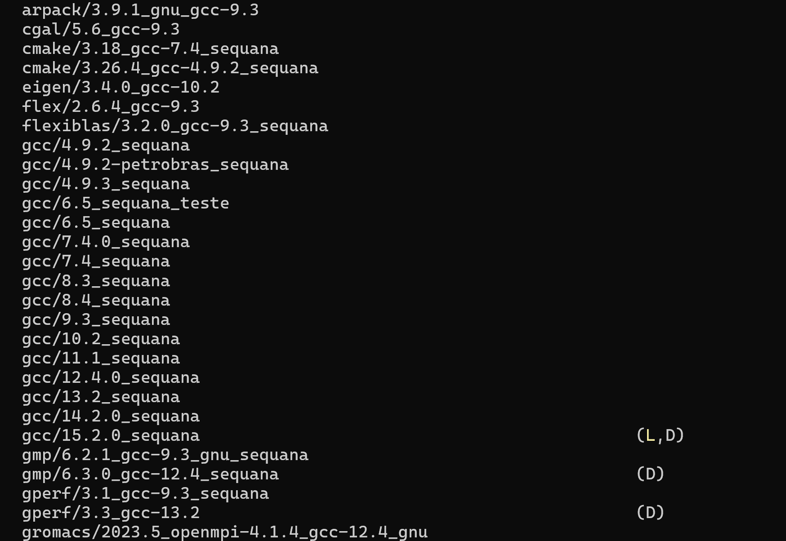

```bash
module load gcc/12.4.0_sequana
```

```bash
module load cuda/12.6_sequana
```

O Emil usou um compilador gcc mais novo no desenvolvimento do código base, se você compilar o código sem fazer uma pequena alteração, vai aparecer um erro como este:
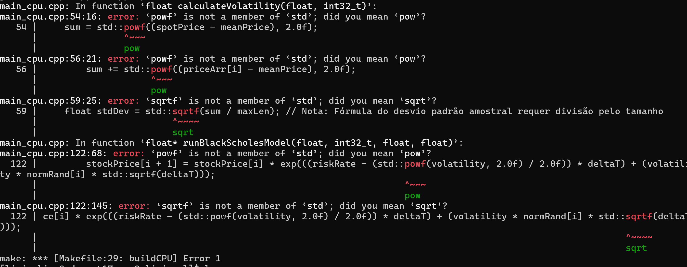

basta trocar `powf` por `pow` e `sqrtf` por `sqrt` no seu código que vai compilar sem erros.

Seu arquivo `Makefile` deve definir os parâmetros de complexidade computacional utilizados nos testes.

Para os primeiros experimentos, vamos utilizar uma configuração mais simples, garantindo que a execução seja rápida e fácil de validar;

```cpp
# Execuções
runCPU:
        ./$(CPU_EXE)  100 100 100 100 0.5 0.5

```


Após estes ajustes execute o comando:

```bash
make buildCPU
```

Depois de gerar os binários, teste o código:

```bash
srun --partition=sequana_cpu_dev make runCPU
```

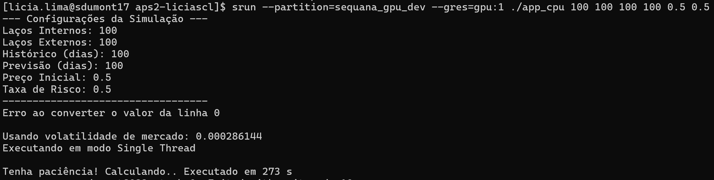

Ou use o sbatch 

```bash
#!/bin/bash
#SBATCH --job-name=exemplo_gpu
#SBATCH --output=saida.txt
#SBATCH --time=00:10:00
#SBATCH --gres=gpu:1
#SBATCH --partition=sequana_gpu_dev
#SBATCH --mem=1G

#carregue os modulos
module load gcc/12.4.0_sequana
module load cuda/12.6_sequana

#Execute o binario
make runCPU
```

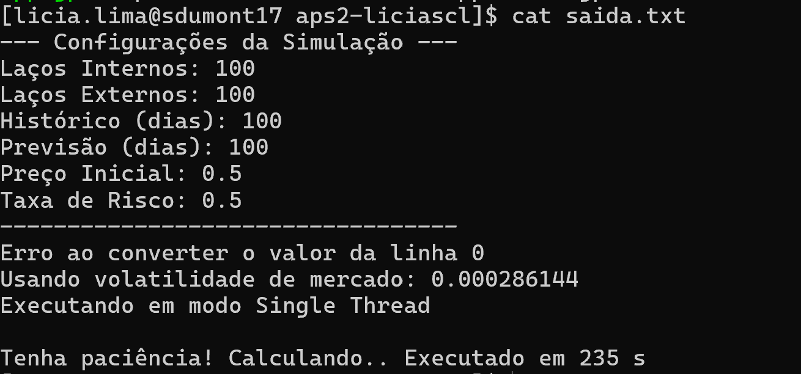

Desta forma testamos a versão CPU sequencial do código.

### Entendendo o código base

O código base da APS2 implementa uma simulação do comportamento das ações da NVIDIA utilizando o modelo de Black-Scholes aliado ao Método de Monte Carlo.

A aplicação utiliza dados históricos de fechamento das ações para calcular a volatilidade do mercado e, a partir disso, gerar múltiplas projeções probabilísticas para o preço futuro do ativo.

Quando você configura os parâmetros desta forma, como no exemplo:

```cpp
# Execuções
runCPU:
        ./$(CPU_EXE)  100 100 100 100 0.5 0.5

```
Você está configurando:

| Parâmetro           | Valor | Significado                                                            |
| ------------------- | ----- | ---------------------------------------------------------------------- |
| `inLoops`           | `100` | Quantidade de simulações |
| `outLoops`          | `100` | Quantidade total de execuções do método de Monte Carlo                 |
| `timeStepsHistory`  | `100` | Janela de dados históricos utilizados para calcular a volatilidade |
| `timeStepsForecast` | `100` | Janela de tempo para a previsão futura                      |
| `spotPrice`         | `0.5` | Preço inicial da ação no instante inicial                       |
| `riskRate`          | `0.5` | Taxa livre de risco utilizada no modelo matemático                     |


Na prática, configurar:

```cpp
# Execuções
runCPU:
        ./$(CPU_EXE)  100 100 100 100 0.5 0.5

```

significa:

- Executar 100 simulações
- Executar o Monte Carlo 100 vezes
- Utilizar 100 amostras históricas do mercado
- Projetar 100 passos temporais futuros
- Considerar um preço inicial da ação igual a 0.5
- Utilizar taxa de risco de 0.5


Lembrando que para a entrega da [APS2](../../projetos/2026-1/APS2.md) a configuração dos testes muda de acordo com a rúbrica, para validar a pontuação inicial, você deve cumprir os seguintes critérios:

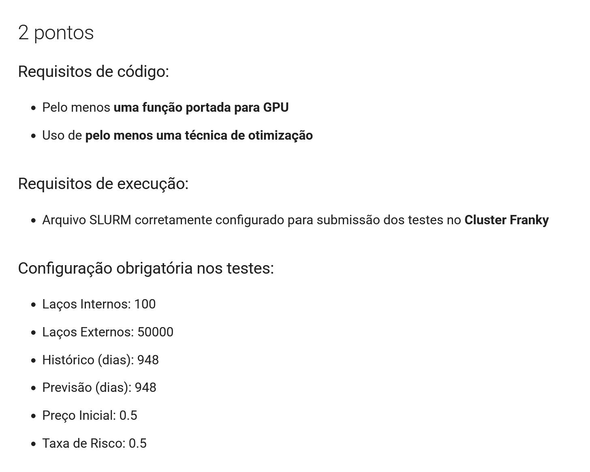


É a sua vez, use as ferramentas de otimização que aprendemos até aqui para melhorar o código base e resolver o primeiro desafio da APS2. 
