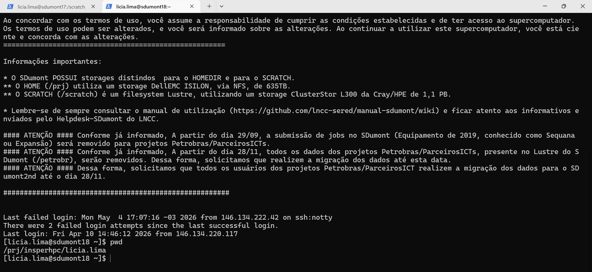
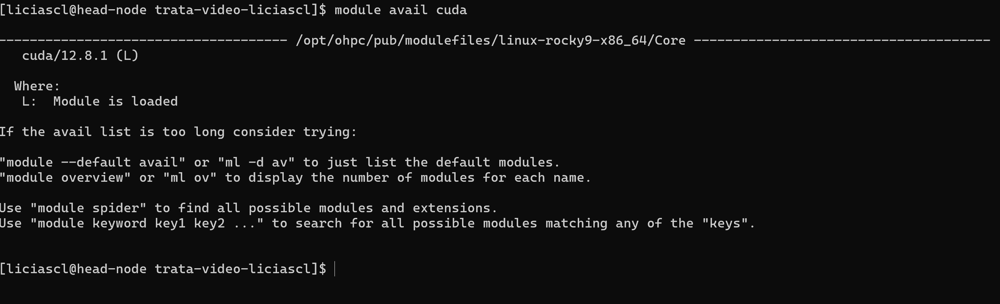
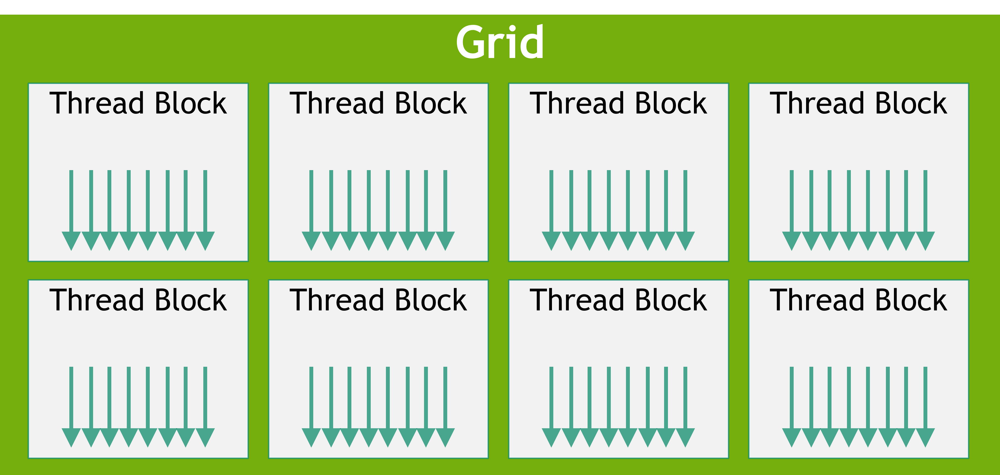

# Revisão I - Passando o código da CPU para GPU

## Sistemas de HPC

O paralelismo em GPU se diferencia do paralelismo em CPU de várias formas, uma delas está na maneira como solicitamos recursos para o SLURM, primeiro de tudo é importante considerar que não é possível compartilhar o hardware da GPU com outros usuários, uma vez que a GPU é alocada para o seu job, só você terá acesso a GPU, desta forma, você pode alocar completamente a GPU, e esta é um boa prática, aproveitar o máximo possível o potencial da GPU. Para fazer a solicitação de GPU via slurm você precisa:

### Carregar os modulos

Um sistema de HPC pode ter várias versões de drivers e módulos, é importante prestar atenção em qual versão do modulo você precisa trabalhar para garantir compatibilidade de drivers, para verificar a lista de módulos e drivers disponíveis para uma determinada instalação, utilize o comando:

```bash
module avail cuda
```
Neste exemplo, filtramos a busca por `cuda`, desta forma, podemos visualizar todos os módulos e drivers disponíveis com esta interface

Cluster SDumont


Cluster Franky


Observando as opções disponíveis do cuda, verificamos que a instalação mais atualizada é a `cuda/12.6_sequana`, no caso do SDumont, no Franky temos apenas a opção `cuda/12.8.1`.

No Franky use:
```bash
module load cuda/12.8.1 
```

No SDumont use:
```bash
module load cuda/12.6_sequana 
```


Uma vez carregado o módulo, é possível utilizar as ferramentas desta instalação em todo o ambiente, inclusive nos nós de computação.

### Submetendo um job com suporte a GPU

Com o srun, você pode solicitar um terminal para executar o seu job de forma rápida, você pode ou não, salvar o output desta execução, se quiser salvar o output, faça a submissão do job desta forma:

```bash
srun --partition=gpu --gres=gpu:1 --output=saida.txt ./seu_binario
```

Esse comando pede ao SLURM que execute imediatamente um programa dentro da partição `gpu`, reservando uma GPU, e salvando todo o output em `saida.txt`.


Se você precisa executar um código que vai ficar rodando sem a sua supervisão, é melhor usar o sbatch, pois o sbatch executa em background.

Um sbatch com suporte a GPU seria assim:

```bash
#!/bin/bash
#SBATCH --job-name=exemplo_gpu
#SBATCH --output=saida_%j.txt
#SBATCH --time=00:10:00
#SBATCH --gres=gpu:1
#SBATCH --partition=gpu
#SBATCH --mem=1G                  


module load cuda/12.8.1 

./seu_binario
```

## Passando um código sequencial em CPU para GPU usando CUDA

Vamos começar com um programa C++ simples que soma os elementos de dois arrays.

```cpp
#include <iostream>
#include <cmath>
#include <chrono>

using namespace std;
using namespace std::chrono;


// ==========================================================
// FUNÇÃO CPU
// ==========================================================

void compute(int n,
             float *out,
             float *x,
             float *y)
{
    for (int i = 0; i < n; i++)
    {
        float v = x[i] + y[i];

        // carga computacional 
        for (int k = 0; k < 1000; k++)
        {
            v =
                v * 1.00001f +
                sqrt(v) +
                sin(v);
        }

        out[i] = v;
    }
}


// ==========================================================
// MAIN
// ==========================================================

int main()
{
    // ------------------------------------------------------
    // TAMANHO DO VETOR
    // ------------------------------------------------------

    int N = 10'000'000;

    // ------------------------------------------------------
    // ALOCA MEMÓRIA
    // ------------------------------------------------------

    float *x   = new float[N];
    float *y   = new float[N];
    float *out = new float[N];

    // ------------------------------------------------------
    // INICIALIZA DADOS
    // ------------------------------------------------------

    for (int i = 0; i < N; i++)
    {
        x[i] = 1.0f + i * 0.000001f;
        y[i] = 2.0f + i * 0.000001f;
    }

    // ------------------------------------------------------
    // INÍCIO DA MEDIÇÃO
    // ------------------------------------------------------

    auto start =
        high_resolution_clock::now();

    // ------------------------------------------------------
    // EXECUTA COMPUTAÇÃO
    // ------------------------------------------------------

    compute(N, out, x, y);

    // ------------------------------------------------------
    // FIM DA MEDIÇÃO
    // ------------------------------------------------------

    auto stop =
        high_resolution_clock::now();

    double elapsed =
        duration<double, milli>(
            stop - start
        ).count();

    // ------------------------------------------------------
    // OUTPUT
    // ------------------------------------------------------

    cout << "Tempo CPU: "
         << elapsed
         << " ms"
         << endl;

    cout << "out[0] = "
         << out[0]
         << endl;

    cout << "out[N-1] = "
         << out[N - 1]
         << endl;

    // ------------------------------------------------------
    // LIBERA MEMÓRIA
    // ------------------------------------------------------

    delete[] x;
    delete[] y;
    delete[] out;

    return 0;
}
```

Primeiro, compile e execute esse programa C++. Coloque o código acima em um arquivo e salve como **compute.cpp**, e então compile com o compilador C++. 
```
g++ compute.cpp -o comp_cpu
```

Depois execute:

```
srun --partition=gpu ./comp_cpu

```

Para passa esse código para a GPU, primeiro, precisa transformar a função **compute** em uma função que a GPU pode executar, chamada de *kernel* em CUDA. Para fazer isso, é preciso adicionar o especificador **global** à função, o que diz ao compilador CUDA C++ que essa é uma função que roda na GPU e pode ser chamada a partir de código da CPU.

```cpp
__global__
void computeGPU(int n,
                float *out,
                float *x,
                float *y)
{
    // índice global da thread
    int i = blockIdx.x * blockDim.x +   threadIdx.x;

    // evita acessar posições inválidas
    if (i < n)
    {
        float v = x[i] + y[i];

        // carga computacional 
        for (int k = 0; k < 1000; k++)
        {
            v =
                v * 1.00001f +
                sqrtf(v) +
                sinf(v);
        }

        out[i] = v;
    }
}

```

Essa função **__global__** é conhecida como kernel CUDA e roda na GPU. Código que roda na GPU é frequentemente chamado de *device code*, enquanto código que roda na CPU é chamado de *host code*.


Até agora, os arrays `x`, `y` e `sum` existem apenas na memória da CPU (host).

A GPU possui sua própria memória, chamada de **device memory**, separada da RAM principal do computador.

Por isso, antes de executar o kernel, precisamos:

1. alocar memória na GPU;
2. copiar os dados da CPU para a GPU.


Primeiro criamos ponteiros que irão apontar para memória no device (GPU):

```cpp
float *d_x;
float *d_y;
float *d_out;
```

Agora usamos `cudaMalloc`, que funciona de forma parecida com `malloc` em C.

A sintaxe é:

```cpp
cudaMalloc(&ponteiro, tamanho_em_bytes);
```

Então fica:

```cpp
cudaMalloc(&d_x,   N * sizeof(float));
cudaMalloc(&d_y,   N * sizeof(float));
cudaMalloc(&d_out, N * sizeof(float));
```

Com este comando, a GPU reserva espaço na VRAM, mas esses dados ainda estão vazios.

Agora precisamos copiar os arrays da CPU (`x` e `y`) para a memória da GPU (`d_x` e `d_y`).

Isso é feito com `cudaMemcpy`. A Sintaxe é:

```cpp
cudaMemcpy(destino, origem, bytes, direção);
```

Então fica:

```cpp
cudaMemcpy(d_x, x, N * sizeof(float),
           cudaMemcpyHostToDevice);

cudaMemcpy(d_y, y, N * sizeof(float),
           cudaMemcpyHostToDevice);
```

| Parâmetro                | Significado         |
| ------------------------ | ------------------- |
| `d_x`                    | destino na GPU      |
| `x`                      | origem na CPU       |
| `N * sizeof(float)`      | quantidade de bytes |
| `cudaMemcpyHostToDevice` | direção da cópia    |


Agora que os dados já estão na GPU, precisamos dizer:

1. quantas threads serão criadas;
2. como essas threads serão organizadas;
3. quantos elementos cada thread irá processar.

Em CUDA, as threads são organizadas em:

```text 
THREADS → dentro de BLOCOS
BLOCOS  → dentro de uma GRID
```

A hierarquia fica assim:

```text 
GRID
 ├── BLOCO 0
 │     ├── thread 0
 │     ├── thread 1
 │     ├── thread 2
 │     └── ...
 │
 ├── BLOCO 1
 │     ├── thread 0
 │     ├── thread 1
 │     └── ...
 │
 └── ...
```


Se quisermos que, por exemplo, 1 thread fique responsável por 1 posição do vetor

Por exemplo:

| Thread   | Elemento processado |
| -------- | ------------------- |
| thread 0 | soma posição 0      |
| thread 1 | soma posição 1      |
| thread 2 | soma posição 2      |
| ...      | ...                 |

Podemos adotar esta configuração muito comum em CUDA:

```cpp 
int threadsPerBlock = 256;
```

Isso significa:

```text
cada bloco terá 256 threads
```
Como as GPUs funcionam melhor com grupos de threads múltiplos de 32.

Então valores como:

* 128
* 256
* 512

costumam funcionar muito bem.


Agora precisamos descobrir quantos blocos são necessários para cobrir todo o vetor


Se temos `N = 1.000.000` elementos e 256 threads por bloco, então precisamos dividir:

$$
\frac{1,000,000}{256}
$$

Mas precisamos tomar cuidado:

* a divisão pode não ser exata;
* podemos precisar de um bloco extra.

Por isso usamos:

```cpp 
int blocksPerGrid =
    (N + threadsPerBlock - 1)
    / threadsPerBlock;
```

A fórmula:

$$
blocksPerGrid = \frac{N + threadsPerBlock - 1}{threadsPerBlock}
$$

faz um arredondamento para cima.

Isso garante que sempre haverá threads suficientes

Agora precisamos lançar o kernel.

A sintaxe é:

```cpp 
kernel<<<n_blocos, n_threads>>>();
```

No nosso caso:

```cpp 
add<<<blocksPerGrid, threadsPerBlock>>>( N, d_sum, d_x, d_y );
```

Se:

```cpp 
threadsPerBlock = 256
blocksPerGrid = 3907
```

Então a GPU criará:

$$
3907 \times 256 \approx 1,000,000\ \text{threads}
$$

Cada thread:

1. calcula seu índice `i`;
2. lê `d_x[i]`;
3. lê `d_y[i]`;
4. soma os valores;
5. escreve em `d_sum[i]`.


Só falta mais uma coisa: preciso que a CPU espere até que o kernel esteja terminado antes de acessar os resultados (porque lançamentos de kernel CUDA não bloqueiam a thread da CPU que o chamou). Para isso, basta chamar **cudaDeviceSynchronize()** antes visualizar os resultados.

Depois do kernel terminar, precisamos trazer o resultado para a CPU.

```cpp
cudaMemcpy(out, d_out, N * sizeof(float), cudaMemcpyDeviceToHost);
```

Assim como usamos `delete` ou `free` na CPU, precisamos liberar a memória da GPU usando `cudaFree`.

```cpp
cudaFree(d_x);
cudaFree(d_y);
cudaFree(d_out);
```


Arquivos CUDA têm a extensão **.cu**. Então salve esse código em um arquivo chamado **compute.cu**


O código completo:
```cpp
#include <iostream>
#include <cmath>
#include <chrono>

using namespace std;
using namespace std::chrono;


// ==========================================================
// KERNEL CUDA
// ==========================================================

__global__
void computeGPU(int n,
                float *out,
                float *x,
                float *y)
{
    // índice global da thread
    int i = blockIdx.x * blockDim.x + threadIdx.x;

    // evita acessar posições inválidas
    if (i < n)
    {
        float v = x[i] + y[i];

        // carga computacional
        for (int k = 0; k < 1000; k++)
        {
            v =
                v * 1.00001f +
                sqrtf(v) +
                sinf(v);
        }

        out[i] = v;
    }
}


// ==========================================================
// MAIN
// ==========================================================

int main()
{
    // ------------------------------------------------------
    // TAMANHO DO VETOR
    // ------------------------------------------------------

    int N = 10'000'000;

    size_t size = N * sizeof(float);

    // ------------------------------------------------------
    // DADOS CPU
    // ------------------------------------------------------

    float *x   = new float[N];
    float *y   = new float[N];
    float *out = new float[N];

    // ------------------------------------------------------
    // INICIALIZA DADOS
    // ------------------------------------------------------

    for (int i = 0; i < N; i++)
    {
        x[i] = 1.0f + i * 0.000001f;
        y[i] = 2.0f + i * 0.000001f;
    }

    // ------------------------------------------------------
    // DADOS GPU
    // ------------------------------------------------------

    float *d_x;
    float *d_y;
    float *d_out;

    cudaMalloc(&d_x, size);
    cudaMalloc(&d_y, size);
    cudaMalloc(&d_out, size);

    // ------------------------------------------------------
    // COPIA CPU -> GPU
    // ------------------------------------------------------

    cudaMemcpy(d_x,
               x,
               size,
               cudaMemcpyHostToDevice);

    cudaMemcpy(d_y,
               y,
               size,
               cudaMemcpyHostToDevice);

    // ------------------------------------------------------
    // CONFIGURA KERNEL
    // ------------------------------------------------------

    int threadsPerBlock = 256;

    int blocks =
        (N + threadsPerBlock - 1)
        / threadsPerBlock;

    // ------------------------------------------------------
    // INÍCIO DA MEDIÇÃO
    // ------------------------------------------------------

    auto start =
        high_resolution_clock::now();

    // ------------------------------------------------------
    // EXECUTA KERNEL
    // ------------------------------------------------------

    computeGPU<<<blocks, threadsPerBlock>>>(
        N,
        d_out,
        d_x,
        d_y
    );

    // espera GPU terminar
    cudaDeviceSynchronize();

    // ------------------------------------------------------
    // FIM DA MEDIÇÃO
    // ------------------------------------------------------

    auto stop =
        high_resolution_clock::now();

    double elapsed =
        duration<double, milli>(
            stop - start
        ).count();

    // ------------------------------------------------------
    // COPIA GPU -> CPU
    // ------------------------------------------------------

    cudaMemcpy(out,
               d_out,
               size,
               cudaMemcpyDeviceToHost);

    // ------------------------------------------------------
    // OUTPUT
    // ------------------------------------------------------

    cout << "Tempo GPU: "
         << elapsed
         << " ms"
         << endl;

    cout << "out[0] = "
         << out[0]
         << endl;

    // ------------------------------------------------------
    // LIBERA MEMÓRIA GPU
    // ------------------------------------------------------

    cudaFree(d_x);
    cudaFree(d_y);
    cudaFree(d_out);

    // ------------------------------------------------------
    // LIBERA MEMÓRIA CPU
    // ------------------------------------------------------

    delete[] x;
    delete[] y;
    delete[] out;

    return 0;
}
    
```

Compile com o **nvcc**, o compilador CUDA C++.

```
nvcc compute.cu -o comp_gpu
srun --partition=gpu --gres=gpu:1 ./comp_gpu
```

Isso é apenas o primeiro passo, com o código em GPU podemos usar técnicas de otimização para melhorar ainda mais o desempenho do código, porém, iremos veremos sobre isso na próxima revisão.

## Exercícios — Passando Código Sequencial da CPU para GPU com CUDA

A ideia desses exercícios é praticar:

* criação de kernels CUDA;
* paralelismo com threads;
* `cudaMalloc`;
* `cudaMemcpy`;
* configuração de grids e blocos;
* execução de kernels.

### Exercício 1 — Multiplicação de Vetores

Passe a função `multiply` para um kernel CUDA, faça a alocação e a cópia dos dados para a GPU corretamente, e crie o lançador do kernel `multiply`: 

Código base:
```cpp
#include <iostream>

void multiply(int n, float *a, float *b, float *out)
{
    for(int i = 0; i < n; i++)
        out[i] = a[i] * b[i];
}

int main()
{
    int N = 1'000'000;

    float *a   = new float[N];
    float *b   = new float[N];
    float *out = new float[N];

    for(int i = 0; i < N; i++) {
        a[i] = 2.0f;
        b[i] = 4.0f;
    }

    multiply(N, a, b, out);

    std::cout << out[0] << std::endl;

    delete[] a;
    delete[] b;
    delete[] out;
}
```
### Exercício 2 — Soma de Matrizes

Paralelize a soma de matrizes em GPU passando a função `matrixAdd` para um kernel Cuda, faça a alocação, a cópia dos dados para a GPU corretamente, e crie o lançador do kernel.

```cpp 
#include <iostream>

void matrixAdd(int n, float *A, float *B, float *C)
{
    for(int i = 0; i < n*n; i++)
        C[i] = A[i] + B[i];
}

int main()
{
    int N = 1024;

    float *A = new float[N*N];
    float *B = new float[N*N];
    float *C = new float[N*N];

    for(int i = 0; i < N*N; i++) {
        A[i] = 1.0f;
        B[i] = 2.0f;
    }

    matrixAdd(N, A, B, C);

    std::cout << C[0] << std::endl;

    delete[] A;
    delete[] B;
    delete[] C;
}
```

### Exercício 3 — Threshold em Imagem

Paralelize a operação `threshold` em GPU passando a função para um kernel Cuda, faça a alocação, a cópia dos dados para a GPU corretamente, e crie o lançador do kernel.

```cpp 
#include <iostream>

void threshold(unsigned char *in,
               unsigned char *out,
               int n,
               int T)
{
    for(int i = 0; i < n; i++)
    {
        out[i] =
            (in[i] > T) ? 255 : 0;
    }
}

int main()
{
    int N = 1920 * 1080;

    unsigned char *img =
        new unsigned char[N];

    unsigned char *out =
        new unsigned char[N];

    for(int i = 0; i < N; i++)
        img[i] = rand() % 256;

    threshold(img, out, N, 128);

    std::cout << (int)out[0]
              << std::endl;

    delete[] img;
    delete[] out;
}
```

### Exercício 4 — Conversão RGB para Escala de Cinza

Paralelize a operação `rgb2gray` em GPU passando a função para um kernel cuda, faça a alocação, a cópia dos dados para a GPU corretamente, e crie o lançador do kernel.


```cpp 
#include <iostream>

void rgb2gray(unsigned char *rgb,
              unsigned char *gray,
              int n)
{
    for(int i = 0; i < n; i++)
    {
        int idx = i * 3;

        float r = rgb[idx];
        float g = rgb[idx + 1];
        float b = rgb[idx + 2];

        gray[i] =
            0.299f * r +
            0.587f * g +
            0.114f * b;
    }
}

int main()
{
    int N = 1920 * 1080;

    unsigned char *rgb =
        new unsigned char[N * 3];

    unsigned char *gray =
        new unsigned char[N];

    for(int i = 0; i < N*3; i++)
        rgb[i] = rand() % 256;

    rgb2gray(rgb, gray, N);

    std::cout
        << (int)gray[0]
        << std::endl;

    delete[] rgb;
    delete[] gray;
}
```
### Desafio Extra

Depois de terminar os exercícios:

1. compare tempo CPU vs GPU;
2. teste:

   * 128 threads;
   * 256 threads;
   * 512 threads;
3. descubra qual configuração é mais rápida.


Referência:
https://developer.nvidia.com/blog/even-easier-introduction-cuda/