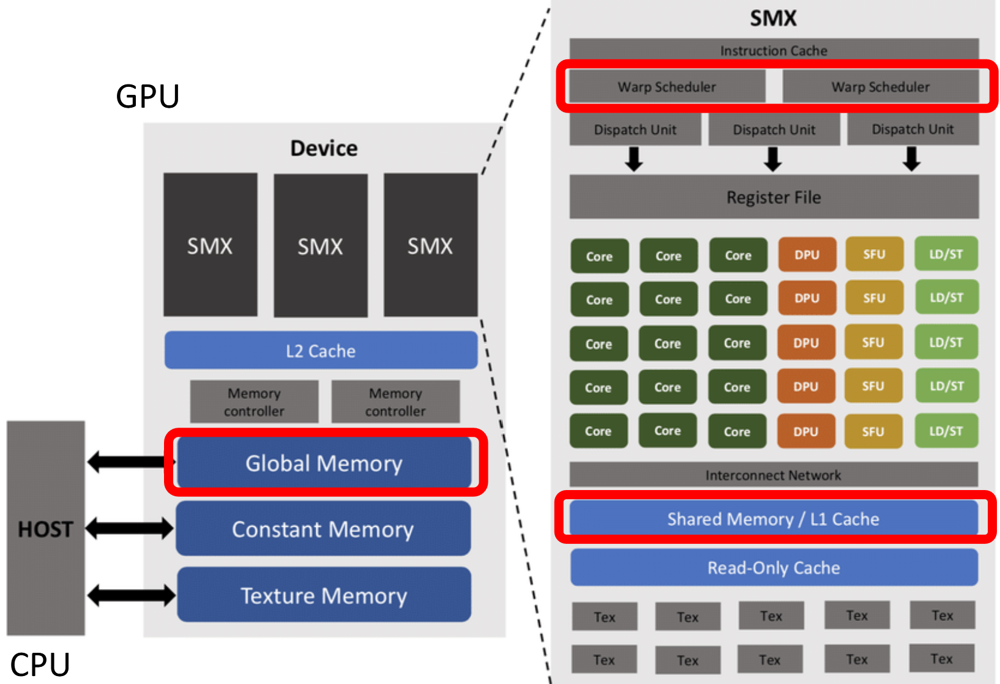
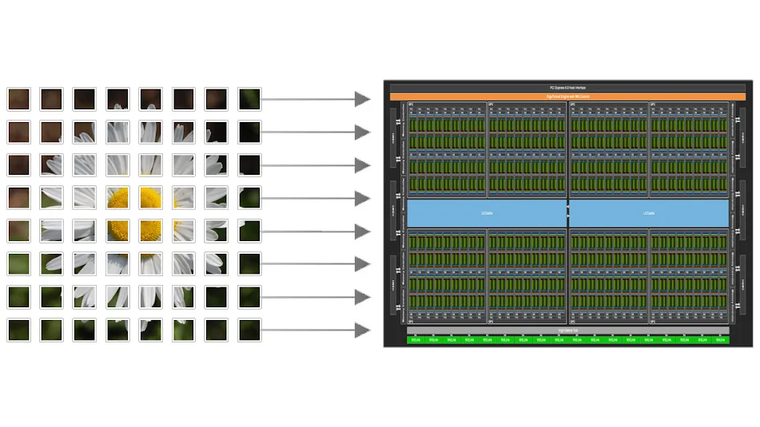
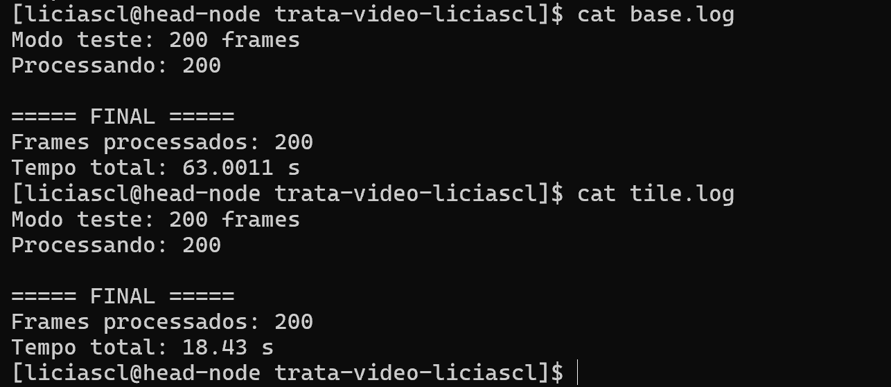
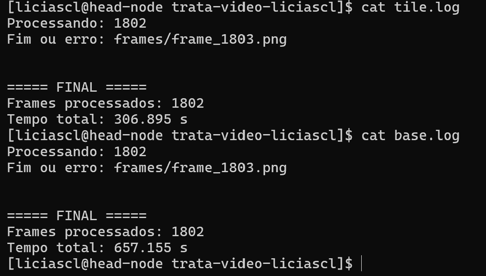

# Revisão II - Estratégias de otimização em GPU

Depois de portar um código da CPU para GPU, é importante analisar suas características para identificar qual é o principal gargalo da aplicação. A partir dessa análise, é possível decidir quais técnicas de otimização fazem mais sentido para melhorar o desempenho.

## Em relação aos gargalos

Existem funções com alto reaproveitamento de dados, em que diferentes threads acessam repetidamente os mesmos dados. Um exemplo clássico é o filtro de Sobel em imagens, onde pixels vizinhos são reutilizados várias vezes. Esse tipo de problema se beneficia muito de **tiling** e do uso de **shared memory**, já que os dados podem ser carregados uma vez e reutilizados por múltiplas threads, reduzindo acessos à memória global.

Outro possível gargalo é o **acesso irregular à memória**, que ocorre quando as threads acessam posições distantes entre si, prejudicando a **localidade espacial**. Estruturas como grafos e matrizes esparsas frequentemente apresentam esse problema. Nesses casos, vale reorganizar estruturas de dados para melhorar localidade espacial, utilizar formatos mais compactos e reduzir os acessos desalinhados.


Em aplicações com muitos valores zero, chamadas de **dados esparsos**, ocorre desperdício de memória e processamento ao armazenar e processar elementos irrelevantes. Nesse cenário, técnicas de compressão como CSR (*Compressed Sparse Row*) permitem armazenar apenas os valores não nulos, reduzindo uso de memória e largura de banda.


Por fim, um gargalo bastante comum é a **transferência excessiva entre CPU e GPU**. Em alguns casos, mover dados entre host e device pode custar mais caro do que a própria computação. Para reduzir esse impacto, é recomendado minimizar transferências, manter os dados na GPU pelo maior tempo possível, utilizar *pinned memory* e aplicar computação assíncrona com CUDA Streams, permitindo sobreposição entre transferência de dados e execução dos kernels.


## Otimizando o código da atividade Trata Vídeo

O código base disponibilizado na atividade trata vídeo realiza, de forma geral, as seguintes etapas:

1. Conversão RGB → grayscale
2. Aplicação do filtro de Sobel
3. Binarização 


Cada uma dessas etapas apresenta características diferentes, permitindo o uso de diferentes técnicas de otimização para melhorar o desempenho.

### Reaproveitamento de Dados 

O filtro de Sobel aplica uma convolução 3x3 sobre a imagem. Isso significa que cada thread acessa não apenas o pixel atual, mas também seus vizinhos. Como pixels vizinhos são reutilizados várias vezes por threads próximas, podemos aplicar **tiling** e **shared memory** para melhorar o reaproveitamento de dados e diminuir o custo de transferência de dados entre Host e Device.

Na implementação original o acesso aos dados ocorre diversas vezes para pixels que poderiam ser reutilizados.

```cpp
int pixel = gray[(y + ky) * w + (x + kx)];
```


Então podemos carregar um bloco da imagem para memória compartilhada e depois reutilizar os pixels entre as threads do bloco.


Com essa otimização, reduzimos acessos à memória global, aumentamos localidade espacial,melhoramos throughput do kernel e reduzimos latência.

No código base, o filtro Sobel é responsável por detectar bordas na imagem através de uma convolução 3x3.

A implementação original faz isso diretamente na memória global:

```cpp
for (int ky = -1; ky <= 1; ky++) {
    for (int kx = -1; kx <= 1; kx++) {

        int pixel =
            gray[(y + ky) * w + (x + kx)];

        sumX += pixel * Gx[ky + 1][kx + 1];
        sumY += pixel * Gy[ky + 1][kx + 1];
    }
}
```


A **Shared Memory** é um tipo de memória extremamente rápida disponível dentro de cada *Streaming Multiprocessor* (SM) da GPU.




Para calcular o valor de um único pixel, cada thread precisa acessar não apenas o pixel central, mas também seus vizinhos. Como threads vizinhas utilizam praticamente os mesmos pixels durante a convolução, muitos acessos acabam sendo repetidos desnecessariamente na memória global.

Para resolver esse problema utilizamos a técnica chamada **tiling**.



O conceito de *tiling* consiste em dividir a imagem em pequenos blocos chamados **tiles**. Cada bloco CUDA fica responsável por carregar uma pequena região da imagem para a Shared Memory. Assim, em vez de cada thread acessar repetidamente a memória global, o bloco inteiro carrega os dados apenas uma vez e depois todas as threads reutilizam esses pixels localmente através da Shared Memory.

Neste exemplo, vamos utilizar blocos de $ 30 \times 30 $

Porém, o Sobel utiliza uma máscara de convolução $
3 \times 3 $

Isso significa que, para calcular um pixel, também precisamos acessar seus vizinhos, o tile não pode armazenar apenas os pixels centrais do bloco. Também precisamos carregar pixels extras ao redor da região principal para que as threads consigam acessar os vizinhos corretamente durante a convolução.

Essas regiões extras recebem o nome de **Halo**.

Como estamos usando um bloco de $ 30 \times 30 $

e precisamos adicionar uma borda de 1 pixel em cada lado, o tamanho real do tile armazenado na Shared Memory passa a ser:

$$
(30+2) \times (30+2)
$$

O `+2` acontece porque adicionamos:

* 1 coluna extra à esquerda;
* 1 coluna extra à direita;
* 1 linha extra acima;
* 1 linha extra abaixo.

Dentro do kernel CUDA, a Shared Memory é criada utilizando o modificador:

```cpp 
__shared__
```

Por exemplo:

```cpp 
__shared__
unsigned char tile[BLOCK_SIZE + 2][BLOCK_SIZE + 2];
```

Com isso, a GPU passa a armazenar temporariamente os dados do tile em uma memória muito mais rápida e próxima das unidades de execução do SM. Dessa forma, reduzimos drasticamente os acessos à memória global e aumentamos o reaproveitamento de dados entre as threads do bloco.


```cpp
#define BLOCK_SIZE 32

__shared__
unsigned char tile[BLOCK_SIZE][BLOCK_SIZE];
```

Aqui estamos criando:

* uma matriz compartilhada;
* acessível por todas as threads do bloco;
* incluindo espaço para o halo.


Cada thread possui:

```cpp
int tx = threadIdx.x;
int ty = threadIdx.y;
```

Esses índices representam a posição da thread dentro do bloco.

Já a posição global da imagem é:

```cpp
int x =
    blockIdx.x * BLOCK_SIZE + tx;

int y =
    blockIdx.y * BLOCK_SIZE + ty;
```

Cada thread copia um pixel da imagem para o tile:

```cpp
tile[sy][sx] =
    gray[y * w + x];
```

Onde:

```cpp
int sx = tx + 1;
int sy = ty + 1;
```

O deslocamento `+1` existe porque a borda do tile será reservada para o halo.


As threads das bordas ficam responsáveis por carregar pixels extras.


O Sobel passa a acessar:

```cpp
tile[sy + ky][sx + kx]
```

em vez de:

```cpp
gray[(y + ky) * w + (x + kx)]
```

Além do uso de **Shared Memory** e **Tiling**, também precisamos fazer algumas otimizações que ajuda a reduzir a latência, e diminuir acessos à memória global para aumentar o throughput da GPU.


No código original, o processamento era dividido em três etapas separadas:

1. RGB → grayscale
2. Sobel
3. Threshold

Cada etapa percorre a imagem inteira novamente.

Isso gerava múltiplos acessos à memória global:

```txt 
RGB -> grayscale
grayscale -> Sobel
Sobel -> threshold
```

Cada função lê os dados da memória global, processa, e escreve novamente na memória global. Como vimos, essa movimentação de dados de CPU para GPU e de GPU para CPU é muito custosa, uma forma simples de resolver isso é colocar essas funções em um único kernel CUDA:

```txt 
RGB -> grayscale -> Sobel -> threshold
```

Com isso:

* o pixel RGB é carregado apenas uma vez;
* o grayscale já é armazenado diretamente no tile;
* o Sobel utiliza os dados da Shared Memory;
* o threshold é aplicado imediatamente após o Sobel.

Isso reduz drasticamente as leituras globais, as escritas globais, o overhead de múltiplos kernels e as  sincronizações entre CPU e GPU.


As máscaras Sobel são pequenas e utilizadas por todas as threads repetidamente. Na versão original, essas máscaras eram recriadas dentro da função Sobel:

```cpp 
int Gx[3][3]
int Gy[3][3]
```

No kernel otimizado elas foram movidas para:


```cpp 
__constant__ int SOBEL_X[3][3];
```
Isso reduz o overhead de carregamento das máscaras.

Se quiser olhar como ficou o código com as otimizações descritas aqui:

??? note "Ver o código"
    // ============================================================
    // STB IMAGE
    // ============================================================

    // Biblioteca utilizada para carregar imagens PNG/JPG.
    #define STB_IMAGE_IMPLEMENTATION
    #include "stb_image.h"

    // Biblioteca utilizada para salvar imagens.
    #define STB_IMAGE_WRITE_IMPLEMENTATION
    #include "stb_image_write.h"

    // ============================================================
    // BIBLIOTECAS
    // ============================================================

    #include <iostream>
    #include <vector>
    #include <queue>
    #include <cmath>
    #include <cstdio>
    #include <filesystem>
    #include <chrono>
    #include <algorithm>

    // Biblioteca principal do CUDA.
    #include <cuda_runtime.h>

    using namespace std;

    // Alias para facilitar uso do filesystem.
    namespace fs = std::filesystem;

    // Alias para medição de tempo.
    using namespace std::chrono;

    // ============================================================
    // CONFIGURAÇÃO DO BLOCO CUDA
    // ============================================================

    // Define o tamanho do bloco CUDA.
    //
    // Nesse caso:
    // 32 x 32 = 1024 threads por bloco.
    //
    // Cada bloco processará uma região
    // da imagem.
    #define BLOCK_SIZE 32

    // ============================================================
    // ESTRUTURA DE BOUNDING BOX
    // ============================================================

    // Estrutura utilizada para representar
    // caixas delimitadoras.
    struct Box {

        // Coordenadas mínimas e máximas.
        int minx, miny, maxx, maxy;
    };

    // ============================================================
    // MÁSCARAS SOBEL EM CONSTANT MEMORY
    // ============================================================

    // Constant Memory é uma memória otimizada
    // para leitura.
    //
    // Como TODAS as threads usam as mesmas
    // máscaras Sobel, faz sentido armazená-las
    // aqui para reduzir acessos repetidos.

    // Sobel horizontal.
    __constant__ int SOBEL_X[3][3] = {

        {-1, 0, 1},
        {-2, 0, 2},
        {-1, 0, 1}
    };

    // Sobel vertical.
    __constant__ int SOBEL_Y[3][3] = {

        {-1,-2,-1},
        { 0, 0, 0},
        { 1, 2, 1}
    };

    // ============================================================
    // KERNEL CUDA FUSIONADO
    //
    // O kernel realiza:
    //
    // RGB -> Grayscale -> Sobel -> Threshold
    //
    // Tudo em UMA única execução.
    // ============================================================

    __global__
    void pipeline_kernel(

        // Imagem RGB original.
        unsigned char* rgb,

        // Saída binária final.
        unsigned char* bin,

        // Largura da imagem.
        int w,

        // Altura da imagem.
        int h,

        // Valor do threshold.
        int threshold)
    {
        // ========================================================
        // SHARED MEMORY
        // ========================================================

        // Shared Memory utilizada para armazenar
        // um tile da imagem.
        //
        // Shared Memory é MUITO mais rápida
        // que memória global.
        //
        // O tile será reutilizado pelas threads
        // do bloco durante o Sobel.
        __shared__
        unsigned char tile[BLOCK_SIZE][BLOCK_SIZE];

        // ========================================================
        // THREAD IDS
        // ========================================================

        // Posição da thread dentro do bloco.
        int tx = threadIdx.x;
        int ty = threadIdx.y;

        // Coordenada global da thread na imagem.
        int x = blockIdx.x * BLOCK_SIZE + tx;
        int y = blockIdx.y * BLOCK_SIZE + ty;

        // Coordenadas dentro do tile.
        //
        // O +1 existe porque as bordas do tile
        // serão utilizadas pelo halo.
        int sx = tx + 1;
        int sy = ty + 1;

        // ========================================================
        // CARREGAMENTO DO PIXEL CENTRAL
        // ========================================================

        // Verifica se a thread está dentro
        // da imagem.
        if (x < w && y < h)
        {
            // Índice do pixel RGB.
            int idx = (y * w + x) * 3;

            // Carrega canais RGB.
            unsigned char r = rgb[idx];
            unsigned char g = rgb[idx + 1];
            unsigned char b = rgb[idx + 2];

            // Conversão RGB -> grayscale.
            //
            // Fórmula padrão de luminância.
            tile[sy][sx] =
                (unsigned char)(
                    0.299f * r +
                    0.587f * g +
                    0.114f * b
                );
        }

        // ========================================================
        // HALO ESQUERDO
        // ========================================================

        // Threads da primeira coluna carregam
        // pixels extras da esquerda.
        //
        // Esses pixels são necessários para
        // o Sobel 3x3.
        if (tx == 0 && x > 0 && y < h)
        {
            int idx = (y * w + (x - 1)) * 3;

            unsigned char r = rgb[idx];
            unsigned char g = rgb[idx + 1];
            unsigned char b = rgb[idx + 2];

            tile[sy][0] =
                (unsigned char)(
                    0.299f * r +
                    0.587f * g +
                    0.114f * b
                );
        }

        // ========================================================
        // HALO DIREITO
        // ========================================================

        // Threads da última coluna carregam
        // os pixels da direita.
        if (tx == BLOCK_SIZE - 1 &&
            x < w - 1 &&
            y < h)
        {
            int idx = (y * w + (x + 1)) * 3;

            unsigned char r = rgb[idx];
            unsigned char g = rgb[idx + 1];
            unsigned char b = rgb[idx + 2];

            tile[sy][BLOCK_SIZE + 1] =
                (unsigned char)(
                    0.299f * r +
                    0.587f * g +
                    0.114f * b
                );
        }

        // ========================================================
        // HALO SUPERIOR
        // ========================================================

        // Threads da primeira linha carregam
        // pixels acima.
        if (ty == 0 && y > 0 && x < w)
        {
            int idx = ((y - 1) * w + x) * 3;

            unsigned char r = rgb[idx];
            unsigned char g = rgb[idx + 1];
            unsigned char b = rgb[idx + 2];

            tile[0][sx] =
                (unsigned char)(
                    0.299f * r +
                    0.587f * g +
                    0.114f * b
                );
        }

        // ========================================================
        // HALO INFERIOR
        // ========================================================

        // Threads da última linha carregam
        // pixels abaixo.
        if (ty == BLOCK_SIZE - 1 &&
            y < h - 1 &&
            x < w)
        {
            int idx = ((y + 1) * w + x) * 3;

            unsigned char r = rgb[idx];
            unsigned char g = rgb[idx + 1];
            unsigned char b = rgb[idx + 2];

            tile[BLOCK_SIZE + 1][sx] =
                (unsigned char)(
                    0.299f * r +
                    0.587f * g +
                    0.114f * b
                );
        }

        // ========================================================
        // HALOS DIAGONAIS
        // ========================================================

        // Também precisamos carregar os
        // cantos diagonais do tile.
        //
        // Isso acontece porque o Sobel usa
        // TODA a vizinhança 3x3.

        // Canto superior esquerdo.
        if (tx == 0 && ty == 0 &&
            x > 0 && y > 0)
        {
            int idx =
                ((y - 1) * w + (x - 1)) * 3;

            unsigned char r = rgb[idx];
            unsigned char g = rgb[idx + 1];
            unsigned char b = rgb[idx + 2];

            tile[0][0] =
                (unsigned char)(
                    0.299f * r +
                    0.587f * g +
                    0.114f * b
                );
        }

        // Canto superior direito.
        if (tx == BLOCK_SIZE - 1 &&
            ty == 0 &&
            x < w - 1 &&
            y > 0)
        {
            int idx =
                ((y - 1) * w + (x + 1)) * 3;

            unsigned char r = rgb[idx];
            unsigned char g = rgb[idx + 1];
            unsigned char b = rgb[idx + 2];

            tile[0][BLOCK_SIZE + 1] =
                (unsigned char)(
                    0.299f * r +
                    0.587f * g +
                    0.114f * b
                );
        }

        // Canto inferior esquerdo.
        if (tx == 0 &&
            ty == BLOCK_SIZE - 1 &&
            x > 0 &&
            y < h - 1)
        {
            int idx =
                ((y + 1) * w + (x - 1)) * 3;

            unsigned char r = rgb[idx];
            unsigned char g = rgb[idx + 1];
            unsigned char b = rgb[idx + 2];

            tile[BLOCK_SIZE + 1][0] =
                (unsigned char)(
                    0.299f * r +
                    0.587f * g +
                    0.114f * b
                );
        }

        // Canto inferior direito.
        if (tx == BLOCK_SIZE - 1 &&
            ty == BLOCK_SIZE - 1 &&
            x < w - 1 &&
            y < h - 1)
        {
            int idx =
                ((y + 1) * w + (x + 1)) * 3;

            unsigned char r = rgb[idx];
            unsigned char g = rgb[idx + 1];
            unsigned char b = rgb[idx + 2];

            tile[BLOCK_SIZE + 1][BLOCK_SIZE + 1] =
                (unsigned char)(
                    0.299f * r +
                    0.587f * g +
                    0.114f * b
                );
        }

        // ========================================================
        // SINCRONIZAÇÃO
        // ========================================================

        // Espera TODAS as threads terminarem
        // de carregar o tile antes do Sobel.
        __syncthreads();

        // ========================================================
        // SOBEL
        // ========================================================

        // Evita processar bordas externas
        // da imagem.
        if (x > 0 &&
            x < w - 1 &&
            y > 0 &&
            y < h - 1)
        {
            int sumX = 0;
            int sumY = 0;


            for (int ky = -1; ky <= 1; ky++)
            {

                for (int kx = -1; kx <= 1; kx++)
                {
                    // Agora acessamos Shared Memory,
                    // NÃO memória global.
                    int pixel =
                        tile[sy + ky][sx + kx];

                    // Convolução horizontal.
                    sumX +=
                        pixel *
                        SOBEL_X[ky + 1][kx + 1];

                    // Convolução vertical.
                    sumY +=
                        pixel *
                        SOBEL_Y[ky + 1][kx + 1];
                }
            }


            int mag =
                abs(sumX) +
                abs(sumY);

            // Limita valor máximo.
            if (mag > 255)
                mag = 255;

            // ====================================================
            // THRESHOLD
            // ====================================================

            // Gera imagem binária.
            //
            // Pixels fortes viram branco.
            // Pixels fracos viram preto.
            bin[y * w + x] =
                (mag > threshold)
                ? 255
                : 0;
        }
    }

    // ============================================================
    // MAIN
    // ============================================================

    int main(int argc, char* argv[])
    {
        // Quantidade máxima de frames.
        int max_frames = -1;

        // Modo teste via terminal.
        if (argc > 1)
        {
            max_frames = atoi(argv[1]);

            cout << "Modo teste: "
                << max_frames
                << " frames\n";
        }

        // Cria pasta de saída.
        fs::create_directory("out");

        // Início da medição.
        auto t0 = high_resolution_clock::now();

        int frame = 1;

        // ========================================================
        // LOOP DOS FRAMES
        // ========================================================

        while (true)
        {
            // Interrompe no modo teste.
            if (max_frames != -1 &&
                frame > max_frames)
                break;

            char filename[256];

            // Nome do frame atual.
            sprintf(
                filename,
                "frames/frame_%04d.png",
                frame
            );

            int w, h, c;

            // Carrega imagem.
            unsigned char* input =
                stbi_load(
                    filename,
                    &w,
                    &h,
                    &c,
                    3
                );

            // Se não conseguiu carregar,
            // encerra execução.
            if (!input)
            {
                cout << "\nFim ou erro: "
                    << filename
                    << endl;
                break;
            }

            // ====================================================
            // MEMÓRIA CPU
            // ====================================================

            // Imagem binária final.
            unsigned char* bin =
                new unsigned char[w * h];

            // ====================================================
            // MEMÓRIA GPU
            // ====================================================

            unsigned char* d_rgb;
            unsigned char* d_bin;

            // Tamanho da imagem RGB.
            size_t rgbSize =
                w * h * 3 *
                sizeof(unsigned char);

            // Tamanho da imagem grayscale/binária.
            size_t graySize =
                w * h *
                sizeof(unsigned char);

            // Aloca memória na GPU.
            cudaMalloc(&d_rgb, rgbSize);
            cudaMalloc(&d_bin, graySize);

            // Copia RGB CPU -> GPU.
            cudaMemcpy(
                d_rgb,
                input,
                rgbSize,
                cudaMemcpyHostToDevice
            );

            // ====================================================
            // CONFIGURAÇÃO CUDA
            // ====================================================

            // Bloco CUDA.
            dim3 block(
                BLOCK_SIZE,
                BLOCK_SIZE
            );

            // Grade CUDA.
            dim3 grid(
                (w + BLOCK_SIZE - 1) / BLOCK_SIZE,
                (h + BLOCK_SIZE - 1) / BLOCK_SIZE
            );

            // ====================================================
            // EXECUÇÃO DO KERNEL
            // ====================================================

            pipeline_kernel<<<grid, block>>>(
                d_rgb,
                d_bin,
                w,
                h,
                100
            );

            // Espera GPU finalizar.
            cudaDeviceSynchronize();

            // ====================================================
            // CÓPIA GPU -> CPU
            // ====================================================

            cudaMemcpy(
                bin,
                d_bin,
                graySize,
                cudaMemcpyDeviceToHost
            );

            // ====================================================
            // OUTPUT
            // ====================================================

            char outname[256];

            sprintf(
                outname,
                "out/frame_%04d.png",
                frame
            );

            // Salva imagem binária.
            stbi_write_png(
                outname,
                w,
                h,
                1,
                bin,
                w * 1
            );

            // Mostra progresso.
            cout << "\rProcessando: "
                << frame
                << flush;

            // ====================================================
            // LIMPEZA DE MEMÓRIA
            // ====================================================

            cudaFree(d_rgb);
            cudaFree(d_bin);

            delete[] bin;

            stbi_image_free(input);

            frame++;
        }

        // Final da medição.
        auto t1 = high_resolution_clock::now();

        // Tempo total.
        double total_time =
            duration<double>(t1 - t0).count();

        // ========================================================
        // RESULTADO FINAL
        // ========================================================

        cout << "\n\n===== FINAL =====\n";

        cout << "Frames processados: "
            << frame - 1
            << endl;

        cout << "Tempo total: "
            << total_time
            << " s\n";

        return 0;
    }


Com essas otimizações e ajustes o código com o sobel otimizado teve uma melhora significativa em relação ao base puro:



Na execução com 200 frames, a implementação original levou aproximadamente `63.00 s` enquanto a versão com o sobel otimizado com tile e shared memory executou em cerca de `18.43 s`.



Com 1800 frames o código base levou `657.15s` e a versão com o sobel otimizando com tile e shared memory levou `306.89s`

Maaaaaaaaaaaaaaaaaasss ainda existem pontos do código que podem ser melhorados, não mexemos nas outras funções e tem técnicas de otimização que podem ser aplicadas para ganhar ainda mais desempenho. Na próxima etapa iremos rever as outras técnias de otimização e aplicar elas nas funções restantes.

### Conclusão 
A técnica de **tiling com Shared Memory** consiste em dividir os dados em pequenos blocos reutilizáveis dentro da GPU, reduzindo acessos repetidos à memória global e aumentando o reaproveitamento de dados entre as threads.

O processo pode ser resumido em poucos passos:

1. identificar regiões com reutilização de dados;
2. dividir o problema em tiles;
3. carregar os tiles para Shared Memory;
4. adicionar halos quando houver vizinhança;
5. sincronizar as threads com `__syncthreads()`;
6. escrever apenas o resultado final na memória global.


## Exercícios
Agora é sua vez, pratique a otimização com tiling e shared memory

### Exercício 1 - Blur Gaussiano 

Otimize o filtro Gaussiano utilizando tiling e shared memory.

Código Base

```cpp
#include <iostream>
#include <cmath>

using namespace std;

#define W 2048
#define H 2048

// ============================================================
// GAUSSIAN BLUR
// ============================================================

void gaussianBlur(
    unsigned char* input,
    unsigned char* output,
    int w,
    int h)
{
    // Kernel Gaussiano 3x3
    int kernel[3][3] = {
        {1,2,1},
        {2,4,2},
        {1,2,1}
    };

    // Percorre imagem
    for (int y = 1; y < h - 1; y++)
    {
        for (int x = 1; x < w - 1; x++)
        {
            int sum = 0;

            // Convolução 3x3
            for (int ky = -1; ky <= 1; ky++)
            {
                for (int kx = -1; kx <= 1; kx++)
                {
                    int pixel =
                        input[(y + ky) * w + (x + kx)];

                    sum +=
                        pixel *
                        kernel[ky + 1][kx + 1];
                }
            }

            // Normalização
            output[y * w + x] =
                sum / 16;
        }
    }
}

// ============================================================
// MAIN
// ============================================================

int main()
{
    unsigned char* input =
        new unsigned char[W * H];

    unsigned char* output =
        new unsigned char[W * H];

    // Inicializa uma imagem fake
    for (int i = 0; i < W * H; i++)
    {
        input[i] = rand() % 256;
    }

    gaussianBlur(input, output, W, H);

    cout << "Filtro concluido.\n";

    delete[] input;
    delete[] output;

    return 0;
}
```

### Exercício 2 — Multiplicação de Matrizes 


Otimize a multiplicação de matrizes utilizando tiling e shared memory.


Código Base 

```cpp
#include <iostream>

using namespace std;

#define N 1024

// ============================================================
// MULTIPLICAÇÃO DE MATRIZES
// ============================================================

void matmul(
    float* A,
    float* B,
    float* C)
{
    // Percorre linhas de A
    for (int i = 0; i < N; i++)
    {
        // Percorre colunas de B
        for (int j = 0; j < N; j++)
        {
            float sum = 0.0f;

            // Produto interno
            for (int k = 0; k < N; k++)
            {
                sum +=
                    A[i * N + k] *
                    B[k * N + j];
            }

            // Resultado
            C[i * N + j] = sum;
        }
    }
}

// ============================================================
// MAIN
// ============================================================

int main()
{
    float* A = new float[N * N];
    float* B = new float[N * N];
    float* C = new float[N * N];

    // Inicializa matrizes
    for (int i = 0; i < N * N; i++)
    {
        A[i] = 1.0f;
        B[i] = 1.0f;
    }

    matmul(A, B, C);

    cout << "Multiplicacao concluida.\n";

    delete[] A;
    delete[] B;
    delete[] C;

    return 0;
}
```

### Exercício 3 — Convolução 

Otimize a convolução utilizando tiling e shared memory.

Código Base 
```cpp 
#include <iostream>

using namespace std;

#define W 2048
#define H 2048
#define K 5

// ============================================================
// CONVOLUÇÃO 2D
// ============================================================

void convolution(
    float* input,
    float* output,
    float kernel[K][K],
    int w,
    int h)
{
    int radius = K / 2;

    for (int y = radius; y < h - radius; y++)
    {
        for (int x = radius; x < w - radius; x++)
        {
            float sum = 0.0f;

            // Janela do kernel
            for (int ky = -radius; ky <= radius; ky++)
            {
                for (int kx = -radius; kx <= radius; kx++)
                {
                    float pixel =
                        input[(y + ky) * w + (x + kx)];

                    float weight =
                        kernel[ky + radius][kx + radius];

                    sum += pixel * weight;
                }
            }

            output[y * w + x] = sum;
        }
    }
}

// ============================================================
// MAIN
// ============================================================

int main()
{
    float* input =
        new float[W * H];

    float* output =
        new float[W * H];

    float kernel[K][K];

    // Inicializa imagem
    for (int i = 0; i < W * H; i++)
    {
        input[i] = 1.0f;
    }

    // Inicializa kernel
    for (int y = 0; y < K; y++)
    {
        for (int x = 0; x < K; x++)
        {
            kernel[y][x] = 1.0f / (K * K);
        }
    }

    convolution(input, output, kernel, W, H);

    cout << "Convolucao concluida.\n";

    delete[] input;
    delete[] output;

    return 0;
}
```


### Exercício 4 — Transposição de Matriz 

Otimize a transposição de matriz utilizando tiling e shared memory.

Código Base 

```cpp 
#include <iostream>

using namespace std;

#define N 4096

// ============================================================
// TRANSPOSE
// ============================================================

void transpose(
    float* input,
    float* output)
{
    for (int y = 0; y < N; y++)
    {
        for (int x = 0; x < N; x++)
        {
            output[x * N + y] =
                input[y * N + x];
        }
    }
}

// ============================================================
// MAIN
// ============================================================

int main()
{
    float* input =
        new float[N * N];

    float* output =
        new float[N * N];

    // Inicializa matriz
    for (int i = 0; i < N * N; i++)
    {
        input[i] = (float)i;
    }

    transpose(input, output);

    cout << "Transpose concluido.\n";

    delete[] input;
    delete[] output;

    return 0;
}
```

