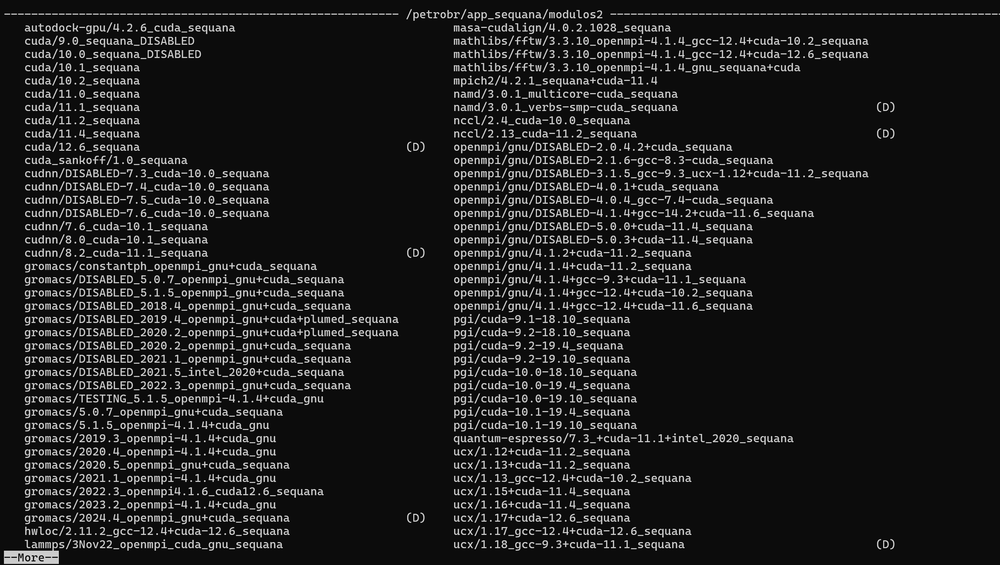

# Revisão


## Sistemas de HPC

O paralelismo em GPU se diferencia do paralelismo em CPU de várias formas, uma delas está na maneira como solicitamos recursos para o SLURM, primeiro de tudo é importante considerar que não é possível compartilhar o hardware da GPU com outros usuários, uma vez que a GPU é alocada para o seu job, só você terá acesso a GPU, desta forma, você pode alocar completamente a GPU, e esta é um boa prática, aproveitar o máximo possível o potencial da GPU. Para fazer a solicitação de GPU via slurm você precisa:

### Carregar os modulos

Um sistema de HPC pode ter várias versões de drivers e módulos, é importante prestar atenção em qual versão do modulo você precisa trabalhar para garantir compatibilidade de drivers, para verificar a lista de módulos e drivers disponíveis para uma determinada instalação, utilize o comando:

```bash
module avail cuda
```
Neste exemplo, filtramos a busca por `cuda`, desta forma, podemos visualizar todos os módulos e drivers disponíveis com esta interface



Observando as opções disponíveis do cuda, verificamos que a instalação mais atualizada é a `cuda/12.6_sequana`, então vamos carregar ela no ambiente

```bash
module load cuda/12.6_sequana 
```

Uma vez carregado o módulo, é possível utilizar as ferramentas desta instalação em todo o ambiente, inclusive nos nós de computação.

### Diretório Scratch

Assim que você conecta no Santos Dumont via SSH, usando algo como:

```bash
ssh -o MACs=hmac-sha2-256 seu_usuario@login.sdumont.lncc.br
```

Você cairá na pasta de projeto dentro do nó de login do Santos Dumont, com o comando `pwd`, é possível verificar o caminho do diretório que você está, que deverá ser algo como:

```bash
/prj/insperhpc/seu_usuario
```

O diretório de trabalho é o `SCRATCH`, somente neste ambiente os nós de computação terão acesso aos seus códigos e aos seus binários, então, logo que carregar os módulos necessários, troque para o diretório de trabalho:

```bash
cd /scratch/insperhpc/seu_usuario    
```

Neste ambiente você pode clonar seus repositórios, organizar suas pastas, submeter seus jobs...

### Informações úteis sobre os recursos do sistema

Para saber quais são as filas disponíveis para o seu usuário em um ambiente de HPC, você pode usar o seguinte comando:

```bash
sacctmgr list user $USER -s format=partition%20,MaxJobs,MaxSubmit,MaxNodes,MaxCPUs,MaxWall
```

No caso do Santos Dumont, você deve ver algo como:
```bash
           Partition MaxJobs MaxSubmit MaxNodes  MaxCPUs     MaxWall
-------------------- ------- --------- -------- -------- -----------
     sequana_cpu_dev       1         1        4      192    00:20:00
         sequana_gpu       4        24       24     1152  4-00:00:00
     sequana_gpu_dev       1         1        4      192    00:20:00

```

**Partition**

É a “fila” do SLURM, o espaço do cluster onde seu job vai rodar.
Cada partição tem características próprias: hardware específico, limites, prioridades.

No Santos Dumont:

* **sequana_cpu_dev**: CPUs para desenvolvimento rápido (jobs curtos).
* **sequana_gpu**: GPUs para produção (jobs longos, pesados).
* **sequana_gpu_dev**: GPUs para desenvolvimento (jobs curtos).


# **MaxJobs**

Número máximo de **jobs simultâneos em execução** que você, pode ter naquela partição.

* `1` significa que você só pode rodar um job por vez na partição. 
* `4` significa que você pode ter até quatro jobs rodando ao mesmo tempo.

**Exemplo:**
Em `sequana_gpu_dev`, se você tentar rodar dois jobs simultâneos, o segundo fica na fila como *pending* esperando o primeiro terminar.


**MaxSubmit**

Número máximo de **jobs pendentes ou rodando** que você pode **enviar** para uma fila.

É o limite de quantas submissões o SLURM aceita de você.

* Em dev (`sequana_cpu_dev`): `1`
  Só um job enviado por vez.
* Em produção (`sequana_gpu`): `24`
  Você pode enviar 24 jobs para a fila se quiser.

**MaxNodes**

Quantos nós você pode reservar **por job** nessa partição.

* `4` significa que seu job pode ocupar até 4 nós simultâneos.
* Se você tentar usar `--nodes=8` dentro dessa partição, o SLURM rejeita.


**MaxCPUs**

Número máximo de CPUs que você pode alocar **por job**.

Essa conta geralmente é:

```
MaxNodes × CPUs_por_nó = MaxCPUs
```

* `sequana_cpu_dev`: 4 nós × 48 CPUs = 192 CPUs
* `sequana_gpu_dev`: 4 nós × 48 CPUs = 192 CPUs
* `sequana_gpu`: 24 nós × 48 CPUs = 1152 CPUs

Isso não significa que você *vai* usar tudo, mas esse é o limite superior permitido para sua submissão.


**MaxWall**

O tempo máximo de **duração** que um job pode ter antes de ser morto.

Valores:

* `00:20:00` significa 20 minutos.
* `4-00:00:00` significa 4 dias.


### Para saber detalhes sobre o hardware disponível em cada fila

Usamos o comando

```bash
scontrol show partition sequana_gpu_dev
```

Para saber informações detalhadas sobre o hardware disponível em determinada fila

```bash
PartitionName=sequana_gpu_dev
   AllowGroups=ALL AllowAccounts=ALL AllowQos=ALL
   AllocNodes=ALL Default=NO QoS=defaultgpu
   DefaultTime=00:20:00 DisableRootJobs=NO ExclusiveUser=NO GraceTime=0 Hidden=NO
   MaxNodes=UNLIMITED MaxTime=UNLIMITED MinNodes=0 LLN=NO MaxCPUsPerNode=UNLIMITED MaxCPUsPerSocket=UNLIMITED
   Nodes=sdumont[8029-8055,8060-8083,8085-8091,8093-8095]
   PriorityJobFactor=40 PriorityTier=40 RootOnly=NO ReqResv=NO OverSubscribe=NO
   OverTimeLimit=NONE PreemptMode=OFF
   State=UP TotalCPUs=2928 TotalNodes=61 SelectTypeParameters=NONE
   JobDefaults=DefCpuPerGPU=12,DefMemPerGPU=94000
   DefMemPerCPU=8000 MaxMemPerNode=UNLIMITED
   TRES=cpu=2928,mem=22875G,node=61,billing=2928,gres/gpu=244
```

De forma resumida, a sequana_gpu e a sequana_gpu_dev tem essas características:


| Fila                | Nós | CPUs Totais | GPUs Totais | Memória Total | CPUs por GPU (default) | Memória por GPU (default) |
| ------------------- | --- | ----------- | ----------- | ------------- | ---------------------- | ------------------------- |
| **sequana_gpu_dev** | 61  | 2928        | 244         | 22.8 TB       | 12 CPUs/GPU            | 94 GB/GPU                 |
| **sequana_gpu**     | 87  | 4176        | 348         | 32.6 TB       | 12 CPUs/GPU            | 94 GB/GPU                 |


Ambas as filas são de GPU's V100 com 32 GB de VRAM.


### Submetendo um job com suporte a GPU

Considerando as informações sobre filas disponíveis e as configurações de hardware de cada fila, você pode submeter o seu job de duas formas diferentes:

### Comando srun

Com o srun, você pode solicitar um terminal para executar o seu job de forma rápida, você pode ou não, salvar o output desta execução, se quiser salvar o output, faça a submissão do job desta forma:

```bash
srun --partition=sequana_gpu_dev --gres=gpu:1 --output=saida.txt ./seu_binario
```

Esse comando pede ao SLURM que execute imediatamente um programa dentro da partição `sequana_gpu_dev`, reservando uma GPU, e salvando todo o output em `saida.txt`.

**`srun`**

É o comando do SLURM usado para executar jobs interativos ou iniciar processos paralelos dentro de alocações já existentes.


* Se a partição tiver recurso livre, ele roda agora.
* Se não tiver, seu comando fica *pending* até conseguir GPU.


**`--partition=sequana_gpu_dev`**

Define em qual fila você quer rodar.

`sequana_gpu_dev` é a fila de GPUs, com tempo máximo de 20 minutos.

Se você rodasse na `sequana_gpu`, poderia usar jobs longos, mas com maior concorrência.


**`--gres=gpu:1`**

Aqui você está dizendo:

“Reserve **1 GPU** para mim”.

Se você colocar `--gres=gpu:4`, estaria pedindo quatro GPUs.


**`--output=saida.txt`**

Tudo o que normalmente apareceria no seu terminal é redirecionado para um arquivo.

Se não colocar esse parâmetro, o output aparece diretamente no terminal.


### Comando sbatch

Se você precisa executar um código que vai ficar rodando sem a sua supervisão, é melhor usar o sbatch, pois o sbatch executa em background.

Um sbatch direto ao ponto para executar um código em GPU seria assim:

```bash
#!/bin/bash
#SBATCH --job-name=exemplo_gpu
#SBATCH --output=saida_%j.txt
#SBATCH --time=00:10:00
#SBATCH --gres=gpu:1
#SBATCH --partition=sequana_gpu_dev
#SBATCH --mem=1G                  


module load cuda/12.6_sequana

./seu_binario
```

## Passando um código sequencial em CPU para GPU usando CUDA

Vamos começar com um programa C++ simples que soma os elementos de dois arrays, cada um com um milhão de elementos.

```cpp
#include <iostream>
#include <math.h>

// function to add the elements of two arrays
void add(int n, float *x, float *y)
{
  for (int i = 0; i < n; i++)
      y[i] = x[i] + y[i];
}

int main(void)
{
  int N = 1<<20; // 1M elements

  float *x = new float[N];
  float *y = new float[N];

  // initialize x and y arrays on the host
  for (int i = 0; i < N; i++) {
    x[i] = 1.0f;
    y[i] = 2.0f;
  }

  // Run kernel on 1M elements on the CPU
  add(N, x, y);

  // Check for errors (all values should be 3.0f)
  float maxError = 0.0f;
  for (int i = 0; i < N; i++)
    maxError = fmax(maxError, fabs(y[i]-3.0f));
  std::cout << "Max error: " << maxError << std::endl;

  // Free memory
  delete [] x;
  delete [] y;

  return 0;
}
```

Primeiro, compile e execute esse programa C++. Coloque o código acima em um arquivo e salve como **add.cpp**, e então compile com o compilador C++. 
```
g++ add.cpp -o add
```

Depois execute:

```
./add
Max error: 0.000000
```

Para passa esse código para a GPU, primeiro, precisa transformar a função **add** em uma função que a GPU pode executar, chamada de *kernel* em CUDA. Para fazer isso, é preciso adicionar o especificador **global** à função, o que diz ao compilador CUDA C++ que essa é uma função que roda na GPU e pode ser chamada a partir de código da CPU.

```cpp
// Kernel function to add the elements of two arrays
__global__
void add(int n, float *sum, float *x, float *y)
{
  for (int i = 0; i < n; i++)
    sum[i] = x[i] + y[i];
}
```

Essa função **__global__** é conhecida como kernel CUDA e roda na GPU. Código que roda na GPU é frequentemente chamado de *device code*, enquanto código que roda na CPU é chamado de *host code*.


Para computar na GPU, precisa alocar memória acessível pela GPU. **Unified Memory** (Memória Unificada) no CUDA facilita isso ao fornecer um único espaço de memória acessível por todas as GPUs e CPUs do sistema. Para alocar dados em memória unificada, da pra usar o **cudaMallocManaged()**, que retorna um ponteiro acessível tanto pelo host (CPU) quanto pelo device (GPU). Para liberar os dados, basta passar o ponteiro para **cudaFree()**.


```cpp
// Allocate Unified Memory -- accessible from CPU or GPU
float *x, *y, *sum;
cudaMallocManaged(&x, N*sizeof(float));
cudaMallocManaged(&y, N*sizeof(float));

...

// Free memory
cudaFree(x);
cudaFree(y);
```

Lançamentos de kernel CUDA são especificados usando a sintaxe com três sinais de maior: **<<< >>>**. Só preciso adicioná-la na chamada de **add** antes da lista de parâmetros.

```
add<<<1, 1>>>(N, sum, x, y);
```

Essa linha lança **uma thread** da GPU para executar **add()**.

Só falta mais uma coisa: preciso que a CPU espere até que o kernel esteja terminado antes de acessar os resultados (porque lançamentos de kernel CUDA não bloqueiam a thread da CPU que o chamou). Para isso, basta chamar **cudaDeviceSynchronize()** antes de fazer a verificação final de erro na CPU.

O código completo:
```cpp
#include <iostream>
#include <math.h>

// Kernel function to add the elements of two arrays
__global__
void add(int n, float *x, float *y)
{
  for (int i = 0; i < n; i++)
    y[i] = x[i] + y[i];
}

int main(void)
{
  int N = 1<<20;
  float *x, *y;

  // Allocate Unified Memory – accessible from CPU or GPU
  cudaMallocManaged(&x, N*sizeof(float));
  cudaMallocManaged(&y, N*sizeof(float));

  // initialize x and y arrays on the host
  for (int i = 0; i < N; i++) {
    x[i] = 1.0f;
    y[i] = 2.0f;
  }

  // Run kernel on 1M elements on the GPU
  add<<<1, 1>>>(N, x, y);

  // Wait for GPU to finish before accessing on host
  cudaDeviceSynchronize();

  // Check for errors (all values should be 3.0f)
  float maxError = 0.0f;
  for (int i = 0; i < N; i++) {
    maxError = fmax(maxError, fabs(y[i]-3.0f));
  }
  std::cout << "Max error: " << maxError << std::endl;

  // Free memory
  cudaFree(x);
  cudaFree(y);
  return 0;
}
```

Arquivos CUDA têm a extensão **.cu**. Então salve esse código em um arquivo chamado **add.cu** e compile com o **nvcc**, o compilador CUDA C++.

```
nvcc add.cu -o add_cuda
./add_cuda
Max error: 0.000000
```

Isso é apenas o primeiro passo, porque da forma como está, esse kernel só funciona para **uma única thread**. 

Nos próximos passos é importante entender como gerenciar memória adequadamente, como funciona a divisão lógica dentro da GPU e, para implementações mais complexas, é legal entender como programar de forma assíncrona. O material sobre os próximos passos estão disponíveis nas aulas anteriores.


Referência:
https://developer.nvidia.com/blog/even-easier-introduction-cuda/