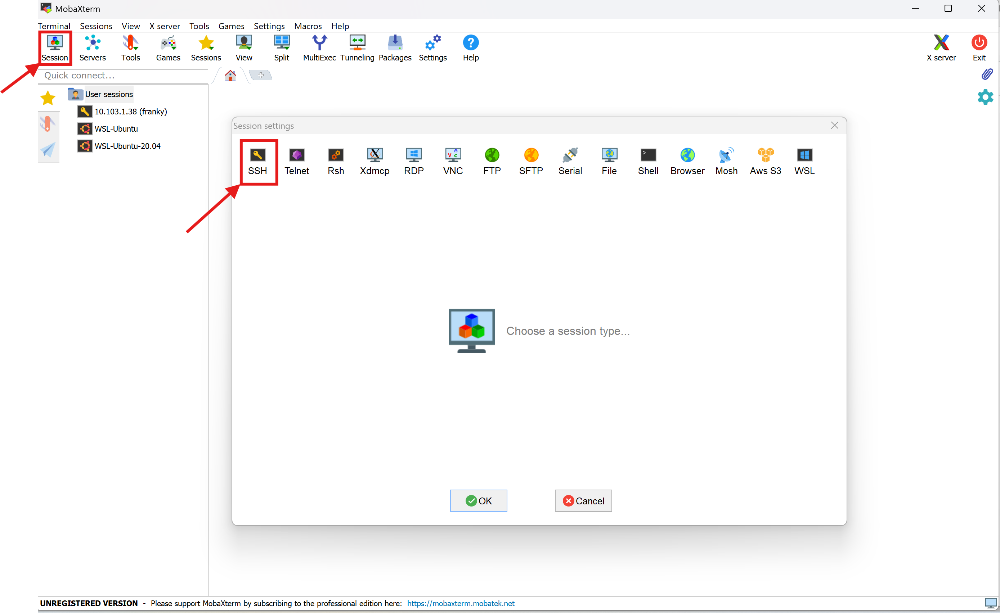
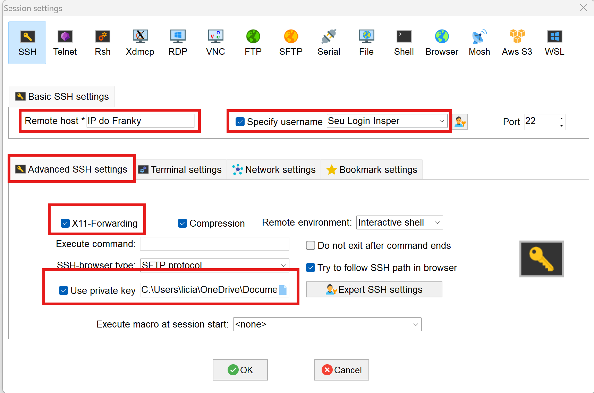
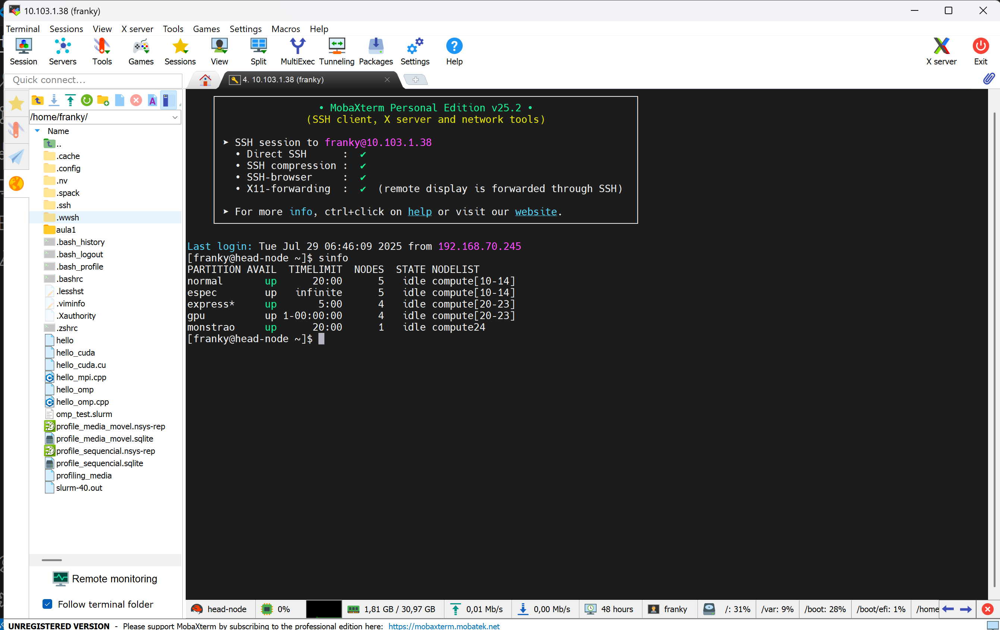
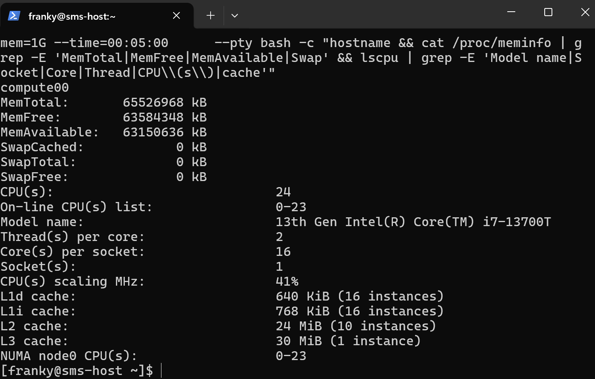

# Explorando o Poder de um Cluster HPC

Antes de qualquer coisa, precisamos configurar a conexão SSH com o sistema de HPC.

Para ter acesso ao Cluster Franky você precisa configurar suas credenciais de acesso e realizar acesso remoto via SSH.

As chaves foram enviadas para o seu email Insper, Faça o download da pasta completa, que contém os arquivos `id_rsa` (chave privada) e `id_rsa.pub` (chave pública). Dependendo do sistema operacional que você utiliza, siga as instruções abaixo para configurar corretamente seu acesso ao cluster Franky.

#### **Para Macbook ou Linux:**

Abra o terminal, navegue até a pasta onde a chave privada (`id_rsa`) foi baixada, mova a chave para o diretório `.ssh` em sua home:

```bash
mv id_rsa ~/.ssh/
```

Garanta que apenas você possa ler o arquivo:

```bash
chmod 400 ~/.ssh/id_rsa
```

Conecte-se ao cluster utilizando o comando SSH:

O login é o seu "usuario Insper", o endereço de IP foi fornecido durante a aula.


```bash
ssh -i ~/.ssh/id_rsa login@ip_do_cluster
```
ou

```bash
ssh login@ip_do_cluster
```


#### **Para Windows:**


**Usando MobaXTerm**

Baixe o MobaXterm Home Edition em:
https://mobaxterm.mobatek.net/download-home-edition.html

Execute a aplicação, com o MobaXterm aberto, clique em Session, depois em SSH.


Preencha todos os campos marcados em vermelho


Estabeleça a conexão, se tudo der certo, você verá algo como:



### Conhecendo o Sistema

Antes de começar a fazer pedidos de recursos pro SLURM, vamos conhecer os diferentes hardwares que temos disponível no Franky. Vamos utilizar alguns comandos de sistema operacional para ler os recursos de CPU, memória e GPU disponíveis


### Comandos utilizados

* `lscpu`: mostra detalhes da CPU (núcleos, threads, memória cache...)
* `cat /proc/meminfo`: mostra detalhes sobre a memória RAM 
* `nvidia-smi`: mostra detalhes de GPU, se disponível

### Comando SRUN

```bash
srun --partition=normal --ntasks=1 --cpus-per-task=1 --mem=1G --time=00:05:00 \
--pty bash -c "hostname && \
cat /proc/meminfo | grep -E 'MemTotal|MemFree|MemAvailable|Swap' && \
lscpu | grep -E 'Model name|Socket|Core|Thread|CPU\\(s\\)|cache' && \
{ command -v nvidia-smi &> /dev/null && nvidia-smi || echo 'nvidia-smi não disponível ou GPU não detectada'; }" 
```

Você deve ver algo como:



`srun`

> É o comando do SLURM usado para **executar uma tarefa interativamente** em um nó do cluster.

`--partition=normal`

> Indica **em qual fila** (partição) o job será executado.
> No seu caso, `normal` pode ser substituído por qualquer outra fila do sistema

`--ntasks=1`

> Solicita **1 tarefa** (processo).
> Se você estivesse rodando um código paralelo, faz sentido trocar esse valor.

`--cpus-per-task=1`

> Cada tarefa receberá **1 CPU (core)**.
> Quando estiver usando paralelismo com várias threads , faz sentido aumentar esse valor.

---

`--mem=1G`

> Aloca **1 gigabyte de memória RAM** para essa tarefa.
> Se ultrapassar esse limite, o job será encerrado.


`--time=00:05:00`

> Define um **tempo máximo de execução de 5 minutos**.
> Depois disso, o SLURM mata o processo automaticamente.

`--pty bash`

> Solicita um terminal para o SLURM dentro do nó de computação.
> Interessante para fazer testes no código ou realizar debugs

`{ command -v nvidia-smi &> /dev/null && nvidia-smi || echo 'nvidia-smi não disponível ou GPU não detectada'; }`

> Esse trecho verifica se o comando `nvidia-smi` está disponível no sistema (ou seja, se há driver NVIDIA instalado e uma GPU NVIDIA acessível).
>
> * Se **`nvidia-smi` estiver disponível**, ele será executado e mostrará as informações da(s) GPU(s) no nó (como nome, memória, uso, driver etc).
> * Se **não estiver disponível** (por exemplo, em nós sem GPU ou sem driver instalado), exibirá a mensagem:
>   `"nvidia-smi não disponível ou GPU não detectada"`.


!!! tip 
      * Em **nós CPU-only** (como os da partição `normal`), é esperado que `nvidia-smi` **não esteja presente**.
      * Para testar o comando em um nó **com GPU**, use `--partition=gpu` ou `--partition=monstrao`  para alocar nós com placas NVIDIA.


O comando abaixo faz exatamente a mesma coisa, mas eu coloquei ele dentro de um shell script para ter uma formatação melhor no display:

```bash
srun --partition=normal --ntasks=1 --pty bash -c \
"echo '=== HOSTNAME ==='; hostname; echo; \
 echo '=== MEMORIA (GB) ==='; \
 cat /proc/meminfo | grep -E 'MemTotal|MemFree|MemAvailable|Swap' | \
 awk '{printf \"%s %.2f GB\\n\", \$1, \$2 / 1048576}'; \
 echo; \
 echo '=== CPU INFO ==='; \
 lscpu | grep -E 'Model name|Socket|Core|Thread|CPU\\(s\\)|cache'
 echo '=== GPU INFO ==='; \
 if command -v nvidia-smi &> /dev/null; then nvidia-smi; else echo 'nvidia-smi não disponível'; fi"
```


O comando `sinfo` mostra quais são as filas e quais são os status dos nós 

```bash
sinfo
```
O comando abaixo mostra detalhes sobre os recursos de cada fila

```bash
scontrol show partition
```

Recomendo que você mude o nome da fila (partition) no comando abaixo para se ambientar no Cluster Franky e desconrir quais são as diferenças entre as filas

```bash
srun --partition=normal --ntasks=1 --cpus-per-task=1 --mem=1G --time=00:05:00 \
     --pty bash -c "hostname && cat /proc/meminfo | grep -E 'MemTotal|MemFree|MemAvailable|Swap' && lscpu | grep -E 'Model name|Socket|Core|Thread|CPU\\(s\\)|cache'"

```


## Introdução Teórica

Antes de partir para o código, é importante compreender o **modelo de execução em HPC**.

| Tipo de paralelismo | Exemplo de biblioteca | Escopo | Comunicação |
|---------------------|----------------------|---------|--------------|
| Paralelismo local (CPU) | `multiprocessing`, `threading`, `numba` | Dentro do mesmo nó | Memória compartilhada |
| Paralelismo em GPU | `numba.cuda`, `cupy`, `pycuda` | Dentro do mesmo nó | Memória da GPU |
| Paralelismo distribuído | `mpi4py` | Entre nós do cluster | Mensagens (MPI) |

Um cluster é formado por **vários nós interligados**, e o SLURM coordena a execução dos programas nesses nós.  
Cada camada de paralelismo atua em um nível diferente do hardware:


## Parte 1 — Baseline Sequencial

Começamos com um problema simples, mas computacionalmente intenso:  
**Aproximar o valor de pi usando o método de Monte Carlo.**

```python
#!/usr/bin/env python3
# seq_montecarlo.py
import random
import time

def estimate_pi(N):
    inside = 0
    for _ in range(N):
        x, y = random.random(), random.random()
        if x*x + y*y <= 1.0:
            inside += 1
    return 4 * inside / N

if __name__ == "__main__":
    N = 10_000_000
    t0 = time.time()
    pi = estimate_pi(N)
    print(f"π ≈ {pi:.4f} (tempo: {time.time()-t0:.3f}s)")

```

Vamos criar um arquivo slurm para executar esse código:

```bash
srun --partition=normal --ntasks=1 --nodes=1 --cpus-per-task=1 python seq_montecarlo.py
```

## Parte 2 - Paralelismo em CPU

```python
#!/usr/bin/env python3
# paralelo_montecarlo.py
import os
import random
import time
from multiprocessing import Pool

def worker(n):
    inside = 0
    for _ in range(n):
        x, y = random.random(), random.random()
        if x*x + y*y <= 1.0:
            inside += 1
    return inside

def main():
    N = 10_000
    nproc = int(os.getenv("SLURM_CPUS_PER_TASK", os.cpu_count()))
    chunk = N // nproc

    t0 = time.time()
    with Pool(nproc) as p:
        results = p.map(worker, [chunk]*nproc)

    pi = 4 * sum(results) / N
    print(f"π ≈ {pi:.4f} (nproc={nproc}, tempo={time.time()-t0:.3f}s)")

if __name__ == "__main__":
    main()

```


Criando um arquivo .slurm

```bash
#!/bin/bash
#SBATCH --job-name=pi-mp
#SBATCH --output=pi_paralelo_%j.out
#SBATCH --nodes=1
#SBATCH --ntasks=1
#SBATCH --cpus-per-task=2
#SBATCH --time=00:05:00
#SBATCH --partition=normal
#SBATCH --mem=2G                       

python paralelo_montecarlo.py
```
